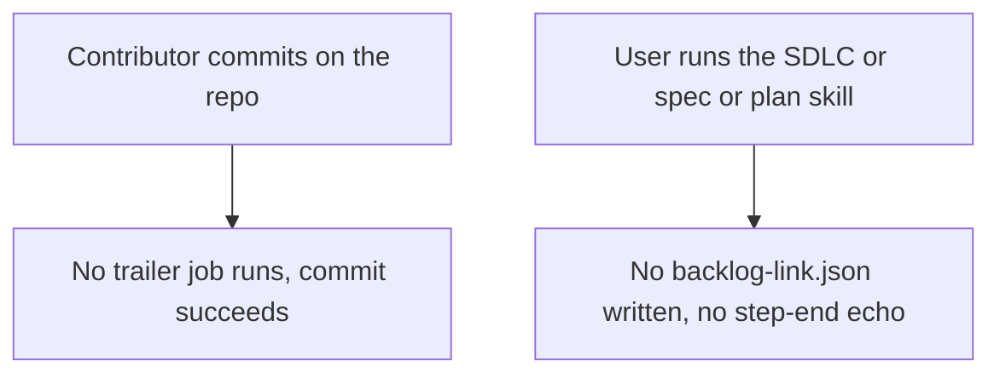
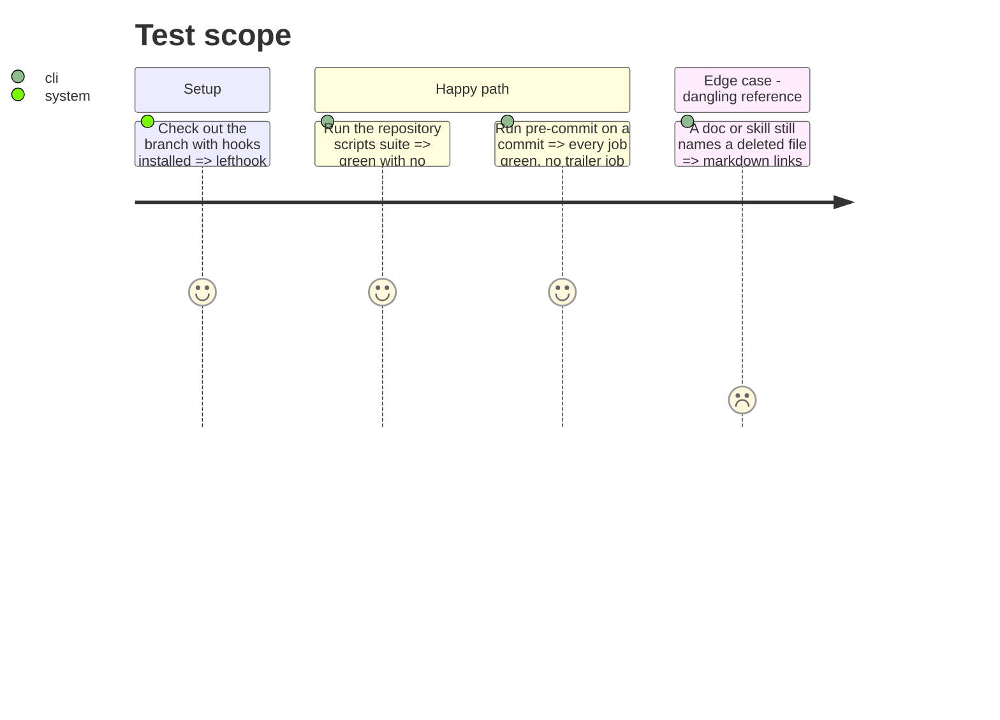

<!-- Fill or omit these sections; never add, rename, or reorder one. -->

# Instruction: Remove the previous telemetry from the plugins, scripts, CI and docs

## Architecture projection

> Tree of the final files. ✅ create · ✏️ modify · ❌ delete

```txt
.
├── plugins/aidd-telemetry/
│   ├── hooks/                                   ❌ journal.cjs, lib/, opencode-plugin.js, hooks.json (rebuilt in phase 6)
│   ├── skills/{00-init,01-cost,02-check}/       ❌ (rebuilt in phase 9)
│   ├── README.md                                ✏️ "being rebuilt" until phase 9
│   └── CATALOG.md                               ✏️ regenerated
├── plugins/aidd-pm/skills/04-spec/
│   ├── actions/01-build.md                      ✏️ no Declare step, no backlog-link test row
│   ├── references/backlog-link.md               ❌
│   └── assets/backlog-link-template.json        ❌
├── plugins/aidd-dev/skills/01-plan/
│   ├── actions/04-plan.md                       ✏️ no backlog-link step or test
│   └── SKILL.md                                 ✏️ no step-end marker
├── plugins/aidd-orchestrator/skills/
│   ├── 01-sdlc/SKILL.md                         ✏️ no "Say when this orchestration is over"
│   ├── 01-sdlc/references/01-frame.md           ✏️ no backlog-link paragraph
│   ├── 00-async-dev/SKILL.md                    ✏️ no step-end marker
│   └── 02-backlog/SKILL.md                      ✏️ no step-end marker
├── scripts/__tests__/aidd-telemetry-*.test.js, telemetry-*.test.js, a-backlog-link-*.test.js  ❌
├── scripts/__tests__/fixtures/ (telemetry-only fixtures)                                        ❌
├── scripts/lib/telemetry-reference-week.cjs, scripts/probe-identifier-join.cjs                  ❌
├── lefthook.yml                                 ✏️ no prepare-commit-msg trailer job, no prompts-doc job if it only served telemetry
├── .github/workflows/cli-ci.yml, ci.yml         ✏️ no journal replay, no telemetry check, no telemetry e2e exclusion
├── aidd_docs/product/{cost-report,metrics}-contract.md   ❌
├── aidd_docs/runs/                              ❌
├── aidd_docs/tasks/2026_09/{the-upward-link,flow-and-versions,install-surfaces-agree, fewer-verbs,one-place-per-nature,telemetry-at-scale}  ✏️ status: superseded
├── cli/aidd_docs/memory/telemetry.md, cli/.claude/skills/telemetry/   ❌
└── memory, README, docs/*.md, cli/README.md, cli/ARCHITECTURE.md      ✏️ no claim about the previous telemetry
```

## User Journey



## Test Scope



## Tasks to do

### `1)` Empty the plugin and unhook the other skills

> No plugin emits or writes anything for the previous telemetry.

1. Delete the aidd-telemetry hooks and skills; leave `plugin.json` and a README saying the plugin is being rebuilt.
2. Remove the backlog-link step, reference, template and test rows from `aidd-pm:04-spec` and `aidd-dev:01-plan`, and the paragraph from `01-sdlc/references/01-frame.md`.
3. Remove every `aidd:step-end` echo and the SDLC's "Say when this orchestration is over" section.

### `2)` Scripts, hooks, CI

> The repository's own gates no longer mention the previous telemetry.

1. Delete the telemetry script tests, their fixtures and the two telemetry scripts.
2. Remove the `prepare-commit-msg` trailer job from `lefthook.yml`, and the prompts-doc job if telemetry was its only input.
3. Remove the journal replay, `telemetry check` and telemetry e2e exclusion from the workflows.

### `3)` Docs and task history

> Docs describe what exists; past work stays readable as history.

1. Delete the two product contracts, `aidd_docs/runs/`, the CLI telemetry memory and skill.
2. Rewrite each memory, README and docs line that claims the previous telemetry (list in the explore notes) to say nothing or point at phase 9's docs.
3. Mark the pending telemetry task folders `status: superseded`; leave done folders untouched.

## Test acceptance criteria

| Task | Acceptance criteria |
| ---- | ------------------- |
| 1 | `grep -rn "backlog-link\|aidd:step-end" plugins` finds nothing |
| 2 | `node --test 'scripts/__tests__/**/*.test.js'` and `lefthook run pre-commit` are green |
| 2 | A commit in a clone that has a stale `aidd-session-trailer.sh` delegate, and one that has none, both succeed |
| 3 | markdown-links, referenced-paths, comments-name-files-that-exist and the CATALOG/README count checks are green |
| 3 | kanban shows no pending telemetry task from before this plan |
