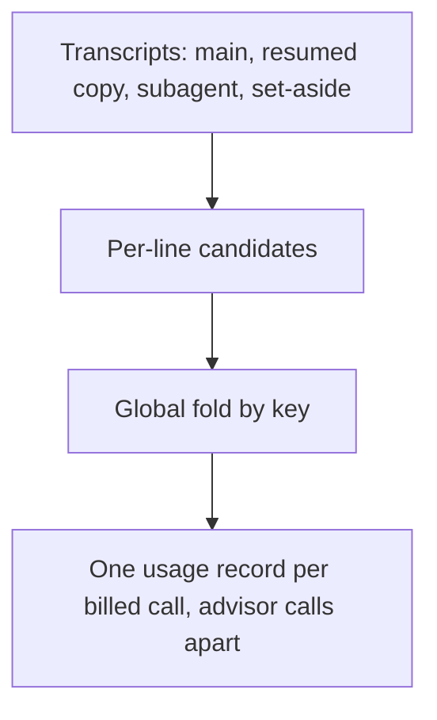
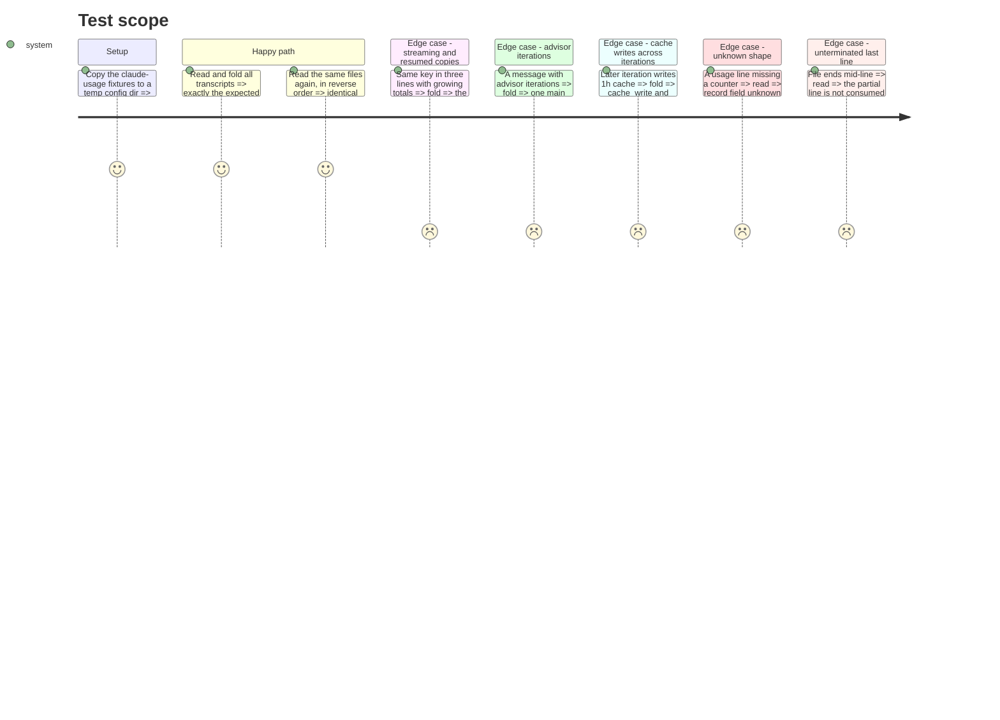

<!-- Fill or omit these sections; never add, rename, or reorder one. -->

# Instruction: Count, Claude transcripts to usage records

## Architecture projection

> Tree of the final files. ✅ create · ✏️ modify · ❌ delete

```txt
cli/
├── src/contexts/telemetry/
│   ├── domain/usage-record.ts                         ✅ the common record (context/usage-record-contract.md)
│   ├── domain/formats/claude-transcript-usage.ts      ✅ one transcript line to candidate records, pure
│   ├── domain/usage-fold.ts                           ✅ global fold: one record per key, deterministic winner
│   ├── domain/ports/transcript-source.ts              ✅ list files, read bytes from an offset
│   └── infrastructure/claude-transcript-source-adapter.ts  ✅ recursive walk of <CLAUDE_CONFIG_DIR or ~/.claude>/projects
└── tests/
    ├── fixtures/claude-usage/                         ✅ ported from context/prototype/fixtures, synthetic ids only
    ├── contexts/telemetry/domain/*.unit.test.ts       ✅ one test per rule, each with its mutation noted
    └── contexts/telemetry/infrastructure/claude-transcript-source-adapter.integration.test.ts  ✅
```

## User Journey



## Test Scope



## Tasks to do

### `1)` The record and the per-line rules

> A pure function turns one transcript line into zero or more candidate records.

1. Define `UsageRecord` exactly as `context/usage-record-contract.md`, `tool: "claude-code"`; unknown is `null`.
2. Key `message.id:requestId`, else `message.id:sessionId:timestamp`; drop `<synthetic>`; `agent` is `subagent` when `isSidechain` or `agentId`.
3. `cache_write` and `cache_write_1h` summed over `iterations[type=message]`, top-level when there are none; `cache_write_1h` unknown when any split is missing.
4. Each `iterations[type=advisor_message]` is its own record, key `<key>#advisor<n>`, its own model.
5. A recognisable usage line with an unexpected shape yields an "unrecognised" outcome counted and surfaced, never a guessed record.

### `2)` The global fold

> Order-independent: one winner per key.

1. Winner is the largest total; tie, the earliest `at`; tie, the lowest `session_id`.
2. Fold across every file, not per file.

### `3)` The transcript source

> Every transcript under the projects root, read from a byte offset.

1. Walk `<CLAUDE_CONFIG_DIR or HOME/.claude>/projects` recursively, including `subagents/` and `*.jsonl.superseded-*` set-asides.
2. Read from a given byte offset; never consume an unterminated last line; report file size and identity (device+inode or equivalent) so a shrunk or replaced file is re-read whole.

## Test acceptance criteria

| Task | Acceptance criteria |
| ---- | ------------------- |
| 1 | Each rule has a unit test that fails when that rule alone is mutated (iteration sum, advisor key, synthetic filter, sidechain agent, requestless key) |
| 2 | Reading files in any order gives the same records; mutating the tie-break or folding per file turns a named test red |
| 3 | Subagent and set-aside files are found; a file appended mid-line yields its complete lines only; a truncated file is re-read whole |
| all | No fixture holds a real session id, prompt, path or name |
