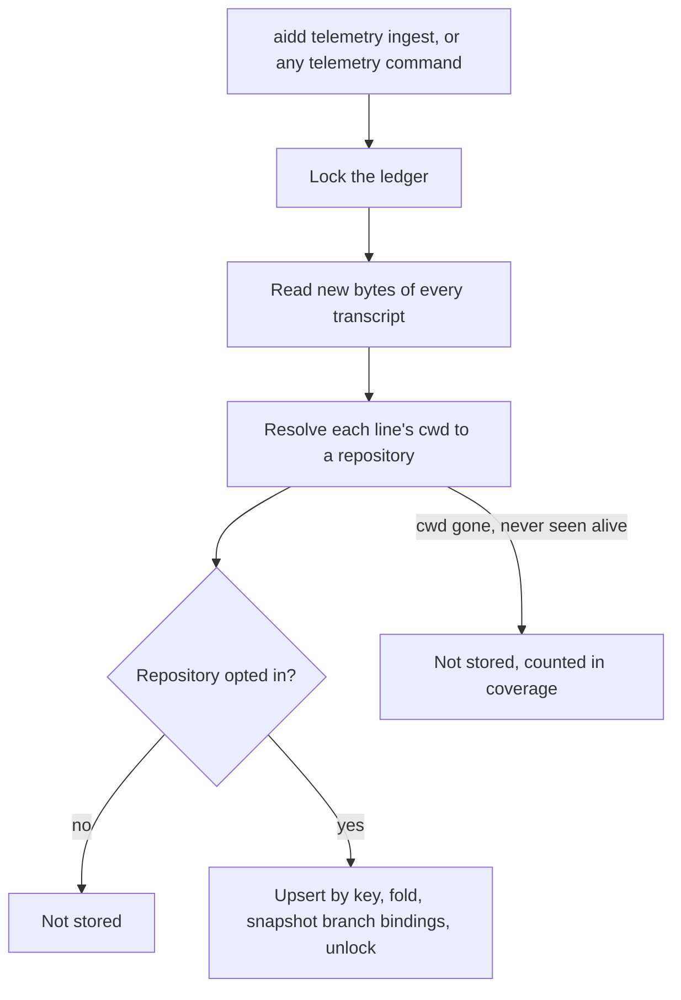
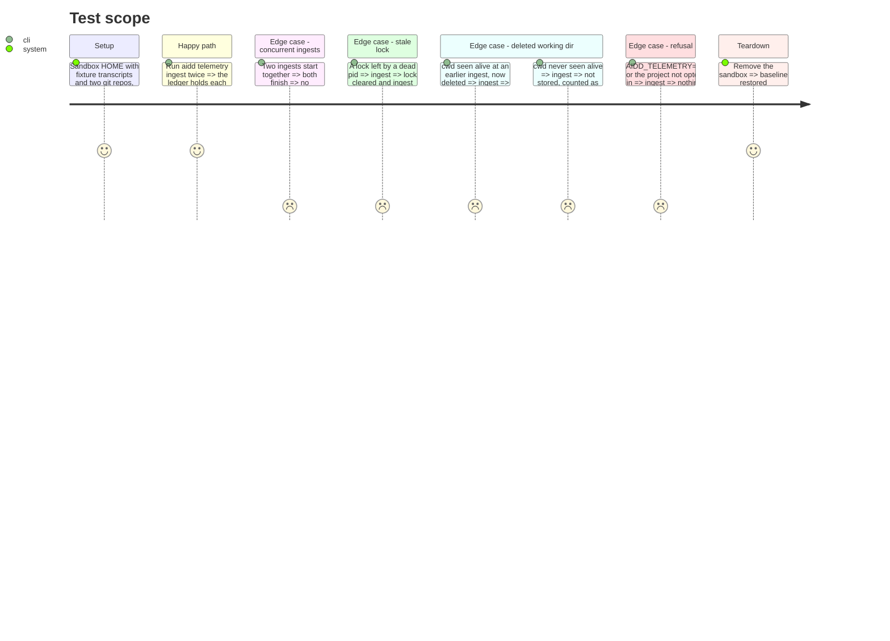

<!-- Fill or omit these sections; never add, rename, or reorder one. -->

# Instruction: Store, the ledger, ingest and consent

## Architecture projection

> Tree of the final files. ✅ create · ✏️ modify · ❌ delete

```txt
cli/
├── src/
│   ├── cli.ts                                              ✏️ register the telemetry group
│   ├── presentation/commands/telemetry.ts                  ✅ group + `ingest` (hidden from the skill surface, used by the hook)
│   ├── runtime/wiring/telemetry.ts                         ✅
│   ├── runtime/git/git-adapter.ts                          ✏️ rev-parse roots, origin url, root commit, config get/set/unset, branch reflog creation
│   └── contexts/telemetry/
│       ├── domain/repository-identity.ts                   ✅ hash(host/owner/repo) from origin, else root commit
│       ├── domain/telemetry-consent.ts                     ✅ .aidd/config.json telemetry.enabled + AIDD_TELEMETRY=0
│       ├── domain/ports/{usage-ledger,repository-locator,binding-snapshot-store}.ts  ✅
│       ├── application/ingest-usage-use-case.ts            ✅
│       └── infrastructure/{usage-ledger-adapter,repository-locator-adapter,binding-snapshot-store-adapter}.ts  ✅
└── tests/…                                                 ✅ unit, integration, e2e (sandboxed HOME)
```

## User Journey



## Test Scope



## Tasks to do

### `1)` Repository resolution

> Each line is tied to a repository at ingest, from its own cwd.

1. realpath + case-fold the cwd, `git rev-parse --show-toplevel --git-common-dir`, cached per cwd.
2. Repository id: hash of `host/owner/repo` parsed from `origin` (https and ssh, credentials stripped), else the root commit SHA; the raw url is never stored.
3. Every resolution `cwd -> {repository id, root, consent}` is persisted in `<telemetry dir>/ledger/roots.json` the first time the cwd is seen alive, so lines from a worktree deleted later still resolve. A cwd never seen alive is not stored (its consent is unprovable) and is counted in coverage. Outside any repo: not stored, counted as `outside-repo` in coverage.
4. Snapshot every opted-in repository's branch bindings (git config keys plus the branch creation time read from its reflog at that moment) into `<telemetry dir>/bindings/branches.jsonl`, append-only, on each ingest and each declaration. Attribution reads only snapshots, so a deleted or renamed branch keeps its past attribution.

### `2)` The ledger

> Append-only, idempotent, safe under concurrency.

1. `<telemetry dir>/ledger/<YYYY-MM>.jsonl` by record `at`; offsets in `<telemetry dir>/ledger/offsets.json`.
2. Upsert by `(tool, key)` with the phase 3 fold; a newline guard before each append.
3. Lock file with pid and creation time; a lock whose pid is gone or older than its timeout is cleared.
4. Directory 0700 and files 0600 on POSIX, icacls on Windows, as `auth-storage` does.

### `3)` Consent and ingest

> Only opted-in projects are read into the ledger.

1. Consent per repository root: `.aidd/config.json` `telemetry.enabled === true` **and** `telemetry.version === 2`. The previous version's bare `enabled: true` is not consent. `AIDD_TELEMETRY=0` refuses everything. Consent is checked when the cwd is first resolved.
2. `ingest` is the one use case; every later telemetry command calls it first.

## Test acceptance criteria

| Task | Acceptance criteria |
| ---- | ------------------- |
| 1 | https, ssh and credential-bearing remotes of one repo give one id; a repo without origin gets its root commit; a linked worktree resolves to its main repository's id |
| 2 | Re-ingesting the same transcripts never changes the ledger; two concurrent ingests leave each key once |
| 2 | A transcript rewritten shorter is re-read whole and the fold keeps the best record |
| 3 | A project without consent, and any project under `AIDD_TELEMETRY=0`, stores nothing |
| 1 | A branch deleted after its declaration still attributes its past records, read from the snapshot |
| all | Each rule (key fold, lock clearing, consent refusal, snapshot) has a named mutation that turns its test red |
