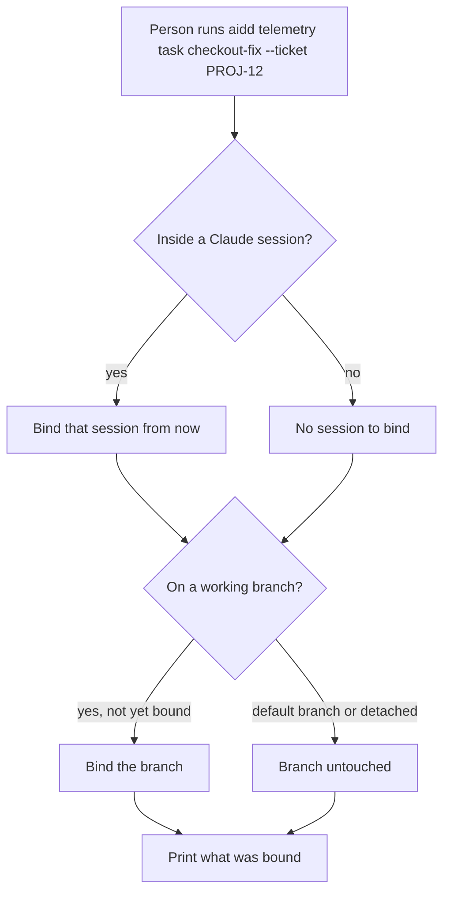
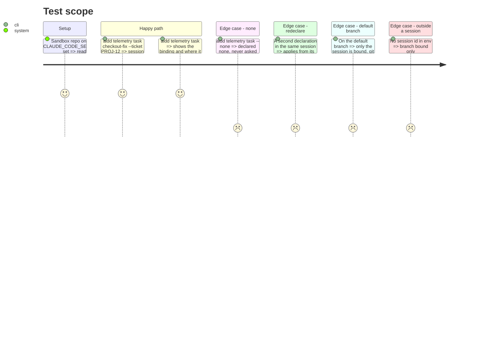

<!-- Fill or omit these sections; never add, rename, or reorder one. -->

# Instruction: Declare, the task command and its stores

## Architecture projection

> Tree of the final files. ✅ create · ✏️ modify · ❌ delete

```txt
cli/src/
├── presentation/commands/telemetry.ts                    ✏️ `task <name> [--ticket <ref>] | --none`, `task` alone shows the current binding
└── contexts/telemetry/
    ├── domain/task-declaration.ts                        ✅ name, ticket, none, declared_at, by (command | hook-intercept)
    ├── domain/ports/{branch-binding-store,session-binding-store}.ts  ✅
    ├── application/declare-task-use-case.ts              ✅
    └── infrastructure/
        ├── branch-binding-store-adapter.ts               ✅ git config branch.<name>.aiddTask / aiddTicket / aiddDeclaredAt
        └── session-binding-store-adapter.ts              ✅ <telemetry dir>/bindings/sessions.jsonl, append-only
scripts/__tests__/fixtures/telemetry-bindings/            ✅ the shared format fixture (read by CLI and hook tests)
```

## User Journey



## Test Scope



## Tasks to do

### `1)` The declaration and its two stores

> One declaration, stored where its scope lives.

1. Ticket is free text, trimmed, never parsed or validated against a forge.
2. Branch store: `git config --local branch.<name>.aiddTask|aiddTicket|aiddDeclaredAt`, then an immediate snapshot (phase 4, task 1.4) with the branch creation time read from the reflog now, before it can expire.
3. Session store: one JSON line per declaration `{session_id, task, ticket, none, declared_at, by}`; the latest per session wins from its own time.
4. Default branch (`origin/HEAD`, else `main`/`master` when no remote head) and detached HEAD never get a branch binding.

### `2)` The shared format fixture

> One file both languages test against.

1. Fixture holds sample `sessions.jsonl`, `carries.jsonl` (phase 6) and the git config keys, with the expected "is this session bound, to what" answers, plus cases for every rule the hook duplicates: telemetry-dir resolution, default-branch detection, consent, and the Claude-only guard.
2. A CLI unit test reads it; phase 6's hook test reads the same file.

## Test acceptance criteria

| Task | Acceptance criteria |
| ---- | ------------------- |
| 1 | After a declaration on `feat/x`, `git config branch.feat/x.aiddTask` returns the task; renaming the branch keeps it |
| 1 | On the default branch or detached HEAD, git config is unchanged |
| 1 | Two declarations in one session are both kept, each with its own time |
| 2 | Changing a field name in the CLI writer without updating the fixture turns the fixture test red |
| all | Default-branch exclusion, latest-wins per session, and the none declaration each have a named mutation that turns their test red |
