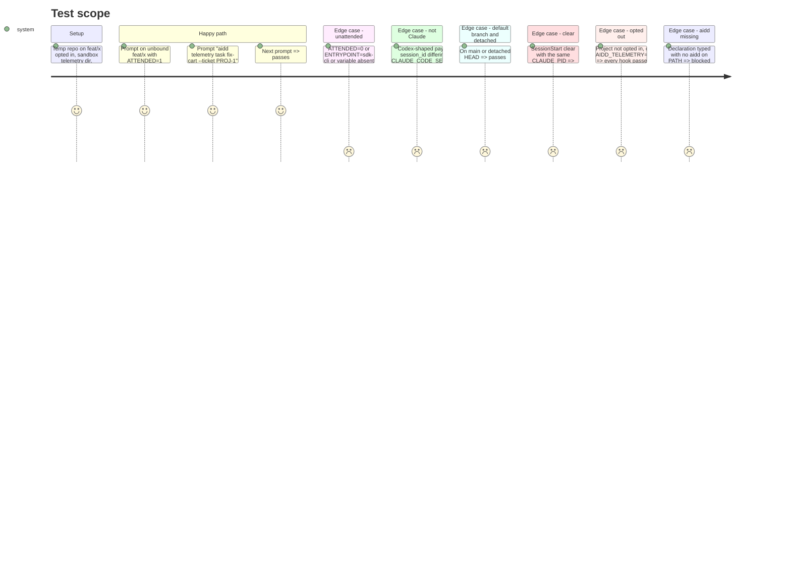

<!-- Fill or omit these sections; never add, rename, or reorder one. -->

# Instruction: Ask, the plugin hooks

## Architecture projection

> Tree of the final files. ✅ create · ✏️ modify · ❌ delete

```txt
plugins/aidd-telemetry/hooks/
├── hooks.json                 ✅ SessionStart (sync: session fact, clear carry), SessionStart (async: ingest), UserPromptSubmit
├── session-start.cjs          ✅ records {pid, session, source}; on clear, carries the predecessor's session binding
├── catch-up.cjs               ✅ async: runs `aidd telemetry ingest` if aidd is on PATH, prints nothing
├── prompt-gate.cjs            ✅ intercept a typed declaration, else ask when the rule says so
└── lib/
    ├── claude-only.cjs        ✅ payload session_id === CLAUDE_CODE_SESSION_ID, Claude-shaped transcript path
    ├── presence.cjs           ✅ ATTENDED=1 and ENTRYPOINT not sdk*, else absent
    ├── binding.cjs            ✅ reads git config + sessions.jsonl + carries.jsonl, answers "bound to what"
    └── telemetry-dir.cjs      ✅ AIDD_TELEMETRY_DIR, else AIDD_USER_CONFIG_DIR/telemetry, XDG, ~/.config/aidd/telemetry
scripts/__tests__/aidd-telemetry-hooks.test.js   ✅ spawns each hook with payloads and a sandbox env
```

## User Journey

```mermaid
flowchart TD
  P[Person submits a prompt] --> Q{Claude, opted in, person present?}
  Q -- no --> R[Pass, silent]
  Q -- yes --> S{Prompt is aidd telemetry task ...?}
  S -- yes --> T[Run the CLI declaration, block with the result, original prompt suppressed]
  S -- no --> U{Working branch and nothing bound?}
  U -- no --> R
  U -- yes --> V[Block: declare a task, two ways shown]
  C[/clear] --> W[Session fact: same pid, new session]
  W --> X[Copy predecessor's session binding as carried, announce it]
```

## Test Scope



## Tasks to do

### `1)` Guards shared by every hook

> Inert outside Claude, outside opted-in projects, and when presence is unknown.

1. Order for latency: env checks first (Claude-only, presence), then one file read (consent), then git. A person with the plugin but no consent pays no git call.
2. Claude-only: payload `session_id` equals `CLAUDE_CODE_SESSION_ID` and the transcript path is under a Claude `projects/` directory (separators normalised).
3. Consent read from `.aidd/config.json` at the repo root, `AIDD_TELEMETRY=0` refuses; the same rule as the CLI, pinned by a shared fixture case.
4. Every hook exits 0 on any internal error, except the deliberate block; a crash never blocks a prompt.

### `2)` The prompt gate

> Ask once per working branch, answer without the model.

1. A prompt matching `^\s*!?\s*aidd telemetry task\b` is tokenized by a strict parser (no shell syntax accepted), and the CLI is spawned with an argv array and no shell, `aidd.cmd` resolved explicitly on Windows; it then blocks with the CLI's output and `suppressOriginalPrompt: true`.
2. Otherwise block only when: Claude, opted in, present, working branch, neither the session (declared or carried) nor the branch is bound, and the answer path works: `aidd` resolves and `aidd telemetry task --help` succeeds (checked only on this rare path). Otherwise pass silently: a block nobody can answer is never raised.
3. The reason names both answers: `! aidd telemetry task <name> [--ticket <ref>]` in a terminal, the same text as a prompt anywhere.

### `3)` Session facts and the clear carry

> `/clear` keeps the task, visibly.

1. On every SessionStart, append `{pid, session_id, source, at}` to the pid's history, pid from `CLAUDE_PID` (undocumented: pinned by a test, falling back to the parent pid as measured, and to no carry when neither is available).
2. On `source: clear`, take the pid's latest session before this one; if it is bound (declared or carried), append `{session_id, from, at}` to `carries.jsonl` and print a `systemMessage` naming the task and how to change it.
3. `resume` uses the resumed session's own binding; `fork` carries from the session it forked from when the history shows it (same work), probed once on `/branch`; `startup` and `compact` carry nothing.

### `4)` Async catch-up

> Ingest at session start, never visible, never blocking.

1. A separate `async: true` SessionStart entry runs `aidd telemetry ingest` when `aidd` resolves on PATH; prints nothing to stdout.
2. Assert that `async: true` survives both Claude install routes (marketplace copy and the flat settings merge).

### `5)` Presence on non-terminal surfaces

> Know, not assume, what the IDE and desktop app expose.

1. Probe once, with the maintainer, in the VS Code extension and the desktop app: `CLAUDE_CODE_SESSION_ATTENDED`, `CLAUDE_CODE_ENTRYPOINT`, and whether a block reason displays. Record the values in `context/target.md`.
2. Extend the presence rule only with values observed there; until observed, those surfaces never block.

## Test acceptance criteria

| Task | Acceptance criteria |
| ---- | ------------------- |
| 1 | A Codex-shaped payload and a mismatched session id both pass and write no file |
| 1 | A hook given malformed JSON exits 0 and passes the prompt |
| 2 | An unbound working branch with a person present blocks; the same with ATTENDED=0 passes |
| 2 | A typed declaration reaches no model: the hook blocks and the CLI has stored it |
| 3 | After a clear on a bound session, the new session reads as bound to the same task, marked carried |
| 3 | The hook reads the phase 5 shared fixture and returns the same answers as the CLI test |
| 4 | The catch-up writes nothing to stdout and exits 0 when aidd is absent |
| 4 | A flat-merged `.claude/settings.json` keeps `async: true` on the catch-up entry |
| 2 | With `aidd` absent or lacking `telemetry task`, an unbound branch is never blocked |
| 2 | A typed declaration containing `;`, `&&`, a pipe or backticks runs no second command |
| 5 | Observed IDE and desktop values are recorded, with a test per observed value |
| all | Claude-only guard, presence rule, answer-path check and clear carry each have a named mutation that turns their test red |
| all | The suite passes on the Windows CI job |
