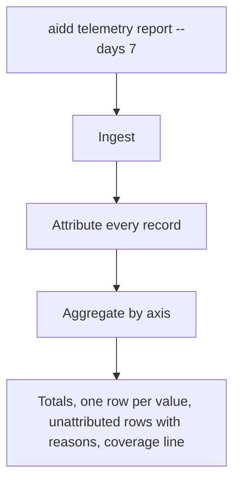

<!-- Fill or omit these sections; never add, rename, or reorder one. -->

# Instruction: Attribute and report

## Architecture projection

> Tree of the final files. ✅ create · ✏️ modify · ❌ delete

```txt
cli/src/
├── presentation/commands/telemetry.ts             ✏️ `report [--from --to | --days] [--axis <axis>] [--json]`
├── presentation/display/telemetry-report-display.ts  ✅ text rendering only
└── contexts/telemetry/
    ├── domain/attribution.ts                      ✅ pure: record + bindings + carries + branch facts -> task/ticket or unattributed(reason)
    ├── domain/usage-report.ts                     ✅ totals and axes, four counters apart
    ├── domain/person.ts                           ✅ opted-in person id or none
    ├── domain/ports/person-identity.ts            ✅
    ├── application/report-usage-use-case.ts       ✅ ingest, then attribute and aggregate
    └── infrastructure/person-identity-adapter.ts  ✅ userConfigDir()/telemetry/identity.json
```

## User Journey



## Test Scope

```mermaid
---
title: Test scope
---
journey
  section Setup
    Ledger fixture spanning two days, two models, two branches, one carry, one redeclaration => ready: 5: system
  section Happy path
    report --axis task => one row per task, unattributed rows by reason, sum equals total: 5: cli
    report on every axis => each sums to the same total, four counters apart: 5: cli
  section Edge case - retroactive branch
    Records on feat/x before it is declared => report => unattributed no-binding; declare; report => on the task: 1: cli
  section Edge case - carried then corrected
    A carried session later declared => report => the whole session on the declared task: 1: cli
  section Edge case - mid-session redeclaration
    Second declaration at t => report => before t on the first task, after t on the second: 1: cli
  section Edge case - unknown counters
    A record with an unknown counter => report => that counter shown unknown for the row, never summed as zero: 1: cli
```

## Tasks to do

### `1)` Attribution

> One pure function, the command the only source.

1. Order: session declaration effective at the record's time; else the session's carry (whole session until its first declaration); else the branch binding read from the snapshots, when the record's `git_branch` and repository match and its time is after the branch creation time captured in the snapshot; else unattributed.
2. A first declaration in a carried session applies to the whole session; later ones apply from their own time.
3. Unattributed reasons: `outside-repo`, `root-unresolved`, `no-binding`, `declared-none`.
4. Subagent and advisor records inherit their parent session's attribution through `session_id`.

### `2)` The report

> Every axis reconciles to one total.

1. Axes: `total`, `person`, `session`, `model`, `day` (UTC), `repository`, `task`, `ticket`.
2. Four counters per row, and a row total; an unknown counter is shown as unknown for its row and excluded from no total silently: the report states how many records had an unknown.
3. A coverage line: files read, records, unrecognised shapes, and the oldest transcript date still on disk.
4. `--json` emits a versioned envelope documented in phase 9.

### `3)` Person

> Opt-in, fresh, local.

1. `aidd telemetry identity <id>` writes `{person_id}` under the telemetry dir; `--off` removes it; absent means no person axis value.

## Test acceptance criteria

| Task | Acceptance criteria |
| ---- | ------------------- |
| 1 | Each attribution rule has a unit test and a named mutation that turns it red |
| 1 | Declaring a branch after its work moves that work from `no-binding` to the task on the next report |
| 2 | For every axis, the rows sum to the total on the fixture and on a property-based generated ledger |
| 2 | The JSON envelope carries its version, and the text never shows a path, cwd or branch name it does not need |
| 3 | Without an identity file, the person axis shows one "not set" row; with one, the id |
