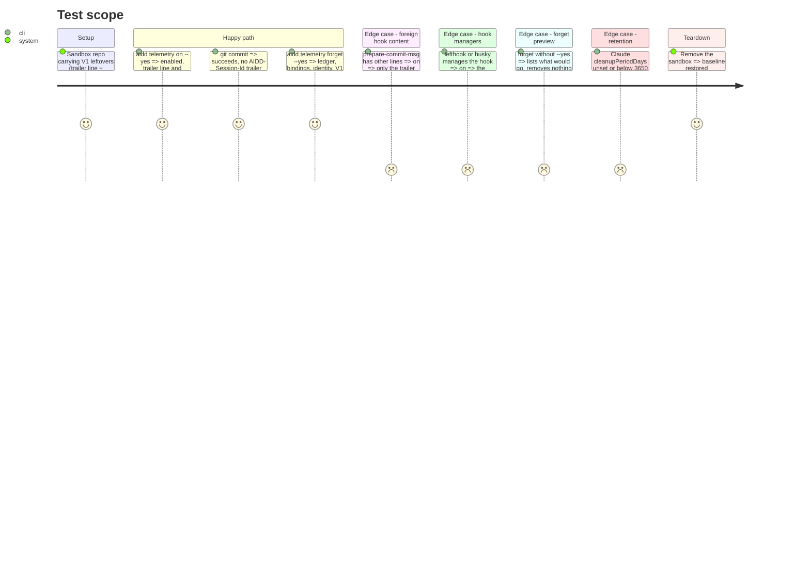

<!-- Fill or omit these sections; never add, rename, or reorder one. -->

# Instruction: Opt in, opt out, forget, and what V1 left behind

## Architecture projection

> Tree of the final files. ✅ create · ✏️ modify · ❌ delete

```txt
cli/src/
├── presentation/commands/telemetry.ts                 ✏️ `on [--yes]`, `off`, `forget [--yes]`
└── contexts/telemetry/
    ├── domain/legacy-leftovers.ts                     ✅ what V1 wrote, by location
    ├── application/{telemetry-on,telemetry-off,forget-telemetry}-use-case.ts  ✅
    └── infrastructure/legacy-leftovers-adapter.ts     ✅ finds and removes them
```

## User Journey

```mermaid
flowchart TD
  A[aidd telemetry on] --> B[Write telemetry.enabled]
  B --> C[Remove V1 leftovers in this repo]
  C --> D[Report Claude transcript retention and the one-line fix]
  E[aidd telemetry forget] --> F[Show what would go]
  F -- --yes --> G[Remove ledger, bindings, identity, V1 sink and identity]
```

## Test Scope



## Tasks to do

### `1)` Opt in and V1 leftovers

> Enabling leaves the repository as if V1 had never run.

1. `on` writes `.aidd/config.json` `telemetry: {enabled: true, version: 2}`, keeping other keys; `--yes` skips the confirmation. A repository carrying only the previous version's `enabled: true` stays off until `on` runs.
2. Remove the `prepare-commit-msg` line calling `aidd-session-trailer.sh` and the delegate script in the same step; never remove the script while a line still calls it.
3. Remove `aidd_docs/runs/` (V1 journal, git-ignored) and its `.gitignore` entry.
4. Read Claude's effective `cleanupPeriodDays` (user and project settings, read only) and print the fix when it is below 3650.

### `2)` Opt out and forget

> Off stops reading; forget erases.

1. `off` sets `telemetry.enabled: false`, keeping `version`; nothing else changes.
2. `forget` previews by default; `--yes` removes the ledger, bindings, carries, identity, V1 day files at the telemetry dir root and V1's `identity.json`, and the git config `aiddTask|aiddTicket|aiddDeclaredAt` keys of every still-existing repository the binding snapshots name.
3. The previous version's locations come from phase 1's notes: sink dir under `AIDD_TELEMETRY_DIR`, `AIDD_USER_CONFIG_DIR/telemetry`, `%APPDATA%\aidd\telemetry` on Windows, `~/.config/aidd/telemetry`; identity at `%APPDATA%\aidd\identity.json` or `~/.config/aidd/identity.json`.

## Test acceptance criteria

| Task | Acceptance criteria |
| ---- | ------------------- |
| 1 | After `on` in a V1 repo, a commit succeeds and carries no AIDD-Session-Id trailer |
| 1 | A prepare-commit-msg with other content keeps that content byte for byte |
| 1 | Nothing under the real or sandboxed Claude profile is written |
| 2 | `forget` without `--yes` changes nothing on disk; with it, nothing of either version remains in the telemetry dir |
| all | Trailer line-and-script pairing, foreign-content preservation and forget's preview each have a named mutation that turns their test red |
