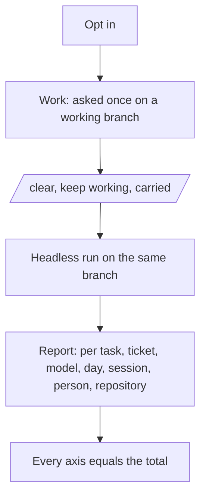
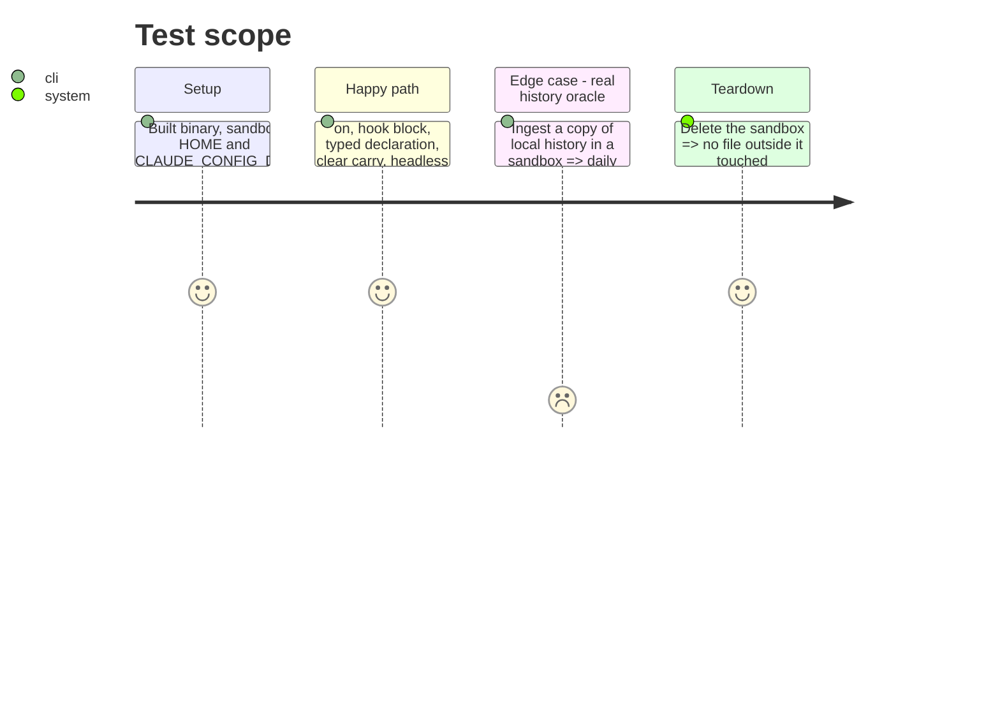

<!-- Fill or omit these sections; never add, rename, or reorder one. -->

# Instruction: Skills, docs, and the end-to-end proof

## Architecture projection

> Tree of the final files. ✅ create · ✏️ modify · ❌ delete

```txt
.
├── plugins/aidd-telemetry/
│   ├── skills/00-init/        ✅ opt in, identity, forget, through the CLI
│   ├── skills/01-usage/       ✅ answer "how many tokens" questions with `aidd telemetry report`
│   ├── README.md              ✏️ what it measures, what it asks and when, what stays local
│   └── CATALOG.md             ✏️ regenerated
├── aidd_docs/product/usage-contract.md      ✅ the usage record, the report envelope, the binding stores
├── cli/aidd_docs/memory/telemetry.md        ✅ how the context is built
├── memory, README, docs/*.md                ✏️ the new telemetry, one line each where relevant
└── cli/tests/e2e/telemetry-journey.e2e.test.ts  ✅ the full journey on the built binary
```

## User Journey



## Test Scope



## Tasks to do

### `1)` Skills

> Two skills, both thin over the CLI, saying loudly when it is absent.

1. `00-init`: opt in after consent, set or remove the identity, forget with a preview.
2. `01-usage`: map a question to `aidd telemetry report` flags and read the JSON; never compute a number itself.

### `2)` Docs

> One contract, written once.

1. `aidd_docs/product/usage-contract.md`: the record, the envelope version, the stores and their owners, the ask rule, the carry rule.
2. Plugin README, CLI memory and repo memory lines.
3. Set the bundle budget once, to the measured build plus about 2 %, with its registry line.

### `3)` Proof

> The whole journey on the built binary, and one comparison on real data.

1. One e2e journey covering the spec's done-when list, no AI tool binary on PATH.
2. A manual, documented oracle run on a copied history in a sandbox, comparing daily totals with an independent count; its output kept in this folder, with no personal data.

## Test acceptance criteria

| Task | Acceptance criteria |
| ---- | ------------------- |
| 1 | Each skill's actions name only commands that exist in the CLI help golden |
| 2 | Every doc link resolves; no doc mentions the previous telemetry's journal, envelope or commands |
| 3 | The e2e journey passes on Linux, macOS and Windows CI |
| 3 | The oracle note shows equal totals for every compared day, or each difference explained to the token |
