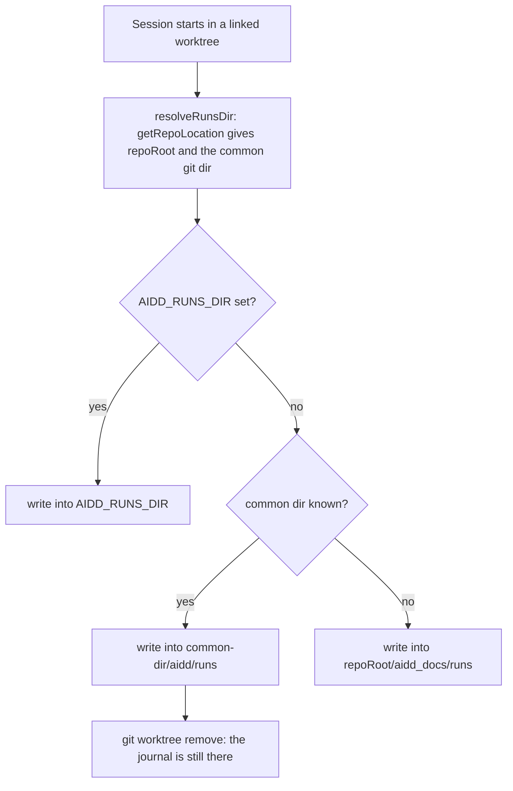
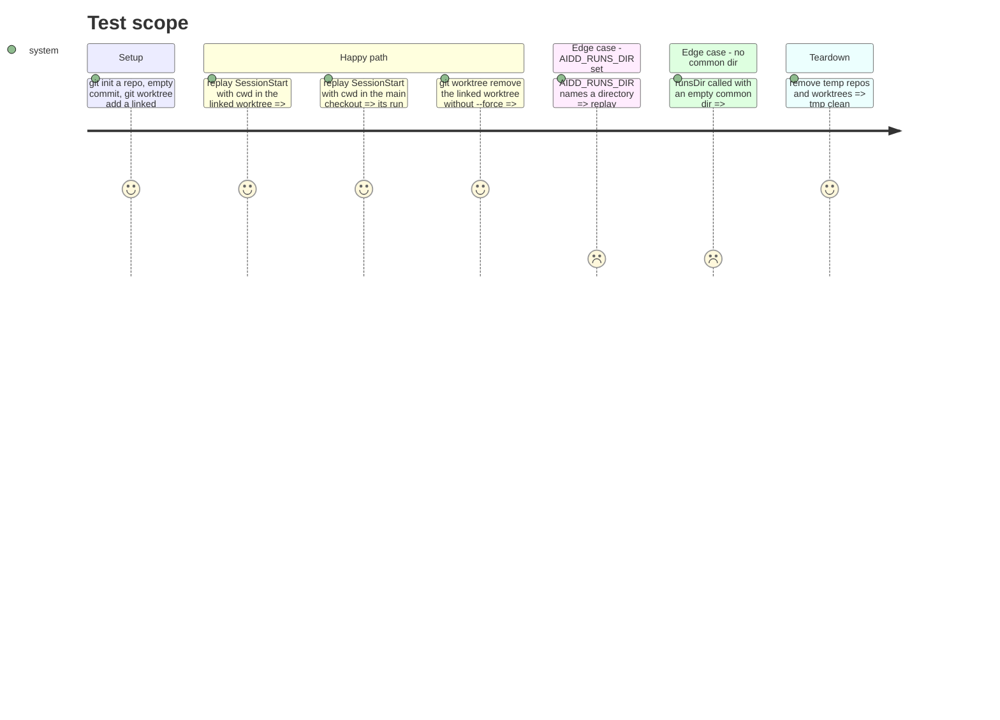

# Instruction: The hook writes under the common git directory

## Architecture projection

> Tree of the final files. ✅ create · ✏️ modify · ❌ delete

```txt
.
├── plugins/aidd-telemetry/hooks/lib/
│   └── repo.cjs                                   ✏️ runsDir(repoRoot, commonDir); resolveRunsDir passes the common dir; decision comment amended
└── scripts/__tests__/
    ├── aidd-telemetry-journal.test.js             ✏️ runsDirOf via git; sessionStartLineIn by session id; new location tests
    ├── aidd-telemetry-runs-dir.test.js            ✏️ default-location assertions point at the common dir
    ├── aidd-telemetry-file-writes.test.js         ✏️ seeded run files move to <repo>/.git/aidd/runs
    ├── aidd-telemetry-plugin-version.test.js      ✏️ reads run files from <repo>/.git/aidd/runs
    ├── opencode-plugin.test.js                    ✏️ runsDirOf points at <repo>/.git/aidd/runs
    └── aidd-telemetry-journal-perf-harness.js     ✏️ seeded dir moves to <repo>/.git/aidd/runs
```

Nothing else in `plugins/aidd-telemetry/hooks/` changes: every writer (`record.cjs`, `file-writes.cjs`, `step-starts.cjs`, `step-ends.cjs`, `task-declared.cjs`) already takes its directory from `resolveRunsDir(...).dir` or `resolveWriteTarget(...).dir`. Do not edit them.

## User Journey



## Test Scope



## Tasks to do

### `1)` Pin the new location in tests first

> Make the suite describe the new location before the code moves, and watch it fail.

1. In `scripts/__tests__/aidd-telemetry-journal.test.js`, replace the body of `runsDirOf(repo)` (around line 663) with a git lookup, so it works for a linked worktree too:

   ```js
   // Where the hook writes: under the clone's common git directory, which every worktree of
   // one clone shares. Asked of git rather than joined by hand, so a linked worktree resolves
   // to its main repository's directory exactly as the hook does.
   function runsDirOf(repo) {
     const commonDir = execFileSync("git", ["rev-parse", "--git-common-dir"], {
       cwd: repo,
       encoding: "utf8",
       env: CLEAN_ENV,
     }).trim();
     return path.join(path.resolve(repo, commonDir), "aidd", "runs");
   }
   ```

2. In the same file add, right below it:

   ```js
   // The pre-move location. Still created by some fixtures to prove it is ignored, never written.
   function legacyRunsDirOf(repo) {
     return path.join(repo, "aidd_docs", "runs");
   }
   ```

3. In `makeTempRepo` (around line 647-649) replace `path.join(dir, "aidd_docs", "runs")` with `legacyRunsDirOf(dir)`. Keep the `withRunsDir` option and its default.
4. In `makeWorktree` (around line 3503) replace `fs.mkdirSync(runsDirOf(worktree), ...)` with `fs.mkdirSync(legacyRunsDirOf(worktree), { recursive: true })`.
5. In `resolveRunsDir writes a worktree's journal under the worktree, not the main checkout` (around line 618):
   - rename the test to `resolveRunsDir writes a worktree's journal under the clone's common git directory, shared with the main checkout`;
   - replace `fs.mkdirSync(runsDirOf(worktree), ...)` with `fs.mkdirSync(legacyRunsDirOf(worktree), { recursive: true })`;
   - replace the last two assertions with:

   ```js
   assert.equal(canonicalPath(target.repoRoot), canonicalPath(worktree));
   assert.equal(path.basename(target.dir), "runs");
   assert.equal(path.basename(path.dirname(target.dir)), "aidd");
   assert.equal(
     canonicalPath(path.dirname(path.dirname(target.dir))),
     canonicalPath(path.join(main, ".git")),
   );
   ```

   `canonicalPath` calls `fs.realpathSync.native`, which throws `ENOENT` on a path that does not exist. Nothing has written yet, so neither `<main>/.git/aidd/runs` nor `<main>/.git/aidd` exists: only `<main>/.git` may be canonicalised. Compare the two last segments by name instead. The three assertions together already prove the directory is not under the worktree, so no `notEqual` is needed.
6. Change `sessionStartLineIn(dir)` (around line 3508) to take the session id, because two worktrees now share one directory:

   ```js
   function sessionStartLineIn(dir, sessionId) {
     const file = readRunFiles(runsDirOf(dir)).find((f) => path.basename(f).endsWith(`__${sessionId}.jsonl`));
     assert.ok(file, `no run file for ${sessionId} under ${runsDirOf(dir)}`);
     return readLines(file)[0];
   }
   ```

   Update every caller to pass the session id it replayed: `sessionStartLineIn(worktree, "wt-named-session")`, `sessionStartLineIn(first, "wt-alpha")`, `sessionStartLineIn(second, "wt-beta")`, and any other caller (`grep -n "sessionStartLineIn(" scripts/__tests__/aidd-telemetry-journal.test.js`), each with the `sessionId` used in its own `makePayload`.
7. Rename the test at line 575 to `runsDir defaults to <commonDir>/aidd/runs, and to <repoRoot>/aidd_docs/runs only without a common dir, when AIDD_RUNS_DIR is unset` and replace its body's assertion with three:

   ```js
   assert.equal(runsDir("/repo", "/repo/.git"), path.join("/repo/.git", "aidd", "runs"));
   assert.equal(runsDir("/repo", ""), path.join("/repo", "aidd_docs", "runs"));
   assert.equal(runsDir("/repo"), path.join("/repo", "aidd_docs", "runs"));
   ```

   In the `AIDD_RUNS_DIR` test right after it (around line 582), call `runsDir("/repo", "/repo/.git")` instead of `runsDir("/repo")`; it must still return `/custom/runs`.
8. Test `a session writes nothing and exits 0 when .aidd/config.json is absent, even with aidd_docs/runs/ present` (line 776): keep it, add `assert.equal(fs.existsSync(runsDirOf(repo)), false);` after the existing assertion.
9. Test `aidd_docs/runs/ is no longer a permission: ...` (line 789): rename to `the run journal directory is no permission: a switched-on session creates it on demand when it does not exist yet`. Its body already uses `runsDirOf`, keep it.
10. Test `a session writes exactly one file directly under aidd_docs/runs/ when opted in, ...` (line 968): rename `aidd_docs/runs/` to `the common git directory's aidd/runs/` in its title only.
11. Test `two repositories with different remotes each write into their own aidd_docs/runs/, ...` (line 1429): rename `aidd_docs/runs/` to `common git directory` in its title only.
12. Test `in a real temporary git repo: the marker files are tracked, a record file is not, ...` (line 2282). The marker files stay in the legacy directory; the record moves:
    - `const runsPath = runsDirOf(repo);` becomes `const markersPath = legacyRunsDirOf(repo);` and the three following lines use `markersPath`;
    - after the `replayIn(...)` and its status assertion, read records with `const recordFiles = readRunFiles(runsDirOf(repo));` and assert `recordFiles.length === 1` with message `"the record did not land under the common git directory"`; set `const recordPath = recordFiles[0];`;
    - delete the `git check-ignore` assertion (a file under `.git` is not part of the working tree, so `check-ignore` does not apply) and replace it with `assert.equal(fs.readdirSync(markersPath).filter((f) => f.endsWith(".jsonl")).length, 0, "no record may land in aidd_docs/runs/ any more");`;
    - keep the `git add -A` / `status --porcelain` clean-tree assertion and the final `existsSync(recordPath)` assertion.
13. Add these new tests at the end of the worktree block (after `a session in a plain checkout carries no worktree field at all ...`):

    ```js
    test("a session in a linked worktree writes into the main repository's .git/aidd/runs, never into the worktree", () => {
      const repo = makeTempRepo({ remote: "git@github.com:acme/worktree-shared.git" });
      const worktree = makeWorktree(repo, "shared");
      try {
        withEnv({ AIDD_RUNS_DIR: "" }, () => {
          processPayload(makePayload({ cwd: worktree, sessionId: "wt-shared", event: "SessionStart" }));
        });
        const shared = readRunFiles(path.join(repo, ".git", "aidd", "runs"));
        assert.equal(shared.filter((f) => path.basename(f).endsWith("__wt-shared.jsonl")).length, 1);
        assert.equal(readRunFiles(legacyRunsDirOf(worktree)).length, 0, "nothing may land in the worktree's own aidd_docs/runs/");
      } finally {
        cleanup(repo, worktree);
      }
    });

    test("the main checkout and a linked worktree write into one directory", () => {
      const repo = makeTempRepo({ remote: "git@github.com:acme/worktree-one-dir.git" });
      const worktree = makeWorktree(repo, "onedir");
      try {
        withEnv({ AIDD_RUNS_DIR: "" }, () => {
          processPayload(makePayload({ cwd: repo, sessionId: "main-session", event: "SessionStart" }));
          processPayload(makePayload({ cwd: worktree, sessionId: "wt-session", event: "SessionStart" }));
        });
        assert.equal(canonicalPath(runsDirOf(repo)), canonicalPath(runsDirOf(worktree)));
        const names = readRunFiles(runsDirOf(repo)).map((f) => path.basename(f));
        assert.ok(names.some((n) => n.endsWith("__main-session.jsonl")));
        assert.ok(names.some((n) => n.endsWith("__wt-session.jsonl")));
      } finally {
        cleanup(repo, worktree);
      }
    });

    test("git worktree remove, without --force, leaves the worktree's journal in place", () => {
      const repo = makeTempRepo({ remote: "git@github.com:acme/worktree-removed.git" });
      const worktree = makeWorktree(repo, "removed");
      try {
        // makeWorktree leaves an untracked .aidd/config.json, which would make
        // `git worktree remove` refuse. Ignore it the way a real project's .gitignore would;
        // info/exclude lives in the common dir, so it applies to every worktree.
        fs.mkdirSync(path.join(repo, ".git", "info"), { recursive: true });
        fs.appendFileSync(path.join(repo, ".git", "info", "exclude"), "\n.aidd/\naidd_docs/\n");
        withEnv({ AIDD_RUNS_DIR: "" }, () => {
          processPayload(makePayload({ cwd: worktree, sessionId: "wt-removed", event: "SessionStart" }));
        });
        execFileSync("git", ["worktree", "remove", worktree], { cwd: repo, env: CLEAN_ENV });
        assert.equal(fs.existsSync(worktree), false, "the worktree itself must be gone");
        const names = readRunFiles(path.join(repo, ".git", "aidd", "runs")).map((f) => path.basename(f));
        assert.ok(names.some((n) => n.endsWith("__wt-removed.jsonl")), "the journal must outlive the worktree");
      } finally {
        cleanup(repo);
      }
    });
    ```

    `cleanup(repo)` alone is right in the last test: the worktree directory no longer exists. Check `cleanup` (`grep -n "^function cleanup" scripts/__tests__/aidd-telemetry-journal.test.js`) tolerates being handed only the repo; it takes a rest list, so it does.
14. In the other test files, every repository is a plain `git init`, so the common dir is `<repo>/.git`. Replace exactly:
    - `scripts/__tests__/aidd-telemetry-file-writes.test.js` lines ~104 and ~195: `path.join(repo, "aidd_docs", "runs")` becomes `path.join(repo, ".git", "aidd", "runs")`;
    - `scripts/__tests__/aidd-telemetry-plugin-version.test.js`: in `readRunFileLines` (line ~199) the same replacement; in `makeTempRepo` (line ~179) **replace** `fs.mkdirSync(path.join(dir, "aidd_docs", "runs"), { recursive: true });` with `fs.mkdirSync(path.join(dir, ".git", "aidd", "runs"), { recursive: true });` (do not delete it);
    - `scripts/__tests__/opencode-plugin.test.js`: `runsDirOf` (line ~78) returns `path.join(repo, ".git", "aidd", "runs")`; in `makeInstalledRepo` (line ~40) **replace** the `aidd_docs/runs` mkdir line with `fs.mkdirSync(path.join(repo, ".git", "aidd", "runs"), { recursive: true });` (do not delete it). Several tests call `readRunLines(repo)` before anything is written, or after an event that must write nothing, and expect `[]`. `readRunLines` calls `fs.readdirSync`, which throws `ENOENT` on a missing directory. The fixture used to pre-create `aidd_docs/runs` for exactly that reason, and it must now pre-create the new directory. `git init` creates `.git`, so the recursive mkdir is enough;
    - `scripts/__tests__/aidd-telemetry-journal-perf-harness.js` line ~33: `path.join(repo, "aidd_docs", "runs")` becomes `path.join(repo, ".git", "aidd", "runs")`.
15. `scripts/__tests__/aidd-telemetry-runs-dir.test.js`, test `AIDD_RUNS_DIR overrides where runs are written`: rename `defaultRunsDir` to `legacyRunsDir`, and add after the existing `defaultWritten` assertion:

    ```js
    assert.equal(fs.existsSync(path.join(repo, ".git", "aidd", "runs")), false, "the common git directory was used anyway");
    ```

16. Run the scripts suite wrapped. The new and changed tests must fail because the hook still writes to `aidd_docs/runs/`. Record which ones fail.

### `2)` Move the write location in the hook

> One function decides the directory; give it the common dir.

1. In `plugins/aidd-telemetry/hooks/lib/repo.cjs`, replace `runsDir` (around line 203-206) with:

   ```js
   // `AIDD_RUNS_DIR` overrides outright. Otherwise the clone's common git directory: shared by
   // every worktree of one clone, outside every working tree, and never touched by
   // `git worktree remove`. Without a common dir, the checkout's own root, as before.
   // The directory existing is not a second gate.
   const RUNS_UNDER_GIT_DIR = ["aidd", "runs"];

   function runsDir(repoRoot, commonDir) {
     if (process.env.AIDD_RUNS_DIR) return process.env.AIDD_RUNS_DIR;
     if (typeof commonDir === "string" && commonDir) return path.join(commonDir, ...RUNS_UNDER_GIT_DIR);
     return path.join(repoRoot, "aidd_docs", "runs");
   }
   ```

2. In `resolveRunsDir` change `dir: runsDir(location.repoRoot)` to `dir: runsDir(location.repoRoot, location.gitDir)`. `location.gitDir` is already the absolute common dir (`getRepoLocation` sets it from `--git-common-dir`); do not change `getRepoLocation`.
3. Replace the comment block above `resolveRunsDir` (the one starting `// A decision, not an inherited default: a worktree keeps its own journal`) with:

   ```js
   // A decision, not an inherited default: one journal per clone, under the common git
   // directory, never at a worktree's root. A worktree's root is deleted by
   // `git worktree remove` with an ignored journal inside it, which lost every session an
   // agent ran there. The earlier reasons still hold and are what rules out the main working
   // tree: a bare clone has none, and writing into it from another worktree dirties a
   // checkout on a different branch. `worktreeFields` still names the worktree on
   // `session_start`, so the shared journal keeps sessions apart.
   // Recorded in aidd_docs/memory/internal/decisions/one-run-journal-per-clone.md.
   ```

4. Do not touch `tightenOwnedDir`, `tightenOwnedFile`, `PRIVATE_DIR_MODE` or the `module.exports` list: `runsDir` stays exported under the same name (`journal.cjs` re-exports it).
5. Run the wrapped scripts suite: all green. Then `pnpm exec lefthook run pre-commit`: green.

   Failures that do not come from this phase, and must not block it:
   - **The perf test `turn-end's and file-written's in-process work stay under 200ms at p95 ...` (`aidd-telemetry-journal.test.js`):** it depends on the machine. Measured on 2026-10-09 on this Windows machine, the turn-end p95 was 326.8 ms *without* this phase's changes, and 228 to 319 ms with them. If it fails, measure the baseline: `git stash push -- plugins/aidd-telemetry/hooks/lib/repo.cjs scripts/__tests__/aidd-telemetry-journal-perf-harness.js`, then `node scripts/__tests__/aidd-telemetry-journal-perf-harness.js`, then `git stash pop`. If the baseline is also over 200 ms, write both numbers in the report and continue. If only the changed tree is over, stop and report.
   - **`check-markdown-links.test.js` (3 repository-scan tests) and `dev-sync.test.js` (`managed OpenCode reload ...`):** they fail because of the staged change to `aidd_docs/memory/README.md` and because of the environment, not because of the telemetry code. Neither file reads the run journal. Mention them in the report and continue. Never fix them in this plan.

## Test acceptance criteria

| Task | Acceptance criteria |
| ---- | ------------------- |
| 1 | Before task 2, the new and renamed tests fail because records still land in `aidd_docs/runs/`. |
| 2 | A session in a linked worktree writes its run file to `<main>/.git/aidd/runs/`, and nothing lands in the worktree's `aidd_docs/runs/`. |
| 2 | The main checkout and a linked worktree of one clone write into the same directory. |
| 2 | After `git worktree remove` without `--force`, the removed worktree's run file still exists. |
| 2 | With `AIDD_RUNS_DIR` set, the file lands there and nothing is created under `.git/aidd/runs`. |
| 2 | `runsDir("/repo", "")` and `runsDir("/repo")` still answer `/repo/aidd_docs/runs`. |
| 2 | The wrapped scripts suite and the pre-commit hook pass. |
