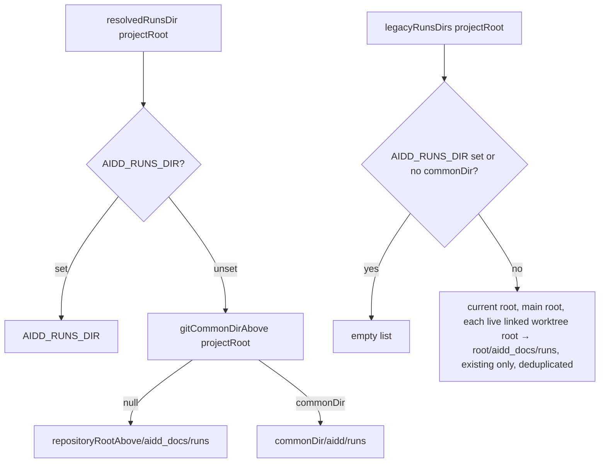
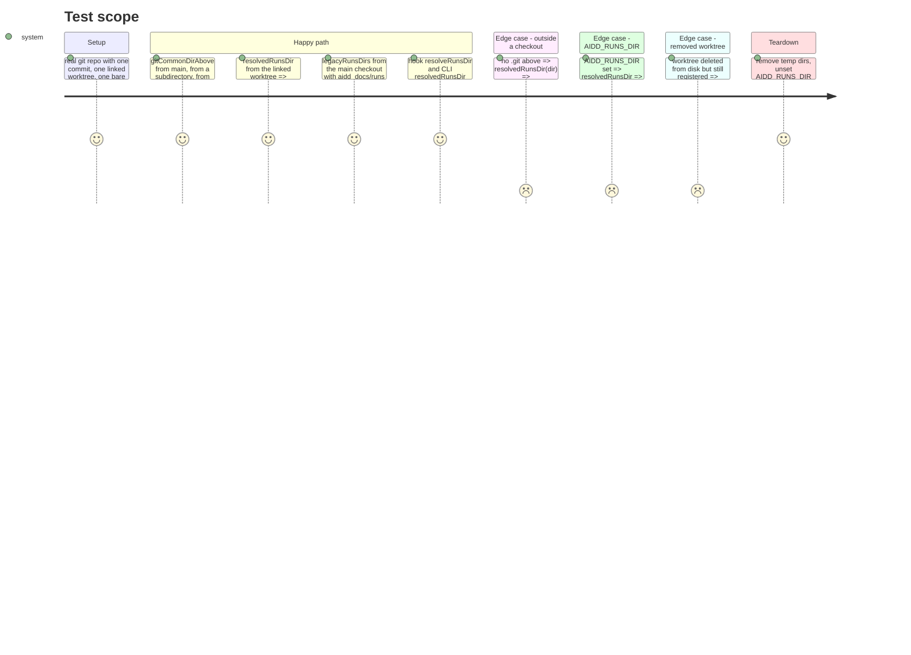

# Instruction: The CLI resolves the same directory and the legacy ones

## Architecture projection

> Tree of the final files. ✅ create · ✏️ modify · ❌ delete

```txt
.
└── cli/
    ├── src/kernel/
    │   ├── paths.ts                                              ✏️ resolvedRunsDir → common dir; new legacyRunsDirs
    │   └── reading/
    │       └── git-common-dir.ts                                 ✅ gitCommonDirAbove, worktreeRootsOf (file reads, no git spawn)
    └── tests/
        ├── kernel/reading/git-common-dir.unit.test.ts            ✅ plain, linked, bare-clone worktree, broken pointer, outside
        ├── kernel/paths.unit.test.ts                             ✏️ resolvedRunsDir and legacyRunsDirs cases
        ├── helpers/telemetry-journal-hook.ts                     ✏️ declare resolveRunsDir on the hook's repo module
        └── integration/run-journal-location-agrees.integration.test.ts  ✅ hook (git rev-parse) and CLI (files) agree
```

## User Journey



## Test Scope



## Tasks to do

### `1)` Find the common git directory from files

> Answer what `git rev-parse --git-common-dir` answers, without spawning git.

1. Write `cli/tests/kernel/reading/git-common-dir.unit.test.ts` first (vitest, temp dirs via `mkdtemp(join(tmpdir(), "aidd-common-dir-"))`, real `git` through `execFileSync("git", [...], { cwd, env: environmentWithoutGitVariables(process.env) })` imported from `../../../src/runtime/git/git-environment.js`). Compare paths with `realpathSync.native` on both sides and `samePath` from `src/kernel/paths.ts`. Cases:
   - plain repo `r` (git init, `git commit --allow-empty -m seed` with `-c user.email=t@e -c user.name=t`): `gitCommonDirAbove(r)` and `gitCommonDirAbove(join(r, "a", "b"))` (create the subdir) both name `r/.git`;
   - linked worktree `w` (`git worktree add -q <w>` from `r`): `gitCommonDirAbove(w)` names `r/.git`;
   - bare clone: `git clone -q --bare r b.git`, then `git -C b.git worktree add -q <bw>`: `gitCommonDirAbove(bw)` names `b.git`;
   - broken pointer: a dir whose `.git` file contains `gitdir: /does/not/exist/.git/worktrees/x`: answers `resolve(dir, "/does/not/exist/.git/worktrees/x")` (the git dir itself, since no `commondir` file can be read);
   - outside any checkout (a fresh temp dir): answers `null`;
   - `worktreeRootsOf(r/.git)` answers `[r, w]` in that order; after `rm -rf w` (no `git worktree prune`), answers `[r]`;
   - `worktreeRootsOf(b.git)` answers `[bw]` (a bare clone has no main working tree).
   Run it: it fails because the module does not exist.
2. Create `cli/src/kernel/reading/git-common-dir.ts`:

   ```ts
   import { existsSync, readdirSync, readFileSync, statSync } from "node:fs";
   import { basename, dirname, join, resolve } from "node:path";
   import { repositoryRootAbove } from "./repository-root.js";

   const GIT_DIR_NAME = ".git";
   const GITDIR_POINTER = /^gitdir:\s*(.+?)\s*$/mu;

   /** The clone's common git directory for the checkout `start` sits in, absolute, as
    * `git rev-parse --git-common-dir` answers it — `null` outside any checkout. Read from
    * files rather than by spawning git, like `repositoryRootAbove`: a `.git` directory is its
    * own common dir; a `.git` file points at a worktree's git dir, whose `commondir` file
    * points at the shared one. A pointer whose `commondir` cannot be read answers the git dir
    * itself, which is what git does for a submodule. */
   export function gitCommonDirAbove(start: string): string | null {
     const root = repositoryRootAbove(start);
     const dotGit = join(root, GIT_DIR_NAME);
     let isDirectory: boolean;
     try {
       isDirectory = statSync(dotGit).isDirectory();
     } catch {
       return null;
     }
     if (isDirectory) return dotGit;
     const gitDir = readGitDirPointer(root, dotGit);
     if (gitDir === null) return null;
     try {
       return resolve(gitDir, readFileSync(join(gitDir, "commondir"), "utf8").trim());
     } catch {
       return gitDir;
     }
   }

   function readGitDirPointer(root: string, dotGitFile: string): string | null {
     try {
       const match = GITDIR_POINTER.exec(readFileSync(dotGitFile, "utf8"));
       return match?.[1] ? resolve(root, match[1]) : null;
     } catch {
       return null;
     }
   }

   /** Every working tree a clone still registers and that still exists on disk: the main one
    * first (only a non-bare clone has one, its common dir being `<root>/.git`), then each
    * linked worktree, by its entry name. A worktree deleted without `git worktree prune`
    * keeps its entry but names a directory that is gone, so it is skipped. */
   export function worktreeRootsOf(commonDir: string): readonly string[] {
     const roots: string[] = [];
     if (basename(commonDir) === GIT_DIR_NAME) roots.push(dirname(commonDir));
     const worktreesDir = join(commonDir, "worktrees");
     let entries: string[];
     try {
       entries = readdirSync(worktreesDir);
     } catch {
       return roots;
     }
     for (const entry of entries.sort()) {
       try {
         const pointer = readFileSync(join(worktreesDir, entry, "gitdir"), "utf8").trim();
         const root = dirname(resolve(worktreesDir, entry, pointer));
         if (existsSync(root)) roots.push(root);
       } catch {
         // A half-pruned entry names nothing.
       }
     }
     return roots;
   }
   ```

3. Run the unit test: green.

### `2)` Move `resolvedRunsDir` and add `legacyRunsDirs`

> One resolver for the primary directory, one for the read-only legacy ones.

1. In `cli/tests/kernel/paths.unit.test.ts` add `describe("resolvedRunsDir()")` and `describe("legacyRunsDirs()")` with real temp git repos (same setup as task 1; `afterEach` deletes `process.env.AIDD_RUNS_DIR`):
   - `resolvedRunsDir(r)` → `join(r/.git, "aidd", "runs")` (compare with `samePath` after `realpathSync.native` of `r/.git`, then join);
   - `resolvedRunsDir(w)` for the linked worktree → the same value;
   - `resolvedRunsDir(outside)` for a temp dir with no `.git` → `join(outside, "aidd_docs", "runs")`;
   - with `process.env.AIDD_RUNS_DIR = "/custom/runs"` → `"/custom/runs"`, and `legacyRunsDirs(r)` → `[]`;
   - `legacyRunsDirs(r)` with `r/aidd_docs/runs` and `w/aidd_docs/runs` both created → two entries, `r`'s first; from `w` → two entries, `w`'s first;
   - `legacyRunsDirs(r)` with only `w/aidd_docs/runs` created → only `w`'s;
   - `legacyRunsDirs(outside)` → `[]`.
   Run: fails.
2. In `cli/src/kernel/paths.ts`:
   - add imports: `existsSync` from `node:fs`; `gitCommonDirAbove`, `worktreeRootsOf` from `./reading/git-common-dir.js`;
   - add, below `RUNS_ENTRY`:

   ```ts
   /** Where the run journal lives under a clone's common git directory. Spelled once here and
    * once in the hook's `repo.cjs`, which cannot import it; a parity test holds the two. */
   const RUNS_UNDER_GIT_DIR = ["aidd", "runs"] as const;
   ```

   - replace `resolvedRunsDir` and its doc comment with:

   ```ts
   /**
    * Where the run journal is written and read first — under the clone's common git directory,
    * which every worktree of one clone shares and `git worktree remove` never deletes. Outside
    * any checkout, `<projectRoot>/aidd_docs/runs` as before. The one resolver, so two readers
    * cannot disagree from a subdirectory or a worktree. `AIDD_RUNS_DIR` overrides it outright,
    * matching the hook.
    */
   export function resolvedRunsDir(projectRoot: string): string {
     if (process.env.AIDD_RUNS_DIR) return process.env.AIDD_RUNS_DIR;
     const commonDir = gitCommonDirAbove(projectRoot);
     return commonDir
       ? join(commonDir, ...RUNS_UNDER_GIT_DIR)
       : join(repositoryRootAbove(projectRoot), DOCS_DIR, RUNS_SUBDIR);
   }

   /**
    * Where the run journal lived before it moved under the common git directory: each live
    * checkout's own `aidd_docs/runs`, current checkout first, then the main one, then every
    * linked worktree — existing directories only, never written. Read so sessions journalled
    * before the move stay counted. Empty under `AIDD_RUNS_DIR`, which replaces every location,
    * and outside a checkout, where `resolvedRunsDir` already is that directory.
    */
   export function legacyRunsDirs(projectRoot: string): readonly string[] {
     if (process.env.AIDD_RUNS_DIR) return [];
     const commonDir = gitCommonDirAbove(projectRoot);
     if (commonDir === null) return [];
     const dirs: string[] = [];
     for (const root of [repositoryRootAbove(projectRoot), ...worktreeRootsOf(commonDir)]) {
       const dir = join(root, DOCS_DIR, RUNS_SUBDIR);
       if (!existsSync(dir) || dirs.some((known) => samePath(resolve(known), resolve(dir)))) continue;
       dirs.push(dir);
     }
     return dirs;
   }
   ```

   - add `resolve` to the existing `node:path` import if it is not there. `samePath` is defined lower in the same file; a function declaration is hoisted, so no reordering is needed.
3. Run `cd cli && pnpm test`. Expected: the new tests pass. Existing tests that seeded `aidd_docs/runs` inside a temp dir carrying a `.git` now find the primary directory empty; they are fixed in phase 3, not here. If any test outside `run-journal-*`, `telemetry-*` e2e and `forget-telemetry-*` fails, stop and report.

### `3)` Hold the hook and the CLI to one location

> A parity test across the language boundary, like the trailer one.

1. In `cli/tests/helpers/telemetry-journal-hook.ts`, add to `JournalRepoModule`:

   ```ts
   /** `null` when telemetry is off or the directory is outside a checkout. */
   resolveRunsDir(cwd: string): { readonly dir: string; readonly repoRoot: string } | null;
   ```

2. Create `cli/tests/integration/run-journal-location-agrees.integration.test.ts`:
   - `describe("the hook and the CLI resolve the run journal to one directory")`;
   - `beforeEach`: delete `process.env.AIDD_RUNS_DIR` and `process.env.AIDD_TELEMETRY`; build temp fixtures as in task 1 (plain repo `r` with a commit, linked worktree `w`, bare clone `b.git` with worktree `bw`), and write `.aidd/config.json` = `{"telemetry":{"enabled":true}}` into `r`, `w` and `bw`;
   - `it.each` over `["the main checkout", r]`, `["a subdirectory", join(r, "sub")]` (create it), `["a linked worktree", w]`, `["a bare clone's worktree", bw]`: assert `journalRepo.resolveRunsDir(cwd)` is not null and `samePath(canon(hookDir), canon(resolvedRunsDir(cwd)))`, where `canon(p)` = `join(realpathSync.native(dirname(dirname(p))), "aidd", "runs")` (the `runs` dir may not exist yet; its grandparent, the common dir, does);
   - `it("agrees that AIDD_RUNS_DIR wins")`: set `process.env.AIDD_RUNS_DIR` to a temp dir, assert both answer exactly that string;
   - `afterEach`: delete env vars, `rm` the temp root.
3. Run `cd cli && pnpm vitest run tests/integration/run-journal-location-agrees.integration.test.ts`: green. Mutation check: temporarily change `RUNS_UNDER_GIT_DIR` in `paths.ts` to `["aidd", "run"]`, see this test go red, revert.

## Test acceptance criteria

| Task | Acceptance criteria |
| ---- | ------------------- |
| 1 | From a main checkout, a subdirectory, a linked worktree and a bare clone's worktree, `gitCommonDirAbove` names the directory `git rev-parse --git-common-dir` names; outside any checkout it answers `null`. |
| 1 | `worktreeRootsOf` lists the main root first then live linked worktrees, skips a deleted one, and lists no main root for a bare clone. |
| 2 | `resolvedRunsDir` answers `<common dir>/aidd/runs` inside any checkout, `<dir>/aidd_docs/runs` outside, and `AIDD_RUNS_DIR` when set. |
| 2 | `legacyRunsDirs` lists every existing `aidd_docs/runs` of the clone's live checkouts, current first, without duplicates, and is empty under `AIDD_RUNS_DIR` or outside a checkout. |
| 3 | The hook and the CLI resolve the same directory from each of the four checkout shapes, and a one-segment change on the CLI side turns the parity test red. |
