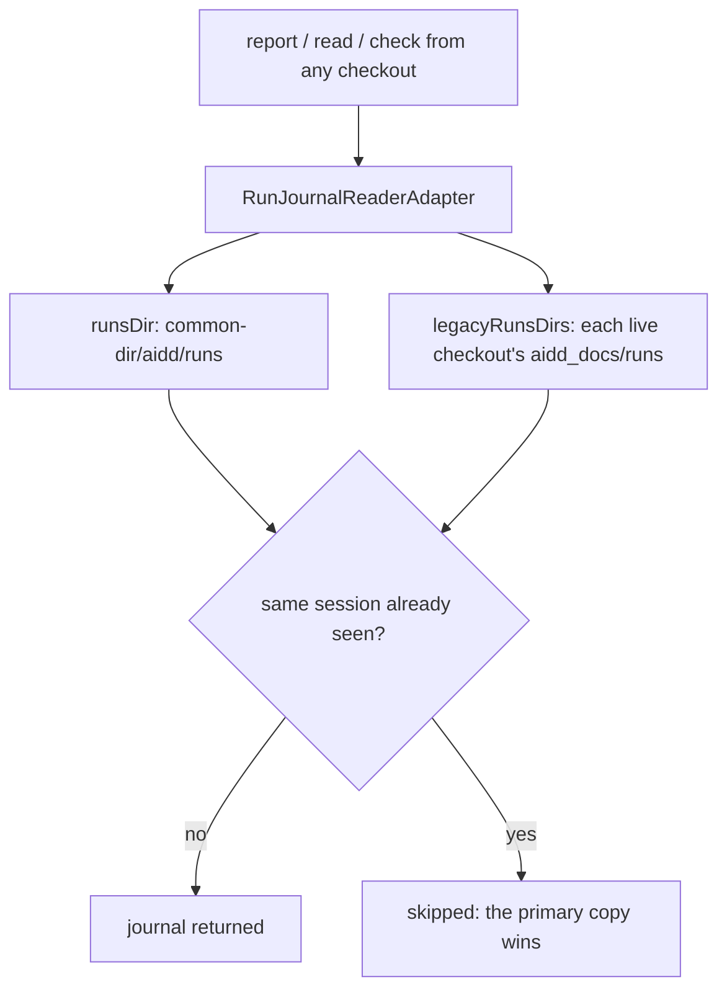
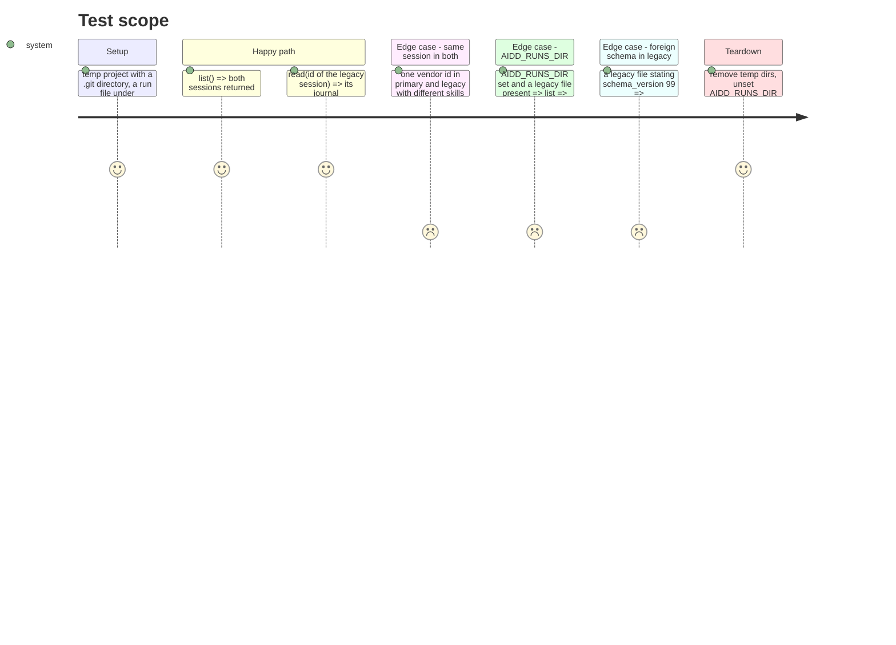

# Instruction: The journal reader reads the new directory and every legacy one

## Architecture projection

> Tree of the final files. ✅ create · ✏️ modify · ❌ delete

```txt
.
└── cli/
    ├── src/contexts/telemetry/
    │   ├── domain/ports/run-journal-reader.ts                     ✏️ RunJournalStore gains legacyRunsDirs and listRunFilesIn
    │   └── infrastructure/run-journal-reader-adapter.ts           ✏️ reads primary then legacy; primary wins per session
    └── tests/
        ├── helpers/ports/in-memory-run-journal-reader.ts          ✏️ double implements the two new members
        └── contexts/telemetry/infrastructure/
            └── run-journal-reader-adapter.integration.test.ts     ✏️ new cases for common dir, legacy, precedence, override
```

`read-local-cost-use-case.ts`, `report-cost-use-case.ts` and `diagnose-telemetry-use-case.ts` call only `read`, `list` and `listForeignSchemas`; they get the legacy journals through the adapter with no change of their own. Do not edit them in this phase.

## User Journey



## Test Scope



## Tasks to do

### `1)` Widen the store port

> Say what a caller needs to name and remove every location.

1. In `cli/src/contexts/telemetry/domain/ports/run-journal-reader.ts`, in `RunJournalStore`, below `runsDir`, add:

   ```ts
   /** Where the run journal lived before it moved under the common git directory — each live
    * checkout's own `aidd_docs/runs`, read but never written. Empty under `AIDD_RUNS_DIR`.
    * Exposed for the same reason as `runsDir`: a caller removing files names these exact
    * directories rather than re-deriving them. */
   readonly legacyRunsDirs: readonly string[];
   /** Every run file's name directly in `dir`, one of `runsDir` or `legacyRunsDirs` — never
    * opened, never parsed, sorted. Never throws; an unreadable directory answers an empty list. */
   listRunFilesIn(dir: string): Promise<readonly string[]>;
   ```

2. In the doc comment of `listRunFiles()` (in `RunJournalReader`), add one sentence at the end: `Lists \`runsDir\` alone; \`listRunFilesIn\` names a legacy directory's files.`
3. In `RunJournalReader.list()` doc comment, add: `Reads \`runsDir\` first, then every legacy directory; a session already read from an earlier directory is skipped, so the primary copy wins.`

### `2)` Test the adapter first

> Describe the new reads, watch them fail.

In `cli/tests/contexts/telemetry/infrastructure/run-journal-reader-adapter.integration.test.ts`, inside the existing `describe("RunJournalReaderAdapter")`, add the cases below. Reuse the file's `RUN_ID`, `SESSION_ID`, `runFileLines`, `projectRoot`. Add a second run id constant `const OTHER_RUN_ID = "01ARZ3NDEKTSV4RRFFQ69G5FAW";` and a second session `const LEGACY_SESSION_ID = "33333333-3333-4333-8333-333333333333";` at the top. The fake second worktree is built from files, no git needed:

```ts
// A second checkout registered with this clone: `<projectRoot>/.git/worktrees/wt/gitdir`
// names `<other>/.git`, the way git records a linked worktree.
async function registerWorktree(other: string): Promise<void> {
  await mkdir(join(projectRoot, ".git", "worktrees", "wt"), { recursive: true });
  await mkdir(other, { recursive: true });
  await writeFile(join(other, ".git"), `gitdir: ${join(projectRoot, ".git", "worktrees", "wt")}\n`);
  await writeFile(join(projectRoot, ".git", "worktrees", "wt", "gitdir"), `${join(other, ".git")}\n`);
  await writeFile(join(projectRoot, ".git", "worktrees", "wt", "commondir"), "../..\n");
}
```

Cases (exact titles):

1. `reads a journal written under the common git directory`: `mkdir(join(projectRoot, ".git", "aidd", "runs"), { recursive: true })`, write `${RUN_ID}__${SESSION_ID}.jsonl` there with a `step_start` skill `from-common-dir`; `new RunJournalReaderAdapter(projectRoot).read(SESSION_ID)` returns that boundary.
2. `lists a journal still sitting in another live worktree's aidd_docs/runs`: `mkdir(join(projectRoot, ".git"))`, `const other = await mkdtemp(join(tmpdir(), "aidd-run-journal-other-"))`, `registerWorktree(other)`, write `${OTHER_RUN_ID}__${LEGACY_SESSION_ID}.jsonl` into `join(other, "aidd_docs", "runs")` with a `session_start` line (`type`, `at`, `run_id: OTHER_RUN_ID`, `tool: "claude-code"`, `vendor_id: LEGACY_SESSION_ID`, `schema_version: 2`); `list()` returns one journal whose `session.vendor_id` is `LEGACY_SESSION_ID`; `read(LEGACY_SESSION_ID)` is not null. Remove `other` at the end.
3. `prefers the common git directory's copy when one session has a file in both`: `.git` dir, write the same `${RUN_ID}__${SESSION_ID}.jsonl` name into `.git/aidd/runs` (skill `primary`) and into `projectRoot/aidd_docs/runs` (skill `legacy`); `read(SESSION_ID)` boundaries show skill `primary`; `list()` has length 1 with skill `primary`.
4. `reads nothing but AIDD_RUNS_DIR when it is set, even with legacy journals present`: `.git` dir, a file in `projectRoot/aidd_docs/runs` with vendor `SESSION_ID`, `process.env.AIDD_RUNS_DIR` = temp dir holding `${OTHER_RUN_ID}__${LEGACY_SESSION_ID}.jsonl`; `list()` returns exactly one journal (the override's, by `session.vendor_id` or by boundary skill); `adapter.legacyRunsDirs` equals `[]`.
5. `reports a foreign schema found in a legacy directory`: `.git` dir, a legacy file in `projectRoot/aidd_docs/runs` whose first line is a `session_start` with `schema_version: 99`; `listForeignSchemas()` equals `[99]`.
6. `names a legacy directory's run files by name`: `.git` dir, two files in `projectRoot/aidd_docs/runs` (`${RUN_ID}__a.jsonl`, `${OTHER_RUN_ID}__b.jsonl`) plus `notes.txt`; `adapter.legacyRunsDirs` has one entry equal (by `samePath`) to `join(projectRoot, "aidd_docs", "runs")`; `listRunFilesIn(thatEntry)` equals the two `.jsonl` names sorted; `listRunFiles()` equals `[]`.

Run `cd cli && pnpm vitest run tests/contexts/telemetry/infrastructure/run-journal-reader-adapter.integration.test.ts`: the new cases fail (no `legacyRunsDirs`, no `listRunFilesIn`, legacy not read).

### `3)` Read primary then legacy in the adapter

> One ordered list of directories; the first file for a session wins.

In `cli/src/contexts/telemetry/infrastructure/run-journal-reader-adapter.ts`:

1. Imports: add `resolve` to the `node:path` import; change the `paths.js` import to `import { legacyRunsDirs, resolvedRunsDir, samePath } from "../../../kernel/paths.js";`.
2. Replace `matchesVendorId` with two functions, keeping the comment above it:

   ```ts
   // Mirrors record.cjs's parseRunFileName: split on the fixed ULID length, never on "__",
   // since a sanitized vendor id can itself contain that substring. `null` for any name that
   // is not a run file, `_unrecognised.jsonl` included.
   function vendorSegmentOf(entry: string): string | null {
     if (!entry.endsWith(RUN_FILE_EXTENSION)) return null;
     const minLength = ULID_LENGTH + "__".length + RUN_FILE_EXTENSION.length;
     if (entry.length <= minLength) return null;
     if (entry.slice(ULID_LENGTH, ULID_LENGTH + 2) !== "__") return null;
     return entry.slice(ULID_LENGTH + 2, -RUN_FILE_EXTENSION.length);
   }

   function matchesVendorId(entry: string, wantedSegment: string): boolean {
     return vendorSegmentOf(entry) === wantedSegment;
   }
   ```

3. In the class doc comment, append: `Reads \`runsDir\` first, then every legacy directory, both resolved once in the constructor; the first file found for a session wins.`
4. Class body changes:
   - add field `readonly legacyRunsDirs: readonly string[];`;
   - constructor: after `this.runsDir = resolvedRunsDir(projectRoot);` add `this.legacyRunsDirs = legacyRunsDirs(projectRoot).filter((dir) => !samePath(resolve(dir), resolve(this.runsDir)));`;
   - add private getter:

   ```ts
   private get readDirs(): readonly string[] {
     return [this.runsDir, ...this.legacyRunsDirs];
   }
   ```

   - `read(sessionId)`:

   ```ts
   async read(sessionId: string): Promise<RunJournal | null> {
     for (const dir of this.readDirs) {
       const filePath = await this.findRunFile(dir, sessionId);
       if (filePath) return this.readJournal(filePath);
     }
     return null;
   }
   ```

   - `list()`:

   ```ts
   async list(): Promise<readonly RunJournal[]> {
     const journals: RunJournal[] = [];
     const seen = new Set<string>();
     for (const dir of this.readDirs) {
       for (const entry of await this.listRunFilesIn(dir)) {
         const segment = vendorSegmentOf(entry);
         if (segment !== null) {
           if (seen.has(segment)) continue;
           seen.add(segment);
         }
         const journal = await this.readJournal(join(dir, entry));
         if (journal) journals.push(journal);
       }
     }
     return journals;
   }
   ```

   - `listForeignSchemas()`: loop `for (const dir of this.readDirs) for (const fileName of await this.listRunFilesIn(dir))`, collecting from `join(dir, fileName)`; body otherwise unchanged.
   - `listRunFiles()` becomes `return this.listRunFilesIn(this.runsDir);`
   - add:

   ```ts
   async listRunFilesIn(dir: string): Promise<readonly string[]> {
     try {
       const entries = await readdir(dir);
       return entries.filter((entry) => entry.endsWith(RUN_FILE_EXTENSION)).sort();
     } catch {
       return [];
     }
   }
   ```

   `deleteRunFile` and `findRunFile` stay as they are.

   Note: `list()` used to read every `.jsonl` (including `_unrecognised.jsonl`) and drop what does not parse; it still does, since `listRunFilesIn` keeps every `.jsonl` and only names with a vendor segment take part in the seen-set.

### `4)` Update the in-memory double

> Tests that use the double must compile and behave as before.

In `cli/tests/helpers/ports/in-memory-run-journal-reader.ts`:

1. In `InMemoryRunJournalReader` add:

   ```ts
   /** Settable, like `runFileNames`: what a legacy directory holds, by directory. */
   legacyRunsDirs: readonly string[] = [];
   readonly legacyRunFileNames = new Map<string, string[]>();

   async listRunFilesIn(dir: string): Promise<readonly string[]> {
     return dir === this.runsDir ? this.runFileNames : (this.legacyRunFileNames.get(dir) ?? []);
   }
   ```

2. In `deleteRunFile`, after the `undeletable` check and `deletedFromDirs.push(dir)`: if `dir === this.runsDir` filter `runFileNames` as today; otherwise replace the map entry for `dir` with its list minus `fileName`. Always `deletedFiles.push(fileName)`.
3. In `NULL_RUN_JOURNAL_READER` add `legacyRunsDirs: []` and `listRunFilesIn: async () => []`.

### `5)` Run

1. `cd cli && pnpm vitest run tests/contexts/telemetry`: green except `forget-telemetry-use-case.unit.test.ts` if it now fails (handled in phase 4).
2. `cd cli && pnpm test`: the only allowed failures are in `tests/e2e/telemetry-forget.e2e.test.ts` and `tests/e2e/telemetry-check.e2e.test.ts` (phase 4). Anything else failing: stop and report.

## Test acceptance criteria

| Task | Acceptance criteria |
| ---- | ------------------- |
| 1 | `RunJournalStore` exposes `legacyRunsDirs` and `listRunFilesIn`, and the typecheck passes with the adapter and both doubles implementing them. |
| 2 | Before task 3, the six new cases fail. |
| 3 | A journal under `<common dir>/aidd/runs` is read; a journal in another live worktree's `aidd_docs/runs` is listed and readable by its session id. |
| 3 | When one session has a file in both places, only the common-dir copy is returned by `read` and by `list`. |
| 3 | With `AIDD_RUNS_DIR` set, no legacy directory is read and `legacyRunsDirs` is empty. |
| 3 | A foreign schema in a legacy file is reported by `listForeignSchemas`. |
| 5 | The whole CLI suite passes apart from the forget and check e2e files named in task 5. |
