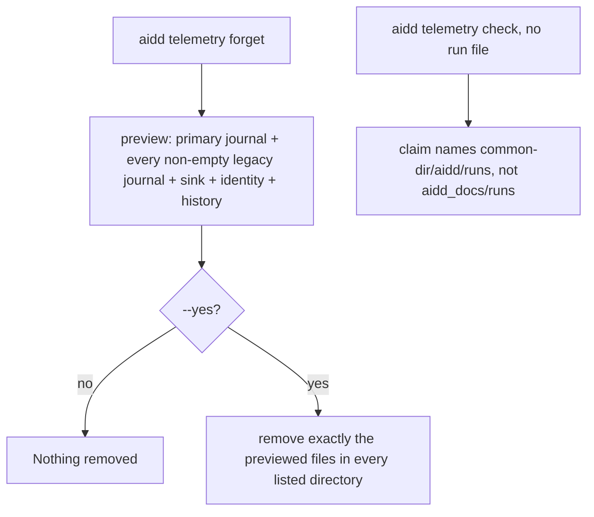

# Instruction: Forget removes every location, check names the real one

## Architecture projection

> Tree of the final files. ✅ create · ✏️ modify · ❌ delete

```txt
.
└── cli/
    ├── src/
    │   ├── contexts/telemetry/
    │   │   ├── domain/telemetry-removal.ts                         ✏️ preview gains legacyJournals; emptiness counts them
    │   │   └── application/
    │   │       ├── forget-telemetry-use-case.ts                    ✏️ previews and removes legacy journals too
    │   │       └── diagnose-telemetry-use-case.ts                  ✏️ runsDirLabel is the reader's real runsDir
    │   └── presentation/display/telemetry-forget-display.ts        ✏️ one preview line per legacy journal
    └── tests/
        ├── contexts/telemetry/domain/telemetry-removal.unit.test.ts             ✏️ legacy-only preview is not empty
        ├── contexts/telemetry/application/forget-telemetry-use-case.unit.test.ts ✏️ legacy preview and removal
        ├── contexts/telemetry/application/diagnose-telemetry-use-case.unit.test.ts ✏️ label is the double's runsDir
        └── presentation/display/telemetry-forget-display.unit.test.ts           ✏️ legacy line printed
```

The `history` reading (`listTrackedFiles` / `hasHistoryFor` on `RUNS_ENTRY`) stays exactly as it is: legacy `aidd_docs/runs/` files may still be committed somewhere, and that is what it reports.

## User Journey



## Test Scope

```mermaid
---
title: Test scope
---
journey
  section Setup
    in-memory store with one primary file and one legacy dir holding two files => preview inputs ready: 5: system
  section Happy path
    preview => legacyJournals lists the legacy dir with its two names: 5: system
    remove(preview) => deletes in both dirs; outcome removed = 3: 5: system
    forget e2e on a git project with files in aidd_docs/runs => they are removed: 5: cli
  section Edge case - empty legacy dir
    legacy dir with no run file => preview => it is not listed: 1: system
  section Edge case - only legacy has files
    primary, sink and identity empty, a legacy file present => telemetryRemovalIsEmpty => false: 1: system
  section Edge case - check label
    no run file anywhere => check => the claim names the reader's runsDir: 1: system
```

## Tasks to do

### `1)` Tests first

> Pin legacy preview, removal, emptiness, display and the check label.

1. `cli/tests/contexts/telemetry/domain/telemetry-removal.unit.test.ts`: add `it("is not empty when only a legacy journal holds run files")` building a preview whose `journal.runFileNames`, `sink.dayFileNames` are `[]`, `identity.present` is `false`, and `legacyJournals: [{ scope: "project", path: "/wt/aidd_docs/runs", runFileNames: ["a.jsonl"] }]`; expect `telemetryRemovalIsEmpty(preview)` to be `false`. Every existing preview literal in this file gets `legacyJournals: []`.
2. `cli/tests/contexts/telemetry/application/forget-telemetry-use-case.unit.test.ts`, using `InMemoryRunJournalReader`:
   - `it("previews every legacy journal that holds run files, and leaves out an empty one")`: `reader.legacyRunsDirs = ["/fake/wt/aidd_docs/runs", "/fake/empty/aidd_docs/runs"]`, `reader.legacyRunFileNames.set("/fake/wt/aidd_docs/runs", ["x.jsonl", "y.jsonl"])`; `preview.legacyJournals` equals `[{ scope: "project", path: "/fake/wt/aidd_docs/runs", runFileNames: ["x.jsonl", "y.jsonl"] }]`.
   - `it("removes the previewed legacy files from their own directory and counts them with the project journal")`: same setup plus `reader.runFileNames = ["p.jsonl"]`; `remove(preview)`; `result.journal.removed` is `3`, `reader.deletedFromDirs` contains `"/fake/wt/aidd_docs/runs"` twice and `reader.runsDir` once, `reader.legacyRunFileNames.get("/fake/wt/aidd_docs/runs")` is `[]`.
   - `it("reports a legacy file that refuses removal by its name and still removes the rest")`: `reader.undeletable.add("x.jsonl")`; `result.journal.removed` is `1` (`y.jsonl`), `result.journal.failed` is `[{ path: "x.jsonl", reason: "cannot delete x.jsonl" }]`.
3. `cli/tests/presentation/display/telemetry-forget-display.unit.test.ts`: every preview literal gets `legacyJournals: []`; add a case where `legacyJournals` holds `{ scope: "project", path: "/wt/aidd_docs/runs", runFileNames: ["a.jsonl", "b.jsonl"] }` and assert the printed output contains exactly the line `  An earlier run journal, from before it moved under the git directory (/wt/aidd_docs/runs): 2 run file(s)`, printed after the `This project's run journal` line and before the `This machine's stored records` line.
4. `cli/tests/contexts/telemetry/application/diagnose-telemetry-use-case.unit.test.ts`, test `names the runs directory in the claim that found no run file` (around line 933): expected detail starts with `"no run file in /fake/project/aidd_docs/runs — the hook has never been observed firing, and the "` (the double's `runsDir`). Search the file for every other `"aidd_docs/runs"` inside an expected string (`grep -n "in aidd_docs/runs" ...`) and change each to `/fake/project/aidd_docs/runs`.
5. Run these four files: they fail (type errors on `legacyJournals`, wrong label).

### `2)` Carry legacy journals in the removal preview

> The type says every place a removal touches.

In `cli/src/contexts/telemetry/domain/telemetry-removal.ts`:

1. In `TelemetryProjectJournalRemoval`, change the `path` doc comment to: `/** The run journal's own directory: \`RunJournalStore.runsDir\`, or one of its \`legacyRunsDirs\`. */`
2. In `TelemetryRemovalPreview`, below `journal`, add:

   ```ts
   /** Each pre-move `aidd_docs/runs` of a live checkout of this clone that still holds run
    * files, as `RunJournalStore.legacyRunsDirs` resolved them. Empty is the ordinary answer. */
   readonly legacyJournals: readonly TelemetryProjectJournalRemoval[];
   ```

3. In `telemetryRemovalIsEmpty`, add the condition `preview.legacyJournals.every((legacy) => legacy.runFileNames.length === 0) &&` right after the `preview.journal.runFileNames.length === 0 &&` line.

### `3)` Preview and remove legacy journals in forget

> Same rule as everything else in forget: remove exactly what was shown.

In `cli/src/contexts/telemetry/application/forget-telemetry-use-case.ts`:

1. In `preview()`, after the `Promise.all` destructuring, add:

   ```ts
   const legacyJournals = await this.legacyJournals();
   ```

   and return `legacyJournals` in the object, right after `journal`.
2. Add the private method below `preview()`:

   ```ts
   // Only a directory still holding run files is shown: an empty pre-move directory is
   // nothing to remove and nothing to confirm.
   private async legacyJournals(): Promise<readonly TelemetryProjectJournalRemoval[]> {
     const found: TelemetryProjectJournalRemoval[] = [];
     for (const path of this.runJournalReader.legacyRunsDirs) {
       const runFileNames = await this.runJournalReader.listRunFilesIn(path);
       if (runFileNames.length > 0) found.push({ scope: "project", path, runFileNames });
     }
     return found;
   }
   ```

3. Replace `remove()` with:

   ```ts
   async remove(preview: TelemetryRemovalPreview): Promise<TelemetryRemovalResult> {
     const [journal, legacy, sink, identity] = await Promise.all([
       this.removeJournal(preview.journal),
       Promise.all(preview.legacyJournals.map((legacyJournal) => this.removeJournal(legacyJournal))),
       this.removeSink(preview.sink),
       this.removeIdentity(preview.identity),
     ]);
     return { journal: mergeOutcomes([journal, ...legacy]), sink, identity, history: preview.history };
   }
   ```

4. Add at module level, below the interfaces:

   ```ts
   /** One count for the project's journals, wherever each file sat: a person confirmed one
    * "run journal", and the result answers in the same unit. */
   function mergeOutcomes(outcomes: readonly TelemetryRemovalOutcome[]): TelemetryRemovalOutcome {
     return {
       removed: outcomes.reduce((sum, outcome) => sum + outcome.removed, 0),
       failed: outcomes.flatMap((outcome) => outcome.failed),
     };
   }
   ```

5. `removeJournal` is unchanged: it already deletes from `journal.path`, the directory the person was shown.

### `4)` Print legacy journals in the forget preview

In `cli/src/presentation/display/telemetry-forget-display.ts`, in `printTelemetryForgetPreview`, right after the `This project's run journal (...)` `output.print(...)` call, add:

```ts
for (const legacy of preview.legacyJournals) {
  output.print(
    `  An earlier run journal, from before it moved under the git directory (${legacy.path}): ` +
      `${legacy.runFileNames.length} run file(s)`
  );
}
```

`printTelemetryForgetResult` is unchanged (the merged outcome prints under `This project's run journal`).

### `5)` Name the real directory in check

In `cli/src/contexts/telemetry/application/diagnose-telemetry-use-case.ts`:

1. Delete `const DEFAULT_RUNS_DIR_LABEL = "aidd_docs/runs";`.
2. Change the constructor parameter type `private readonly runJournalReader: RunJournalReader` to `RunJournalStore`, and the type import accordingly (`import type { RunJournal, RunJournalStore } from "../domain/ports/run-journal-reader.js";` — keep whatever else that import already names). The wiring in `src/runtime/wiring/telemetry.ts` already passes the adapter, which implements `RunJournalStore`; do not change the wiring.
3. In `gatherEvidence`, `runsDirLabel: DEFAULT_RUNS_DIR_LABEL` becomes `runsDirLabel: this.runJournalReader.runsDir`.

### `6)` Run

1. The four test files from task 1: green.
2. `cd cli && pnpm test`: fully green, `tests/e2e/telemetry-forget.e2e.test.ts` and `tests/e2e/telemetry-check.e2e.test.ts` included. If a forget e2e still fails, read its assertion: a project created with `gitInit` now has its seeded `aidd_docs/runs` files listed as a legacy journal and removed through it, which is the intended behaviour; fix production code, not the e2e, unless the e2e asserts the old `aidd_docs/runs` text of the check label.
3. From the repository root: `pnpm exec lefthook run pre-commit` and `pnpm exec lefthook run pre-push`: green.

## Test acceptance criteria

| Task | Acceptance criteria |
| ---- | ------------------- |
| 2 | A preview whose only content is a legacy journal with run files is not empty. |
| 3 | The forget preview lists each legacy directory holding run files, with their names, and omits an empty one. |
| 3 | Confirming removes the previewed files from their own legacy directory, counted together with the primary journal; a file refusing removal is reported by name and the rest are still removed. |
| 4 | The preview prints one `An earlier run journal ...` line per legacy directory, between the project journal line and the machine records line. |
| 5 | `aidd telemetry check` with no run file names the reader's real `runsDir` instead of `aidd_docs/runs`. |
| 6 | The whole CLI suite, pre-commit and pre-push pass. |
