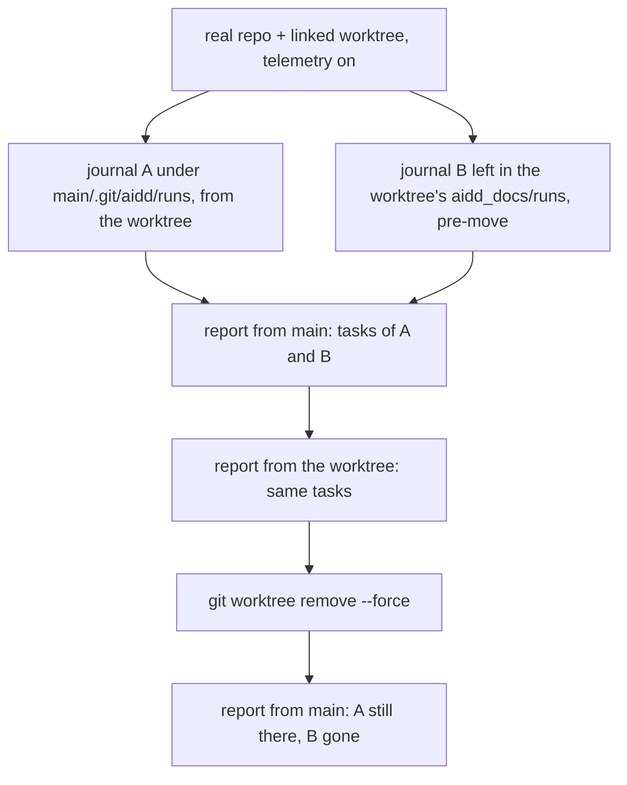
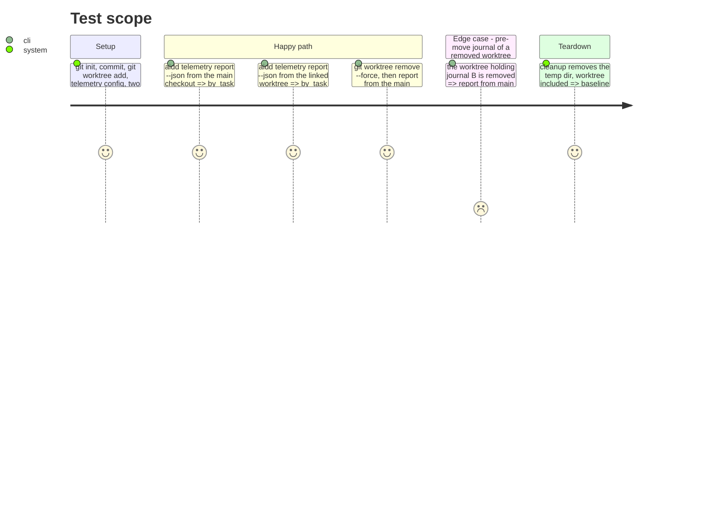

# Instruction: End-to-end proof on real worktrees

## Architecture projection

> Tree of the final files. ✅ create · ✏️ modify · ❌ delete

```txt
.
└── cli/tests/e2e/
    └── telemetry-worktree-journal.e2e.test.ts     ✅ the issue's QA, through the built CLI on real git worktrees
```

No production code changes in this phase. If a case fails, the defect is in phases 2 to 4: fix it there, re-run that phase's gate, then come back.

## User Journey



## Test Scope



## Tasks to do

### `1)` Write the end-to-end test

> Prove #932's QA through the real binary.

Create `cli/tests/e2e/telemetry-worktree-journal.e2e.test.ts`. Model it on `cli/tests/e2e/telemetry-task-midsession.e2e.test.ts`: same imports style, same `record()` helper, same `Envelope`/`TaskRow` interfaces, same `taskRowOfCost` helper, same `afterEach(cleanup)` pattern.

1. Imports:

   ```ts
   import { execFileSync } from "node:child_process";
   import { mkdir, writeFile } from "node:fs/promises";
   import { join } from "node:path";
   import { afterEach, describe, expect, it } from "vitest";
   import { environmentWithoutGitVariables } from "../../src/runtime/git/git-environment.js";
   import { createTestEnv, gitInit, runCli } from "./helpers.js";
   ```

2. Constants:

   ```ts
   const PROJECT_ID = "acme/worktrees";
   const PERIOD = ["--from", "2026-02-01", "--to", "2026-02-28"];
   const ALPHA_TASK = "2026_02/2026_02_10_alpha";
   const BETA_TASK = "2026_02/2026_02_10_beta";
   // A: journalled where the hook now writes. B: left in a worktree by a pre-move hook.
   const RUN_A = "01ARZ3NDEKTSV4RRFFQ69G5FA1";
   const VENDOR_A = "aaaaaaaa-aaaa-4aaa-8aaa-aaaaaaaaaaaa";
   const RUN_B = "01ARZ3NDEKTSV4RRFFQ69G5FB1";
   const VENDOR_B = "bbbbbbbb-bbbb-4bbb-8bbb-bbbbbbbbbbbb";
   const WORKTREE_NAME = "agent-wt";
   ```

3. Helpers:

   ```ts
   function git(cwd: string, args: readonly string[]): void {
     execFileSync("git", ["-c", "user.email=t@example.com", "-c", "user.name=Test", ...args], {
       cwd,
       env: environmentWithoutGitVariables(process.env),
     });
   }

   function journal(runId: string, vendorId: string, task: string, startAt: string): string {
     const lines = [
       {
         type: "session_start",
         at: startAt,
         schema_version: 2,
         run_id: runId,
         tool: "codex",
         vendor_id: vendorId,
         project_id: PROJECT_ID,
         worktree_id: WORKTREE_NAME,
         worktree_repo_id: "project",
       },
       { type: "task_declared", at: startAt.replace(":00:00Z", ":10:00Z"), path: `aidd_docs/tasks/${task}/spec.md` },
     ];
     return `${lines.map((line) => JSON.stringify(line)).join("\n")}\n`;
   }
   ```

   Copy `record(overrides)` verbatim from `telemetry-task-midsession.e2e.test.ts` (it uses `PROJECT_ID`, defined above).

4. Sink records, one per session, each after its declaration:

   ```ts
   const RECORDS = [
     record({ vendor_id: VENDOR_A, turn_id: "a", event_timestamp: "2026-02-10T09:20:00Z", cost_usd: 2 }),
     record({ vendor_id: VENDOR_B, turn_id: "b", event_timestamp: "2026-02-10T11:20:00Z", cost_usd: 3 }),
   ];
   ```

5. `seed()` returns `{ projectDir, worktreeDir, fakeHome }`:
   1. `const env = await createTestEnv("telemetry-worktree-journal"); cleanup = env.cleanup;`
   2. `await gitInit(env.projectDir); git(env.projectDir, ["commit", "-q", "--allow-empty", "-m", "seed"]);`
   3. Ignore the project's own untracked files the way a real project does, so `git worktree add` and later commands see a clean tree: `await writeFile(join(env.projectDir, ".git", "info", "exclude"), ".aidd/\naidd_docs/\n");`
   4. `const worktreeDir = join(env.tempDir, WORKTREE_NAME); git(env.projectDir, ["worktree", "add", "-q", "-b", WORKTREE_NAME, worktreeDir]);`
   5. Telemetry on in both checkouts: write `{"telemetry":{"enabled":true}}` to `.aidd/config.json` in `env.projectDir` and in `worktreeDir` (create `.aidd` first).
   6. Journal A where the hook now writes: `const commonRuns = join(env.projectDir, ".git", "aidd", "runs"); await mkdir(commonRuns, { recursive: true }); await writeFile(join(commonRuns, \`${RUN_A}__${VENDOR_A}.jsonl\`), journal(RUN_A, VENDOR_A, ALPHA_TASK, "2026-02-10T09:00:00Z"));`
   7. Journal B where a pre-move hook wrote it: `const legacyRuns = join(worktreeDir, "aidd_docs", "runs"); await mkdir(legacyRuns, { recursive: true }); await writeFile(join(legacyRuns, \`${RUN_B}__${VENDOR_B}.jsonl\`), journal(RUN_B, VENDOR_B, BETA_TASK, "2026-02-10T11:00:00Z"));`
   8. Sink: `const sinkDir = join(env.fakeHome, ".config", "aidd", "telemetry"); await mkdir(sinkDir, { recursive: true }); await writeFile(join(sinkDir, "2026-02-28.jsonl"), \`${RECORDS.map((r) => JSON.stringify(r)).join("\n")}\n\`);`
   9. `return { projectDir: env.projectDir, worktreeDir, fakeHome: env.fakeHome };`

6. Cases, inside `describe("aidd telemetry report — sessions from every worktree of one clone, before and after removal")`:
   1. `it("counts a session journalled under the common git directory and one still in a live worktree, from the main checkout")`: `runCli(["telemetry", "report", ...PERIOD, "--json"], projectDir, fakeHome)`; exit code `0`; `taskRowOfCost(envelope, 2)?.task` is `ALPHA_TASK`; `taskRowOfCost(envelope, 3)?.task` is `BETA_TASK`.
   2. `it("counts the same sessions when the report runs from the linked worktree")`: same assertions with `worktreeDir` as cwd.
   3. `it("still counts the worktree's session once the worktree is removed")`: `seed()`, then `git(projectDir, ["worktree", "remove", "--force", worktreeDir])` (`--force` because journal B is an untracked file in it); report from `projectDir`; `taskRowOfCost(envelope, 2)?.task` is `ALPHA_TASK`; `taskRowOfCost(envelope, 3)?.task` is **not** `BETA_TASK` (a pre-move journal goes with its worktree, the accepted edge in `plan.md`).
   4. `it("never writes a session's journal into the worktree's own aidd_docs/runs")` is NOT added here: the hook's own suite (phase 1) proves it.

7. Run `cd cli && pnpm vitest run tests/e2e/telemetry-worktree-journal.e2e.test.ts` (the e2e project builds or locates the binary the way every other e2e file does; if it reports a missing `dist/cli.js`, run `cd cli && pnpm build` first). All three green.
8. Mutation check: in `cli/src/kernel/paths.ts`, temporarily make `legacyRunsDirs` return `[]`; case 1 and 2 must go red on `BETA_TASK`; revert. Then temporarily make `resolvedRunsDir` return `join(repositoryRootAbove(projectRoot), DOCS_DIR, RUNS_SUBDIR)` unconditionally; case 3 must go red on `ALPHA_TASK`; revert.
9. `cd cli && pnpm test`, then from the root `pnpm exec lefthook run pre-commit` and `pnpm exec lefthook run pre-push`: green.

## Test acceptance criteria

| Task | Acceptance criteria |
| ---- | ------------------- |
| 1 | From the main checkout, the report attributes a session journalled under the common git directory and a session still journalled in a live worktree's `aidd_docs/runs`, each to its task. |
| 1 | From the linked worktree, the report shows the same two attributions. |
| 1 | After `git worktree remove`, the session journalled under the common git directory is still attributed to its task. |
| 1 | Disabling legacy reading, or the common-dir location, turns the matching case red. |
