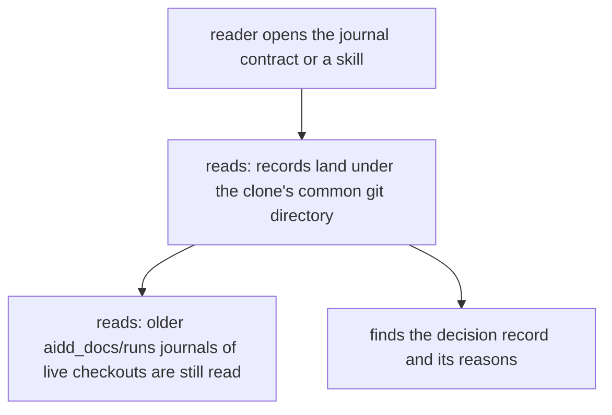
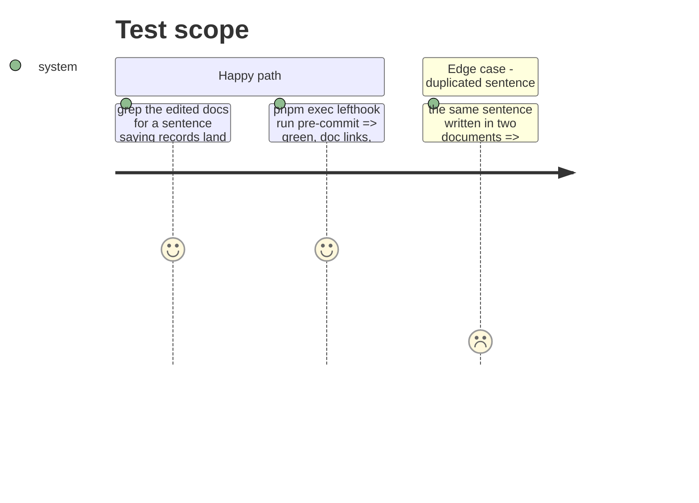

# Instruction: Decision record and docs

## Architecture projection

> Tree of the final files. ✅ create · ✏️ modify · ❌ delete

```txt
.
├── CLAUDE.md                                                     ✏️ only if the context gate asks for the new decision's bullet
├── aidd_docs/
│   ├── memory/internal/decisions/one-run-journal-per-clone.md    ✅ the decision #932 asks to write down
│   ├── memory/project-brief.md                                   ✏️ Run journal row: new location
│   └── runs/README.md                                            ✏️ where records land; worktree paragraph
├── cli/
│   ├── README.md                                                 ✏️ the aidd_docs/runs/ row
│   └── aidd_docs/memory/telemetry.md                             ✏️ "Lives at" bullet
├── docs/FAQ.md                                                   ✏️ stored-data table row
└── plugins/aidd-telemetry/
    ├── README.md                                                 ✏️ "Stored data" paragraph
    └── skills/00-init/actions/
        ├── 02-enable.md                                          ✏️ steps 1 and 3
        └── 03-verify.md                                          ✏️ step 1 command
```

Not changed, on purpose: `docs/ARCHITECTURE.md` and `aidd_docs/product/metrics-contract.md` only link to `aidd_docs/runs/README.md`, which stays the journal contract's home; `cli/.claude/skills/framework/references/post-install-pipeline.md` is still true (install still git-ignores `aidd_docs/runs/`).

## User Journey



## Test Scope



## Tasks to do

### `1)` Write the decision record

> #932's proposed solution, point 1: decide and write the decision down.

Create `aidd_docs/memory/internal/decisions/one-run-journal-per-clone.md` with exactly this content (fill nothing else in):

```markdown
# One run journal per clone, under its common git directory

- Date: 2026-10-09
- Status: Accepted — closes the open choice in #932, amends the per-worktree default kept after #693
- Decided by: proposed by Vincent Menard, for a maintainer to confirm or overturn

## Context

The hook wrote each session's journal at the root of the checkout it ran in, `<worktree>/aidd_docs/runs/`. The CLI read only the journal of the checkout it ran in, and the sink is filled only through that journal. `aidd telemetry on` git-ignores `aidd_docs/runs/`, and `git worktree remove` deletes a worktree whose only extra content is ignored without needing `--force`. A session an agent ran in its own worktree was therefore missing from every report outside that worktree, and lost for good once the worktree was removed. Agent runners give each agent its own worktree, so this was the common case.

The per-worktree default had two sound reasons: nothing should write into another branch's working tree, and a bare clone has no main working tree to write into.

## Decision

1. The run journal of a clone lives in one directory, `<git common dir>/aidd/runs/`, shared by every worktree of that clone. It is outside every working tree, so it is never committed, dirties no branch, and survives `git worktree remove`. A bare clone has a common dir too.
2. `AIDD_RUNS_DIR` still replaces that location entirely.
3. Journals already written to a live checkout's `aidd_docs/runs/` are still read, never written. The copy under the common git directory wins when one session has both.
4. `worktree_id` stays on the `session_start` line. The report gains no worktree axis: two worktrees that worked on one task add up. The 2026-08-31 decision requires an argument for a new axis, and none was made.

## Alternatives

- **Keep one journal per worktree and gather them at report time.** Solves the report, not the removal: the journal still goes with the worktree.
- **Write into the main working tree.** Impossible for a bare clone, and dirties a checkout on another branch.
- **Copy each worktree's journal into the main one.** Two copies of one session diverge, and the copy only happens if someone reports before the removal.

## Consequences

- A worktree removed before this change, never read before, stays lost.
- The two clones of one remote keep two journals; the sink and the project axis already pool them.
- The backlog axis still resolves task folders in the checkout running the report, and catch-up still follows that checkout's switch. Both are outside this decision.
- Hook and CLI spell the location separately (`repo.cjs`, `cli/src/kernel/paths.ts`); a parity test holds them together.
```

### `2)` Update the journal contract

`aidd_docs/runs/README.md`:

1. Replace the whole first paragraph after `# aidd_docs/runs` with:

   ```markdown
   The run journal's contract. Records no longer land in this directory: once AIDD telemetry is turned on, the hook writes them under the clone's common git directory, `<git common dir>/aidd/runs/` (for a plain checkout, `.git/aidd/runs/`), shared by every worktree of the clone and outside every working tree, so `git worktree remove` never takes them and no commit can carry them. `AIDD_RUNS_DIR` replaces that location entirely. The single authoritative switch is still `.aidd/config.json`'s `telemetry.enabled` in the checkout a session runs in, read by `plugins/aidd-telemetry/hooks/journal.cjs` at the point of every write, never cached across a session; the directory is created on demand. Journals an earlier version wrote into a live checkout's `aidd_docs/runs/` are still read by the CLI, never written; they stay git-ignored (see `.gitignore`). Why: `aidd_docs/memory/internal/decisions/one-run-journal-per-clone.md`.
   ```

   (The old paragraph named `hooks/journal.js`; the file is `journal.cjs`.)
2. In the `worktree_id` paragraph (the one starting ``` `worktree_id` is git's own name ```), append one sentence: `Every worktree of a clone writes into the same directory, so these two keys are what keeps their sessions apart.`

### `3)` Update the other docs, one line each

Write each replacement exactly; do not copy the README paragraph into them (the duplication check fails on a sentence written twice).

1. `aidd_docs/memory/project-brief.md`, the `Run journal` table row: `| Run journal | what a session did, appended by a hook under the clone's common git directory (`<git common dir>/aidd/runs/`) |`
2. `cli/README.md` line ~183, replace the row with: `| `<git common dir>/aidd/runs/` | The run journal, shared by every worktree of the clone; older journals in a checkout's `aidd_docs/runs/` are still read |`
3. `cli/aidd_docs/memory/telemetry.md`, the bullet starting `- Lives at the git root above the project:` becomes: `- Lives under the clone's common git directory: `kernel/paths.ts`'s `resolvedRunsDir` finds it from files via `kernel/reading/git-common-dir.ts`, and `legacyRunsDirs` adds each live checkout's pre-move `aidd_docs/runs` for reading only. `AIDD_RUNS_DIR` overrides both, read alike by `hooks/lib/repo.cjs` and the CLI.`
4. `docs/FAQ.md`, stored-data table, the first row's `Where` cell: `` `.git/aidd/runs/` in your clone, outside every working tree `` (keep the `What` cell).
5. `plugins/aidd-telemetry/README.md`, "Stored data": the sentence `Hooks append one line per observation to git-ignored `aidd_docs/runs/<run_id>__<vendor_id>.jsonl`, never rewriting it ...` becomes `Hooks append one line per observation to `<git common dir>/aidd/runs/<run_id>__<vendor_id>.jsonl`, one directory per clone that every worktree shares and no commit can reach, never rewriting it ...` (keep the rest of the sentence as is).
6. `plugins/aidd-telemetry/skills/00-init/actions/02-enable.md`:
   - step 1: `It writes into `aidd_docs/runs/` which session served which task` becomes `It writes, under this clone's git directory and outside every working tree, which session served which task`;
   - step 3: the sentence `The same run also adds `aidd_docs/runs/` to `.gitignore` — the journal belongs to this repository and is never offered to a commit.` becomes `The same run also adds `aidd_docs/runs/` to `.gitignore`, which keeps journals an earlier version wrote there out of a commit; new ones never land in the working tree.`
7. `plugins/aidd-telemetry/skills/00-init/actions/03-verify.md`, step 1: `Run `ls aidd_docs/runs/*.jsonl`.` becomes `Run `ls "$(git rev-parse --git-common-dir)/aidd/runs/"*.jsonl`.`

### `4)` Check and gate

1. Run `grep -rn "aidd_docs/runs" aidd_docs/memory aidd_docs/runs/README.md docs plugins/aidd-telemetry/README.md plugins/aidd-telemetry/skills cli/README.md cli/aidd_docs`. Read every hit: each must describe either the legacy directory (still read, git-ignored), the journal contract's own file name `aidd_docs/runs/README.md`, or the `.gitignore` entry. A hit saying a session writes or lands records there is a miss: fix it with the same wording as task 3.
2. `pnpm exec lefthook run pre-commit`. If `context-reference-form` or `context-imports` reports the new decision file missing from `CLAUDE.md`, add the line `- aidd_docs/memory/internal/decisions/one-run-journal-per-clone.md` right after the two existing `aidd_docs/memory/internal/decisions/...` bullets in `CLAUDE.md`, and run it again. If `check-doc-duplication` flags a sentence, reword the newer occurrence. Green before stopping.
3. Run the wrapped scripts suite once more: `node scripts/check-tests-leave-git-alone.js -- node --test 'scripts/__tests__/**/*.test.js'` (some tests read skill and README text).

## Test acceptance criteria

| Task | Acceptance criteria |
| ---- | ------------------- |
| 1 | The decision record exists, dated 2026-10-09, stating the location, the override, legacy reading, the absence of a worktree axis, and the alternatives refused. |
| 2 | The journal contract says where records land now, that legacy journals are still read, and links the decision. |
| 3 | No edited document still says a session writes into `aidd_docs/runs/`; the verify step lists run files from the common git directory. |
| 4 | The pre-commit hook and the scripts suite pass. |
