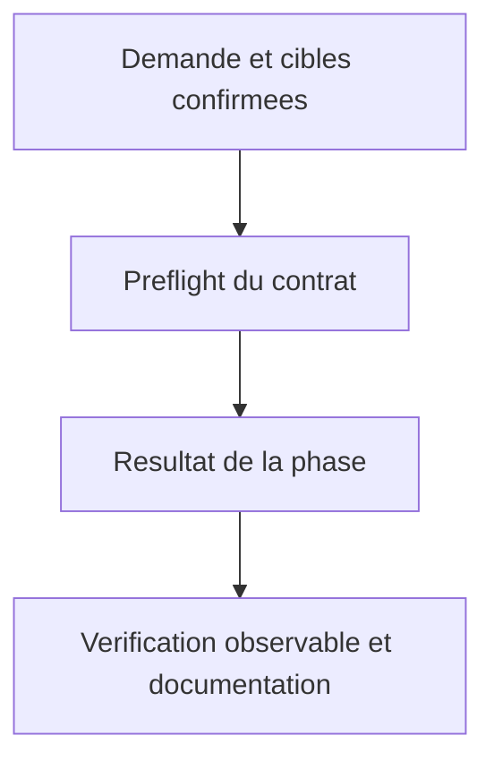
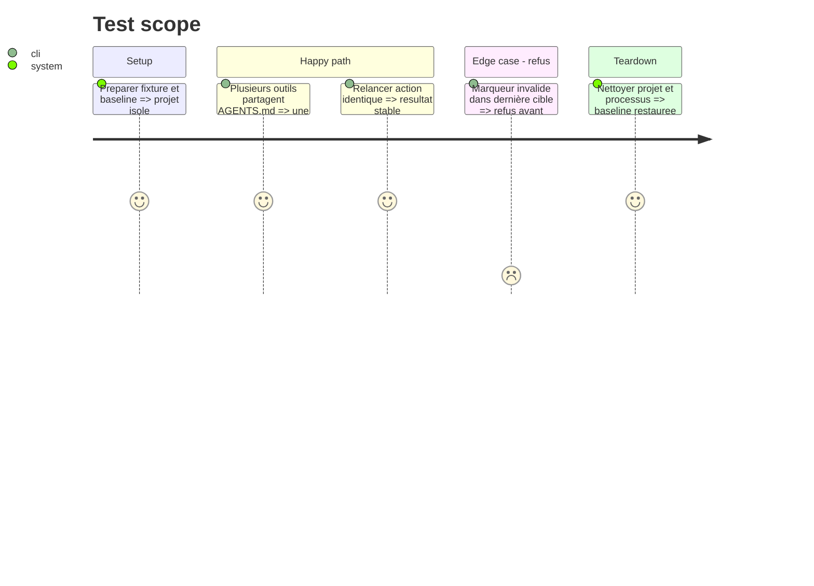

# Instruction: Reconnaître Kilo et partager la mémoire

## Architecture projection

> Arbre des fichiers finaux. ✅ créer · ✏️ modifier · aucune suppression.
> Les chemins conditionnels sont résolus à l’étape de préflight, jamais créés en doublon.

```txt
.
✏️ plugins/aidd-context/skills/00-onboard/references/state/detection.md
✏️ plugins/aidd-context/skills/02-project-memory/references/tools.md
✏️ plugins/aidd-context/skills/02-project-memory/actions/04-sync.md
✏️ plugins/aidd-context/hooks/update_memory.js
✏️ scripts/__tests__/update-memory.test.js
✏️ scripts/skill-eval/cases.json
✅ scripts/__tests__/context-kilo-detection.test.js
✅ scripts/__tests__/fixtures/context-generation/detection/
✏️ plugins/aidd-context/README.md
```

## User Journey



## Test Scope



## Tasks to do

### `1)` Reconnaissance cohérente

> Statut : done. 24 tests de contrats/fixtures réussis et mutation ciblée détectée.

1. Étendre les deux contrats de détection avec les six signaux officiels, y compris JSON/JSONC explicites ; .kilocode est un signal historique, jamais une sortie. AGENTS.md seul et opencode.json[c] seuls ne distinguent pas Kilo. Ajouter fixtures positives et négatives réutilisables dans les phases suivantes, avec garde contractuelle et cas de génération réel. Ne pas modifier bootstrap ni ressusciter project-init.

### `2)` Une seule surface de mémoire

> Statut : validated, publication locale pending. 40 sous-processus réussis, préflight et conservation vérifiés.

1. Ajouter kilo à TOOL_FILES sans ajouter TARGET_FILES ; conserver Set pour Kilo/Codex/OpenCode/Cursor. Dans sync, confirmer les outils, dédupliquer les destinations et modifier seulement le bloc AIDD. Préflight des cibles explicitement sélectionnées et du README opt-in avant Upsert comme avant Fill, donc avant toute création de contexte ou mutation pour refuser des marqueurs incomplets/ambigus. Conserver le mode best-effort du hook automatique sans élargir le scope. Étendre les sous-processus existants et les six scénarios mémoire, préserver imports Claude et liens Copilot.

### `3)` Contrat lisible et preuve

> Statut : validated, publication locale pending. Codex natif et Kilo mémoire observés ; review approve.

1. Ajouter les sources/date au contrat mémoire et documenter Kilo dans le README sans répéter toutes les tables. Exécuter un parcours Codex sur une fixture Kilo-only, puis valider lecture mémoire dans Kilo lors du test runtime de cette phase ; preuve authentifiée Claude non requise pour ces artefacts.

## Test acceptance criteria

| Task | Acceptance criteria |
| --- | --- |
| 1 | Les six signaux proposent Kilo ; fichiers OpenCode seuls et AGENTS.md seul ne le proposent pas. |
| 2 | Kilo + outils partageant AGENTS.md donnent un seul bloc ; contenu utilisateur et fichiers non sélectionnés identiques. |
| 2 | Deux synchronisations identiques ne réécrivent rien ; un marqueur invalide dans la dernière cible nommée laisse toutes les cibles et README inchangés. |
| 3 | CLAUDE.md conserve @imports, Copilot conserve ses liens relatifs ; Kilo charge AGENTS.md et lit une référence mémoire nécessaire à la tâche. |
