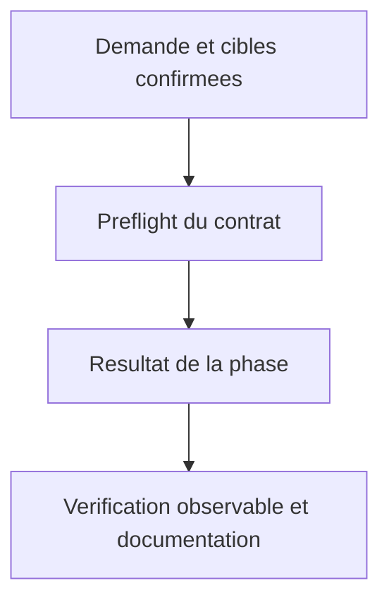
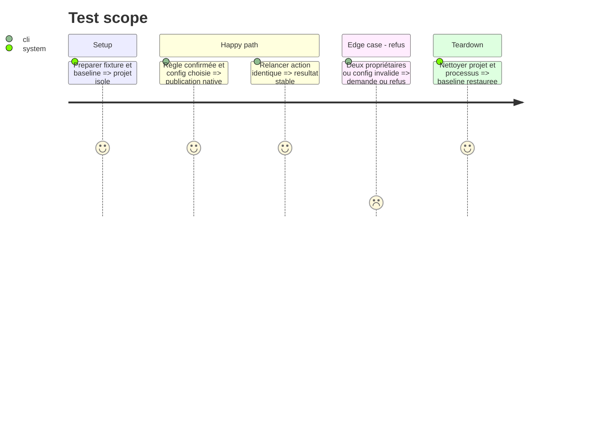

# Instruction: Publier une règle Kilo sans perdre sa configuration

## Tranche indépendante autorisée le 10 octobre 2026

La présente autorisation couvre uniquement les fixtures et tests Kilo dans de nouveaux fichiers distincts de #979, le module local `scripts/kilo-config.cjs` et les validations Kilo réalisables sans publication. Le module sélectionne une configuration et prépare une édition JSONC en mémoire ; il ne crée ni règle ni configuration, ne modifie aucun fichier projet et n’appelle aucun writer. Tester en premier les contrats de sélection, préservation et refus avec filesystem réel ; archiver les preuves, assertions et review de cette tranche. Les commits locaux sont autorisés.

La tâche 1, l’intégration des tâches 2–4 au writer, la publication cohérente source + règle + configuration, les erreurs de publication et les non-régressions du writer #979 restent bloquées pendant que #979 est Draft. Ne modifier aucun fichier de #979, dont `scripts/__tests__/rule-generation.test.js`. Laisser la phase `in-progress` et ses critères de publication ouverts ; aucune fusion, push ou PR. Revalider le head #979 et décider explicitement de l’intégration avant de lever ce verrou.

## Architecture projection

> Arbre des fichiers finaux. ✅ créer · ✏️ modifier · aucune suppression.
> Les chemins conditionnels sont résolus à l’étape de préflight, jamais créés en doublon.

```txt
.
✏️ plugins/aidd-context/skills/05-rule-generate/SKILL.md
✏️ plugins/aidd-context/skills/05-rule-generate/actions/01-capture-rule.md
✏️ plugins/aidd-context/skills/05-rule-generate/actions/02-write-rule.md
✏️ plugins/aidd-context/skills/05-rule-generate/actions/03-validate.md
✏️ plugins/aidd-context/skills/05-rule-generate/references/tool-paths.md
✏️ plugins/aidd-context/skills/05-rule-generate/scripts/write-rule.cjs (base fournie par #979)
✅ plugins/aidd-context/skills/05-rule-generate/scripts/kilo-config.cjs
✏️ scripts/__tests__/rule-generation.test.js (fourni par #979, revalider après intégration)
✅ scripts/__tests__/kilo-rule-publication.test.js
✅ scripts/__tests__/fixtures/context-generation/kilo-config/
✏️ plugins/aidd-context/README.md
```

## User Journey



## Test Scope



## Tasks to do

### `1)` Aligner le propriétaire des règles

> Aligner le propriétaire des règles.

1. Précondition bloquante de l’intégration : base de publication #979 disponible/intégrée et head revalidé, ou nouvelle décision explicite avec plan amendé. Lire tous les nouveaux contrats/tests pertinents et conserver les sorties non Kilo de cette base. Si #979 reste Draft, ne pas implémenter la publication dépendante. Ne pas construire un second writer. Ajouter Kilo au writer autonome après levée du verrou ; le module local au skill reste sans import du CLI ni dépendance implicite du checkout et sera résolu depuis SKILL.md livré lors de l’intégration.

### `2)` Sélection de configuration observable

> Sélection de configuration observable.

1. Avant toute écriture, inventorier les quatre fichiers projet ; zéro => .kilo/kilo.jsonc, unique => ce fichier, plusieurs => propriétaire unique de l’entrée exacte, sinon choix explicite. Plusieurs propriétaires sont ambigus. Afficher .kilo avant racine ; vérifier ordre à priorité égale sur 7.8.8 avant de documenter un ordre total. Annulation ne crée rien. Lire et valider toutes les configurations pertinentes à la sécurité de publication, sans hériter du refus dual-config CLI.

### `3)` Publication sans perte

> Publication sans perte.

1. Ajouter .kilo/rules/category/slug.md et son chemin exact relatif à instructions. Éditer les tokens JSONC sans sérialisation globale ; conserver commentaires, trailing commas, doublons, ordre et octets non concernés. Si entrée déjà présente, ne pas ajouter de doublon AIDD supplémentaire. Préflight source/config/règle et toutes cibles choisies, stage tous résultats avant publication, détecter conflit entre lecture et mutation. Restaurer sur erreur d’écriture couverte et prouver l’absence d’état partiel ; ne pas appeler une série de rename une transaction globale. Limiter la solution aux publications concernées, sans moteur transactionnel générique ; documenter les interruptions brutales et pannes machine hors garantie.

### `4)` Tests et documentation de publication

> Tests et documentation de publication.

1. Tests rouges avec filesystem réel et skill copié hors checkout/ESM/sans aidd, réutiliser tests writer de #979. Oracles hashes de tout projet avant/après erreur, comparaison byte ranges et mtime seconde exécution ; mutations doublon/order et validation tardive. Tester règle chargée par vrai Kilo avec contrôle négatif sans instructions. Documentation sources/date, fichier choisi, config-backed et limites exactes.

## Test acceptance criteria

| Task | Acceptance criteria |
| --- | --- |
| 3 | Règle canonique Kilo et chemin instructions exact existent ; Kilo charge le corps ; dossier seul ne suffit pas. |
| 2 | Aucun choix implicite en ambiguïté ; propriétaire unique réutilisé, annulation ne crée aucun fichier. |
| 3 | JSON/JSONC gardent doublons, ordre, commentaires, trailing commas et format hors insertion ; second passage byte-identique. |
| 3 | Configuration invalide ou cible dangereuse, y compris dernier fichier d’un fan-out, ne laisse aucun changement ; erreurs de publication testées ne laissent ni règle orpheline ni référence cassée. |
| 4 | Les publications Claude/Cursor/Copilot et partagées Codex/OpenCode du writer retenu gardent leurs contrats et les blocs de mémoire. |
