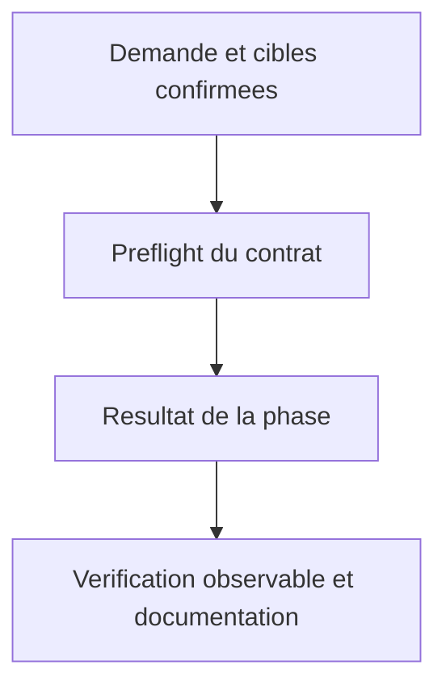
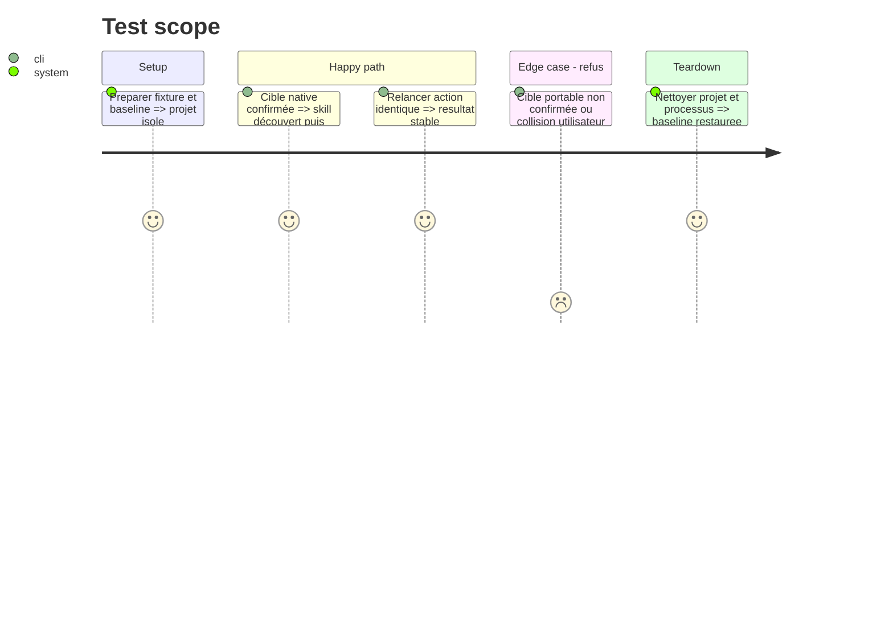

# Instruction: Générer un skill natif ou portable choisi

## Architecture projection

> Arbre des fichiers finaux. ✅ créer · ✏️ modifier · aucune suppression.
> Les chemins conditionnels sont résolus à l’étape de préflight, jamais créés en doublon.

```txt
.
✏️ plugins/aidd-context/skills/04-skill-generate/references/tool-detect.md
✏️ plugins/aidd-context/skills/04-skill-generate/references/tool-write.md
✏️ plugins/aidd-context/skills/04-skill-generate/references/scope-frame.md
✏️ plugins/aidd-context/skills/04-skill-generate/actions/01-scope.md
✏️ plugins/aidd-context/skills/04-skill-generate/actions/03-write.md
✏️ plugins/aidd-context/skills/04-skill-generate/actions/04-validate.md
✅ scripts/__tests__/context-skill-artifacts.test.js
✅ scripts/__tests__/fixtures/context-generation/skills/
✏️ scripts/skill-eval/cases.json
✏️ plugins/aidd-context/README.md
```

## User Journey



## Test Scope



## Tasks to do

### `1)` Choisir la surface

> Choisir la surface.

1. Ajouter mêmes signaux Kilo ; capter cible native .kilo/skills/name ou portable .agents/skills/name seulement sur choix explicite. Dédupliquer destinations partagées et collisions de noms ; ne jamais écrire les deux arbres pour le même skill. En cas de copies déjà présentes, demander une résolution avant écriture, sans supprimer une copie utilisateur.

### `2)` Rendre et préserver

> Rendre et préserver.

1. Garder skill-template.md Claude inchangé. Rendu Kilo Agent Skills avec name égal au dossier, description et champs supportés seulement ; retirer argument-hint propre à Claude des sorties Kilo selon contrat. Préflight de toutes cibles et références avant écriture ; préserver actions/assets utilisateur lors d’une mise à jour. Réexécution conserve contenu identique, pas régénération aléatoire.

### `3)` Vérifier les parcours

> Vérifier les parcours.

1. Fixtures sorties Claude/Codex/OpenCode et Kilo, générées réellement via skill Codex ; vérification YAML/arbre/liens et collisions sans mutation. Catalogue réel kilo debug skill puis invocation gratuite du skill et lecture d’une action avec résultat observable. Tests et sources/date au même changement ; aucun lien vers un skill frère.

## Test acceptance criteria

| Task | Acceptance criteria |
| --- | --- |
| 1 | Kilo-only produit uniquement .kilo/skills/name avec name/description valides. |
| 1 | Portable sans accord explicite ne produit jamais .agents/skills ; accord portable produit exactement une copie. |
| 2 | Mise à jour préserve user assets ; conflit/refus laisse tous les arbres inchangés ; rerun identique. |
| 3 | Les formats et champs des sorties Claude/Codex/OpenCode restent conformes ; Kilo découvre et utilise le skill livré. |
