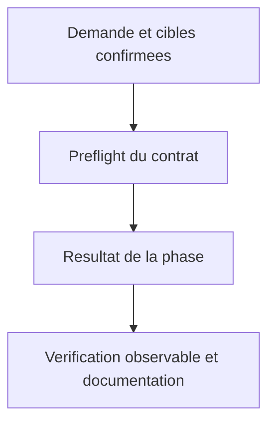
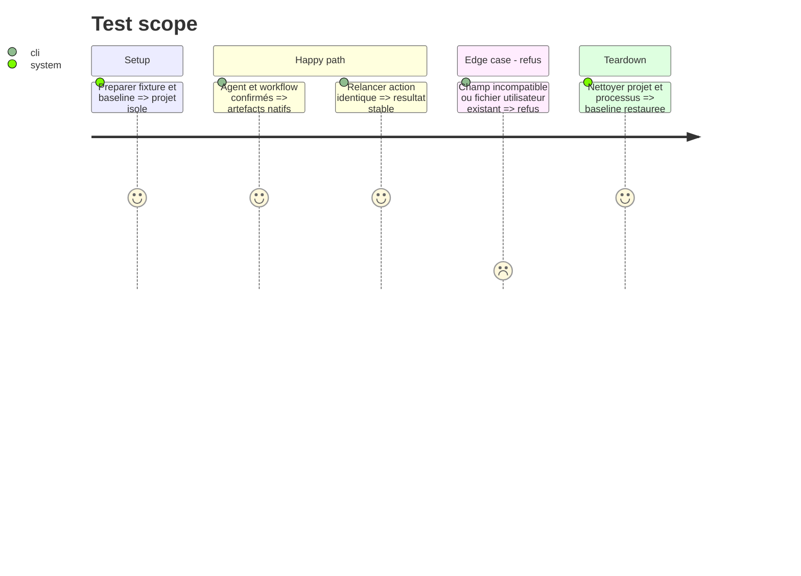

# Instruction: Générer agents et workflows natifs

## Architecture projection

> Arbre des fichiers finaux. ✅ créer · ✏️ modifier · aucune suppression.
> Les chemins conditionnels sont résolus à l’étape de préflight, jamais créés en doublon.

```txt
.
✏️ plugins/aidd-context/skills/06-agent-generate/references/tool-paths.md
✏️ plugins/aidd-context/skills/06-agent-generate/references/agent-authoring.md
✏️ plugins/aidd-context/skills/06-agent-generate/actions/01-capture-agent.md
✏️ plugins/aidd-context/skills/06-agent-generate/actions/02-write-agent.md
✏️ plugins/aidd-context/skills/06-agent-generate/actions/03-validate.md
✏️ plugins/aidd-context/skills/07-command-generate/references/tool-paths.md
✏️ plugins/aidd-context/skills/07-command-generate/references/command-authoring.md
✏️ plugins/aidd-context/skills/07-command-generate/actions/01-capture-command.md
✏️ plugins/aidd-context/skills/07-command-generate/actions/02-write-command.md
✏️ plugins/aidd-context/skills/07-command-generate/actions/03-validate.md
✅ scripts/__tests__/context-agent-command-artifacts.test.js
✅ scripts/__tests__/fixtures/context-generation/agents-commands/
✏️ scripts/skill-eval/cases.json
✏️ plugins/aidd-context/README.md
```

## User Journey



## Test Scope



## Tasks to do

### `1)` Agent par contrat cible

> Statut : done. Contrat Kilo canonique, fixture et debug runtime validés.

1. Détection Kilo commune ; fichier .kilo/agents/name.md donne le nom, description et mode subagent, options demandées model/temperature/permission sans defaults inventés. Scoper la validation name YAML actuelle au format canonique Claude ; template canonique inchangé. Capturer et vérifier types/options avant writes ; pas de droits nouveaux implicites.

### `2)` Workflow par contrat cible

> Statut : done. Contrat Kilo canonique, fixture et commande runtime validés.

1. Détection Kilo ; .kilo/commands/name.md et liste description/agent/model/variant/subtask uniquement selon demande. Ne pas imposer la convention nested location Claude à Kilo ni copier les injections Claude. Commande reste one-shot ; router 03 existant peut déjà déléguer le type commande, aucune modification nécessaire au routeur pour un alias non requis par AC.

### `3)` Préservation et preuves associées

> Statut : done. Préflight documenté, corpus et non-régressions automatisés; limites runtime conservées.

1. Préflight multi-cibles, collision user file, champs inconnus, échappements YAML/TOML, idempotence. Tester agents Claude, TOML Codex, OpenCode et commandes unsupported Codex explicitement. Kilo catalogue/debug, invocation sous-agent réelle et slash-command réelle avec modèle gratuit ; sources/date dans refs, docs même phase.

## Test acceptance criteria

| Task | Acceptance criteria |
| --- | --- |
| 1 | Nom agent Kilo vient du fichier ; frontmatter ne reçoit pas name Claude ; mode subagent et options demandées corrects. |
| 2 | Workflow Kilo au chemin canonique ; uniquement champs officiellement supportés. |
| 3 | Formats Claude/Codex/OpenCode acceptés et bodies intacts, cibles unsupported sautées explicitement. |
| 3 | Invalides ou collisions refusés sans écrire une autre cible ; relance identique ; Kilo charge et utilise agent et workflow. |
