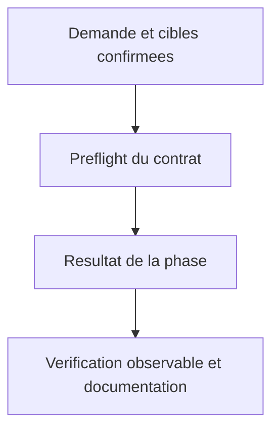
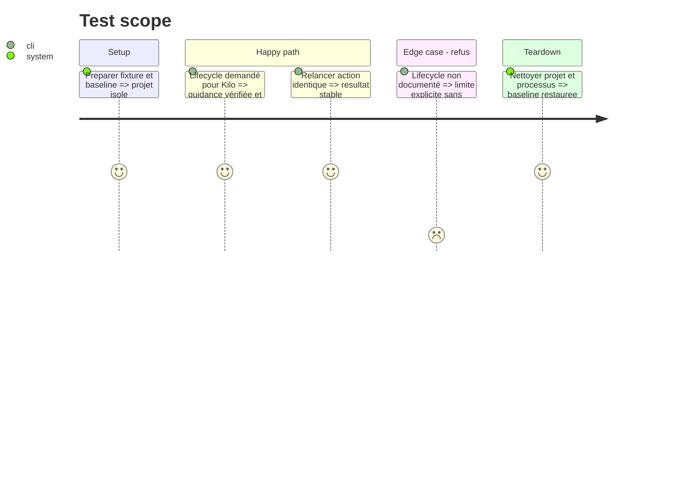

# Instruction: Guider les hooks sans conversion inventée

## Architecture projection

> Arbre des fichiers finaux. ✅ créer · ✏️ modifier · aucune suppression.
> Les chemins conditionnels sont résolus à l’étape de préflight, jamais créés en doublon.

```txt
.
✏️ plugins/aidd-context/skills/08-hook-generate/SKILL.md
✏️ plugins/aidd-context/skills/08-hook-generate/references/tool-paths.md
✏️ plugins/aidd-context/skills/08-hook-generate/references/hook-authoring.md
✏️ plugins/aidd-context/skills/08-hook-generate/actions/01-capture-hook.md
✏️ plugins/aidd-context/skills/08-hook-generate/actions/02-write-hook.md
✏️ plugins/aidd-context/skills/08-hook-generate/actions/03-validate.md
✅ scripts/__tests__/context-hook-generation.test.js
✅ scripts/__tests__/fixtures/context-generation/hooks/
✏️ scripts/skill-eval/cases.json
✏️ plugins/aidd-context/README.md
```

## User Journey



## Test Scope



## Tasks to do

### `1)` Terminer Kilo par guidance

> Terminer Kilo par guidance.

1. Ajouter détection et résultat terminal guidance avant décisions de script/config. Décrire JS/TS .kilo/plugin ou plugins, événement ou typed hook seulement prouvé ; session.created peut référencer le bridge existant. Override explicite pour Kilo de la règle de rabattre un événement absent. Aucun hooks.json Claude sous .kilo, aucun script/plugin générique produit.

### `2)` Conserver le fan-out et les relances

> Conserver le fan-out et les relances.

1. Cible mixte : guidance Kilo séparée, artefact des autres outils selon contrat existant ; preflight avant tout script/config. Dédupliquer uniquement entrée AIDD exacte déjà générée, conserver doublons/hooks utilisateur. Cette correction ciblée répond à AC13 ; aucun refactor d’un moteur de hooks ni modification bridge #971.

### `3)` Démontrer le résultat

> Démontrer le résultat.

1. Parcours Kilo-only puis mixed, événements prouvé/non prouvé, second passage. Comparer arbre complet pour guidance sans write. Tester structures hooks Claude/Codex/Cursor/Copilot, guidance OpenCode conservée, body utilisateur et idempotence. Sources/date et explication limites dans références et README.

## Test acceptance criteria

| Task | Acceptance criteria |
| --- | --- |
| 1 | Kilo-only renvoie guidance sourcée précise et aucune écriture. |
| 1 | Événement non prouvé déclaré unsupported, aucune correspondance inventée. |
| 2 | Fan-out mixte conserve les contrats des outils supportés et n’ajoute pas de config hooks Kilo. |
| 3 | Deux passages identiques ne dupliquent pas l’entrée AIDD ; hooks utilisateur intacts ; une entrée invalide bloque avant script/config. |
