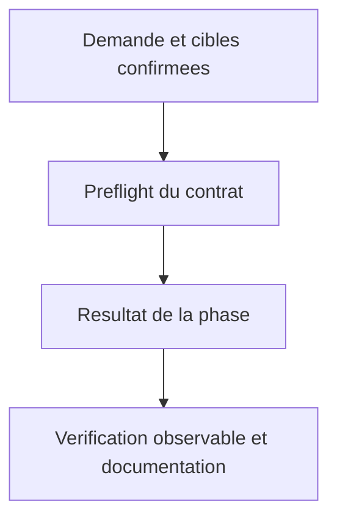
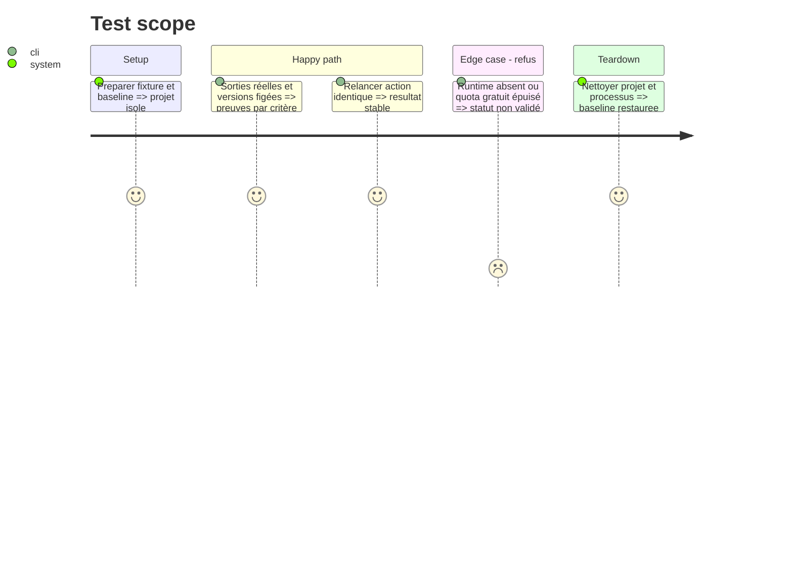

# Instruction: Consolider les preuves de génération et de runtime

## Architecture projection

> Arbre des fichiers finaux. ✅ créer · ✏️ modifier · aucune suppression.
> Les chemins conditionnels sont résolus à l’étape de préflight, jamais créés en doublon.

```txt
.
✏️ scripts/skill-eval.mjs
✏️ scripts/skill-eval/cases.json
✏️ scripts/skill-eval/README.md
✅ scripts/__tests__/context-generation-evidence.test.js
✅ cli/tests/e2e/kilo-native-generation.e2e.test.ts
✏️ cli/tests/e2e/kilo-runtime.e2e.test.ts (seulement extraction minimale de helper réutilisable si nécessaire)
✅ cli/tests/e2e/helpers/kilo-runtime.ts (seulement si extraction nécessaire)
✏️ cli/package.json (commande opt-in de test natif, sans modifier test:e2e:kilo existant)
✏️ .github/workflows/cli-ci.yml (étendre le job Kilo existant, conserver son identité de gate)
✅ aidd_docs/tasks/2026_10/2026_10_10_kilo-native-generation-914/evidence/
✏️ plugins/aidd-context/README.md
```

## User Journey



## Test Scope



## Tasks to do

### `1)` Runner réel ciblé

> Runner réel ciblé.

1. Réutiliser les fixtures et les oracles établis dans phases 1 à 5. Extension minimale du runner existant : choix explicite host Codex pour produire aussi des artefacts Claude, conserver parcours Claude existant, pas de --judge Claude obligatoire. Si un lancement séparé est nécessaire pour l’isolation Codex, l’isoler dans le runner, sans réinventer une orchestration. Lire docs/flags host avant code. Transcript des choix ambigus et de l’accord portable ; skips distinguent impossibilité de pass.

### `2)` Tests runtime sur sorties réelles

> Tests runtime sur sorties réelles.

1. Construire le test natif Kilo à partir des sorties enregistrées d’une exécution de skill livrée, avec hashes/provenance, pas de fixtures manuellement fabriquées présentées comme outputs. Réutiliser helpers #971 après lecture, backend local capturant payloads et usage du modèle gratuit séparé. Chaque artefact a positif/négatif ; guidance hooks validée comme absence d’artefact, bridge existant séparé. Kill processus, ports et nettoyer temp dirs.

### `3)` Plateformes et régressions finales

> Plateformes et régressions finales.

1. Le job cli-kilo-runtime actuel tourne seulement sur Ubuntu avec Kilo 7.7.5 ; le job Windows ne constitue pas une preuve Kilo. Vérifier les plateformes réellement supportées par Kilo/AIDD et les contraintes des runners avant d’adapter de façon ciblée le job Kilo existant aux plateformes justifiées ; aucune matrice élargie présumée. Figer la version retenue et utiliser la suite locale déterministe sans compte. Conserver le smoke existant et son pin tant que son passage sur nouvelle version n’est pas établi. Usage gratuit réel local en complément ; CI sans modèle externe sert la preuve de découverte/chargement. Prévoir les sorties réelles enregistrées/hashées comme inputs CI, aucun générateur LLM supposé gratuit/authentifié en CI. Aucune preuve multi-OS déduite de Linux. Exécuter suites root/CLI pertinentes, golden et validateur offline Claude, mutations ciblées. Relire les changements générés par make check. OpenCode runtime supplémentaire seulement dans environnement déjà équipé. Résultat global reste incomplet si AC15 plateforme non exécuté.

### `4)` Rapport et limites de reprise

> Rapport et limites de reprise.

1. Renseigner la matrice par preuves, pas cocher selon présence fichier. Documenter offline Claude vs runtime authentifié indisponible, hôtes/versions réellement exécutés et #979 retenue. Review/assertion AIDD après implémentation dans session autorisée. Aucun commit/push/PR automatique dans le runner.

## Test acceptance criteria

| Task | Acceptance criteria |
| --- | --- |
| 1 | Traces démontrent que les skills livrés ont généré les sorties testées et que le vrai Kilo les découvre/utilise. |
| 2 | Contrôles négatifs détectent artefact absent/non relié ; second passage et refus laissent les états attendus. |
| 3 | Tous tests offline Claude et régressions automatisées des cibles passent ; aucun runtime Claude authentifié prétendu. |
| 4 | Rapport décrit OS/versions, cas skipped/blocked et limites ; AC15 ne passe que sur la couverture runtime prévue réellement exécutée. |
