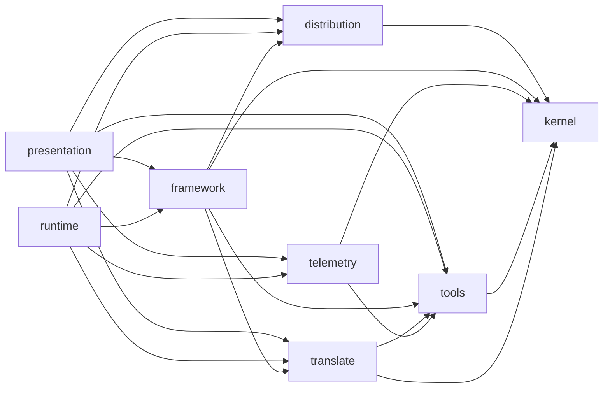

# Architecture

The macro shape of this package: the stack, how the pieces fit, and the decisions behind them.

## Stack

- TypeScript ESM on Node, bundled by tsup into one file.
- Six runtime dependencies, capped; a new one needs an ADR: `commander`, `@inquirer/prompts`, `ajv`, `ajv-formats`, `simple-git`, `smol-toml`.
- vitest, biome, stryker, knip: `testing.md`, `coding-assertions.md`.

## How it fits together

Every edge is a real import direction: the inter-context arrows are exactly `ALLOWED` in `tests/architecture/helpers.ts`, failed over by `context-graph.arch.test.ts`. Reverse edges are `BASELINE` debt in that file, deliberately not drawn.

## Key decisions

- Bounded contexts, never layers. Enforced by `tests/architecture/`, stated in `.claude/rules/00-architecture/0-contexts.md`.
- A tool declares, a context reads: measurement vocabulary lives in `kernel/measurement.ts`, so the edge runs `telemetry → tools` only. `telemetry.md` names what it reuses along it.
- Telemetry reaches no context but `tools`; what it needs elsewhere is its own port, satisfied at the composition root.
- Some tools' project config is inert: Codex, Copilot and Claude load a plugin only once their own CLI registered it. A per-tool fact, verified against the real tool.
- Claude's registration is driven at `--scope local`, so the hashed file keeps a single writer.
- Two file regimes: what this CLI owns is regenerated; what it co-owns with a person is merged, conflicts reported.
- The manifest reads one version and refuses the rest, naming the fix. No migration chain.
- Since v7 each installed plugin records its `scope` (`project` | `user`); base directories are resolved from that record, never the tool's current profile.
- The `aidd-framework` marketplace is machine-scope, shared by every project: [`framework-source-is-machine-scope.md`](internal/decisions/framework-source-is-machine-scope.md).
- Plugin enablement carries its own scope to the host CLI: [`plugin-enablement-carries-its-scope.md`](internal/decisions/plugin-enablement-carries-its-scope.md).
- A launcher runs an external binary, never embeds it. `kanban` broke this and was unwired.
- `clean` drives the host's own CLI and deletes under `$HOME` only inside a declared, `realpath`-contained root: [`clean-drives-the-host-cli.md`](internal/decisions/clean-drives-the-host-cli.md).
- A marketplace's identity is its declared name plus plugin set, never a path or version: [`marketplace-identity-is-name-plus-plugins.md`](internal/decisions/marketplace-identity-is-name-plus-plugins.md).

## Gotchas

- Configs are inlined at build time, schemas are not: five JSON files ship beside the binary. Drop them from `files` and the CLI breaks.
- The build empties its output directory; `AIDD_BUILD_OUT_DIR` accepts two shapes only.
- `git` exports `GIT_*` into everything it spawns. Strip them before reading a repository.
