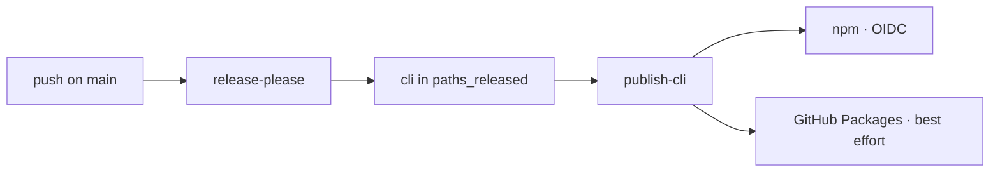

# Deployment

Where the package ships and how: CI, release, and the environment it reads.

## Pipeline

- `.github/workflows/cli-ci.yml` always triggers — no `on.paths` filter, so its required check stays satisfiable on every PR. Its own `changes` job decides relevance by `git diff`-ing the base against the head in bash: `cli/**`, `kanban/**`, `scripts/__tests__/**`, `README.md`, this workflow file itself, or `plugins/aidd-telemetry/**` excluding its own prose. Every other job — `cli-typecheck`, `cli-lint`, `cli-architecture`, `cli-coverage`, `cli-smoke`, `cli-build`, `cli-knip`, `identifier-join` (the session-identifier probe, then Claude Code's own `plugin validate` over a fresh claude build through `scripts/check-claude-accepts-build.cjs`), `cli-jscpd`, `kanban-checks`, `windows` — runs only when `changes` says relevant; `cli-mutation` is a matrix over the scopes `changes` names through `scripts/mutation-scopes-to-run.mjs`, each restoring the newest incremental file its branch or base saved, and `gate` (check name `cli / gate`) fans all of them in. `gate` is the one check the branch rulesets require (`.github/rulesets/main.json`, `next.json`).
- `.github/workflows/ci.yml` — commitlint, release-please, then the release jobs. It runs none of the checks above.
- Build: `pnpm build` (tsup) → `dist/cli.js`, plus the five JSON schemas its `onSuccess` copies beside it. They are read from disk at runtime; dropping them breaks the binary.
- Bundle budget in `package.json` (`bundleBudgetKB`), enforced by `scripts/check-bundle-size.mjs` after every build. That script's own header comment is the registry of every raise and reset, with the measurement behind each — read it there rather than a count here, which goes stale the next time the budget moves.
- `AIDD_BUILD_OUT_DIR` accepts only `dist` or a directory under `.e2e-build/`: the build empties its target first.

## Environments

None. What ships are published packages and release assets.

## Release

- release-please tags this package `cli-v<semver>`; a bare `v<semver>` is the root marketplace, a different line. The `include-component-in-tag` flag behind that is named once, in the repository's own `deployment.md`.
- `publish-cli` is gated on `cli` appearing in `paths_released`, never on a tag: a root or plugin release publishes nothing here.
- npm is the load-bearing step, `npm publish` under OIDC with no token. pnpm is avoided there on purpose. The GitHub Packages step is `continue-on-error`.
- `aidd update` reads the latest version from the npm dist-tags, not from GitHub releases — see `internal/decisions/self-update-version-source-npm.md`. `AIDD_SELF_UPDATE_NPM_BASE` and `AIDD_SELF_UPDATE_API_BASE` point both reads elsewhere for tests.
- npm answers `Accept: application/vnd.github+json` with **406**. The shared HTTP client defaults to it, so a registry read must set `application/json`.

## Monitoring

None. A failure is a red run.
