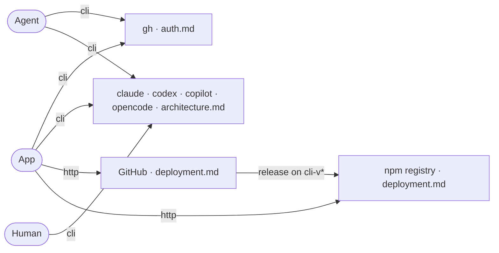

# Ecosystem

```mermaid
flowchart LR
  Human([Human])
  Agent([Agent])
  App([App])
  GitHub["GitHub · deployment.md"]
  Npm["npm registry · deployment.md"]
  Gh["gh · auth.md"]
  Hosts["claude · codex · copilot · opencode · architecture.md"]

  Agent -- cli --> Gh
  Agent -- cli --> Hosts
  Human -- cli --> Hosts
  App -- cli --> Gh
  App -- cli --> Hosts
  App -- http --> GitHub
  App -- http --> Npm

  GitHub -- "release on cli-v*" --> Npm
```
