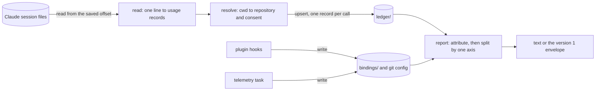

# Telemetry

How the `telemetry` context turns Claude Code's own session files into per-task token counts. A map to the code: formats, rules and stores are in [`usage-contract.md`](../../../aidd_docs/product/usage-contract.md).

## Data flow

- A command that reports or ingests reads new lines first, under the ledger lock. `ingest` is the same step on its own, run quietly by the plugin at session start.
- Reading is one pass: tool-specific only up to the usage record. Resolving, storing, attributing and reporting are written once for every tool.
- The hooks and the CLI never call each other's code. They meet in the files, whose formats one fixture pins on both sides.

## Layers

| Layer | Path under `cli/src/` | Holds |
| --- | --- | --- |
| Presentation | `presentation/commands/telemetry.ts`, `presentation/display/telemetry*` | the command group: `on`, `off`, `forget`, `ingest`, `task`, `report`, `identity` |
| Composition | `runtime/wiring/telemetry.ts` | the telemetry directory, the environment variables, every use case wired |
| Application | `contexts/telemetry/application/` | one use case per command, the directory resolver, `report/` |
| Domain | `contexts/telemetry/domain/` | the usage record and its fold, the declaration and attribution rules, consent, the report axes |
| Infrastructure | `contexts/telemetry/infrastructure/` | the ledger, locks, git config and file stores, the transcript source |

## Where to look

| Question | File |
| --- | --- |
| What a Claude Code line becomes | `domain/formats/claude-transcript-usage.ts` |
| Why a call is counted once | `domain/usage-fold.ts` |
| Where a call's repository comes from | `application/directory-resolver.ts`, `domain/repository-identity.ts` |
| Which task a call belongs to | `domain/report/attribution.ts`, `domain/declaration/binding-resolution.ts` |
| What counts as consent, and where it is read | `domain/telemetry-consent.ts`, `infrastructure/git-consent-adapter.ts`; a deleted directory is judged by its clone, read live (`application/directory-resolver.ts`) |
| What `on` and `forget` clean up from an earlier measurement | `domain/legacy/`, `application/switch/`, `application/forget/` |
| The report axes and the envelope | `domain/report/usage-report.ts`, `application/report/report-envelope.ts` |

## The plugin side

`plugins/aidd-telemetry/hooks/` is plain Node and imports nothing from here. It asks for a task, answers a typed declaration by running `aidd telemetry task`, and records which session a process is on. Its reading of the stores is pinned against `scripts/__tests__/fixtures/telemetry-bindings/`, read by `tests/contexts/telemetry/telemetry-bindings-fixture.unit.test.ts` and by the hook tests.

## Tests

- Unit and integration tests mirror `src/` under `tests/contexts/telemetry/`.
- The `telemetry` end-to-end tests under `tests/e2e/` run the built binary; `tests/e2e/telemetry-journey.e2e.test.ts` drives the plugin's real hooks through a shim to it and checks that every axis adds up to the total.
- The skills' commands are checked against the help golden by `scripts/__tests__/telemetry-skills-name-real-commands.test.js`.
