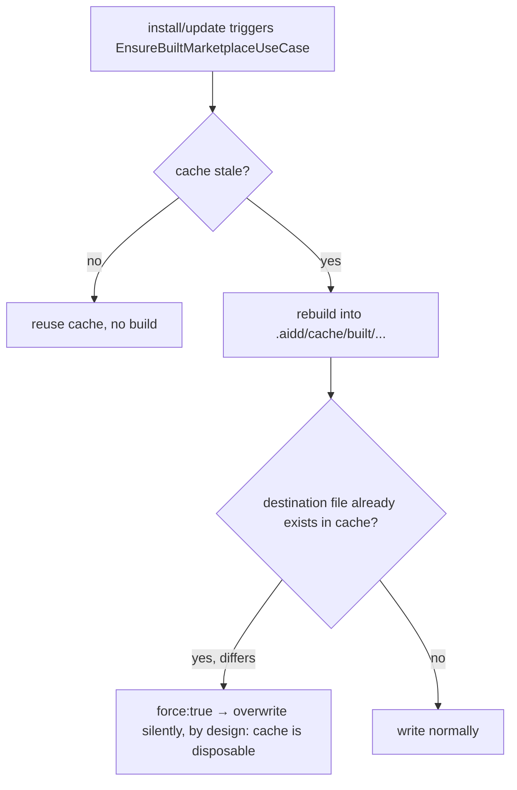

# Instruction: Document and pin the intentional cache-rebuild force

## Architecture projection

> Tree of the final files. ✅ create · ✏️ modify · ❌ delete

```txt
.
└── cli/
    ├── src/infrastructure/
    │   └── deps.ts                                                                      ✏️ modify
    └── tests/application/use-cases/shared/
        └── ensure-built-marketplace-use-case.integration.test.ts                        ✏️ modify
```

## User Journey



## Tasks to do

### `1)` Document the intentional force at its source

> Turn the unexplained `force: true` into a written decision, per BUG-E2-01's DoD.

1. In `src/infrastructure/deps.ts`, above the `force: true` literal inside the `frameworkBuildFor` closure (~line 451-455), add a one-line comment stating: this `outDir` is always the internal `.aidd/cache/built/...` build cache (see `builtMarketplaceDir`), never a user-owned directory, so forcing collision-overwrite here is a cache invalidation, not a destructive overwrite of user data — unlike the direct `framework build --flat --force` CLI path, which threads the real user flag.
2. Do not touch `framework.ts`, `flat-build-strategy.ts`, or any other call site — both already behave correctly; only this site was undocumented.

### `2)` Pin the behavior with a regression test

> Prove the collision-bypass is real and stays real, using the actual `FlatBuildStrategy` collaborator instead of the file's existing fake `buildFor` stub.

1. In `tests/application/use-cases/shared/ensure-built-marketplace-use-case.integration.test.ts`, add a new test (own `describe` block, e.g. `"force behavior at the cache-rebuild path"`) that wires `EnsureBuiltMarketplaceUseCase` with a real `FrameworkBuildUseCase` + real `FlatBuildStrategy` (`force: true`, matching how `deps.ts` constructs it for `*:flat` targets), not the file's existing fake `buildFor`.
2. Pre-seed the in-memory filesystem with a file already present at the exact destination path the flat build would write (different content than what the build produces).
3. Assert `execute()` resolves without throwing `FlatTargetExistsError`, and that the destination file now holds the freshly-built content (proves the overwrite actually happened, not just "didn't throw").
4. Run the full existing suite in this file plus `tests/application/use-cases/framework/flat-build-strategy.integration.test.ts` and `tests/e2e/framework-build.e2e.test.ts` — all must stay green, confirming the direct `framework build --force` CLI path (already correct) is untouched.

## Test acceptance criteria

| Task | Acceptance criteria                                                                                                                          |
| ---- | ----------------------------------------------------------------------------------------------------------------------------------------------- |
| 1    | Reading `deps.ts` at the `force: true` site, a maintainer understands why it's always `true` without needing to trace `FlatBuildStrategy` or `paths.ts` themselves. |
| 2    | The new test fails if `force: true` is changed to `force: false` at that site, and fails if the comment's cache-only claim becomes false (e.g. `outDir` starts pointing outside `.aidd/cache/built`). All other tests in the three named files still pass. |
