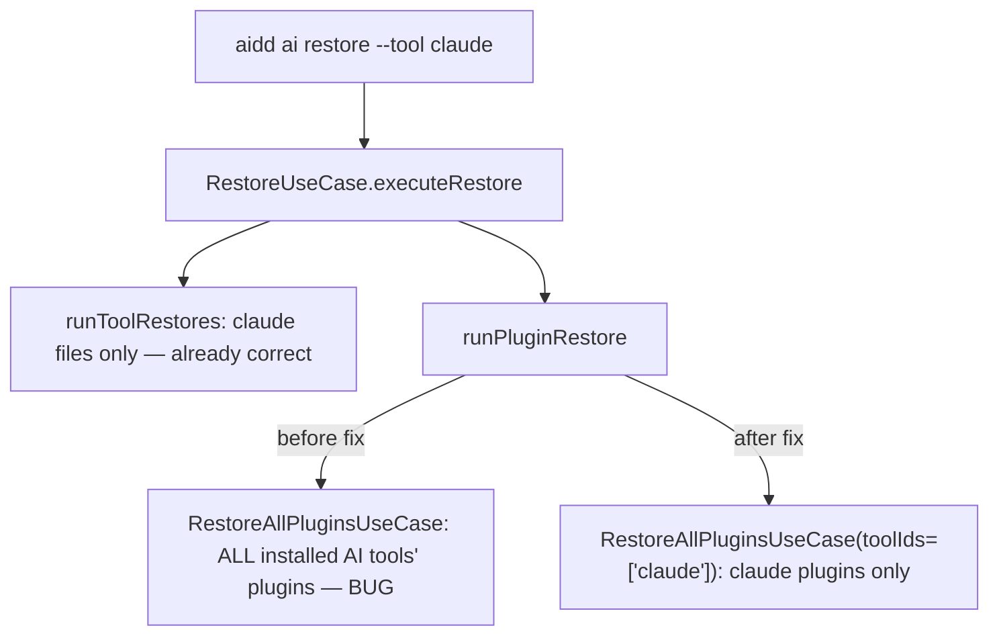

# Instruction: Thread --tool scope into plugin restore (A2)

## Architecture projection

> Tree of the final files. ✅ create · ✏️ modify · ❌ delete

```txt
.
└── cli/
    ├── src/application/use-cases/restore/
    │   ├── restore-all-plugins-use-case.ts                 ✏️ modify (add toolIds scope param)
    │   └── restore-use-case.ts                              ✏️ modify (thread ctx.toolIds through)
    └── tests/application/use-cases/
        └── restore-use-case.unit.test.ts                    ✏️ modify (new scope-leak regression tests)
```

## User Journey



## Tasks to do

### `1)` Add a tool-scope filter to `RestoreAllPluginsUseCase`

> Let the plugin-restore pass honor the same tool scope the file-restore pass already respects.

1. In `src/application/use-cases/restore/restore-all-plugins-use-case.ts`, add `toolIds?: readonly ToolId[]` to `RestoreAllPluginsOptions` (import `ToolId` from `../../../domain/tools/registry.js`, same source `restore-use-case.ts` already uses).
2. In `execute()`'s `for (const toolId of AI_TOOL_IDS)` loop, add a guard right after the existing `if (!manifest.hasTool(toolId)) continue;`: skip when `options.toolIds !== undefined && !options.toolIds.includes(toolId)`.
3. Leave everything else in the file (the `restoreToolPlugins`/`pluginName` filter logic) untouched — this task only narrows which tools are iterated, orthogonal to the existing per-plugin-name filter.

### `2)` Thread `ctx.toolIds` from `RestoreUseCase` into the plugin restore call

> Close the leak: `RestoreUseCase` already computes the correct scoped tool list in `ctx.toolIds` (`restore-use-case.ts:108`) but never passes it to the plugin restore call.

1. In `src/application/use-cases/restore/restore-use-case.ts`, in `runPluginRestore` (~line 136-151), add `toolIds: ctx.toolIds` to the options object passed to `RestoreAllPluginsUseCase.execute(...)`.
2. No other change needed here: `ctx.toolIds` already defaults to `manifest.getInstalledToolIds()` when the caller didn't scope (`buildRestoreContext`, line 108), so unscoped restore keeps restoring every installed AI tool's plugins — this only narrows, never widens, existing behavior.

## Test acceptance criteria

| Task | Acceptance criteria |
| ---- | ---------------------------------------------------------------------------------------------------------------------------- |
| 1, 2 | `aidd ai restore --tool claude` with both claude and cursor installed, each with a plugin: only claude's plugin files are touched, cursor's plugin files are byte-identical to before the restore. |
| 1, 2 | `aidd ide restore --tool <ide>` (e.g. vscode) with an AI tool + plugin also installed: no AI plugin file is touched at all (the tool-scope intersection with AI tools is empty). |
| 1, 2 | Unscoped `aidd ide restore` (no `--tool`, vscode installed) with an AI tool + plugin also installed: no AI plugin file is touched either — this is a deliberate behavior change from today (see plan.md Decisions), test it explicitly so it's asserted, not incidental. |
| 1, 2 | Unscoped `aidd ai restore` (no `--tool`) with two AI tools installed, each with a plugin: both tools' plugins are still restored, exactly as before this change (no regression on the existing `restore-use-case.unit.test.ts` suite). |
