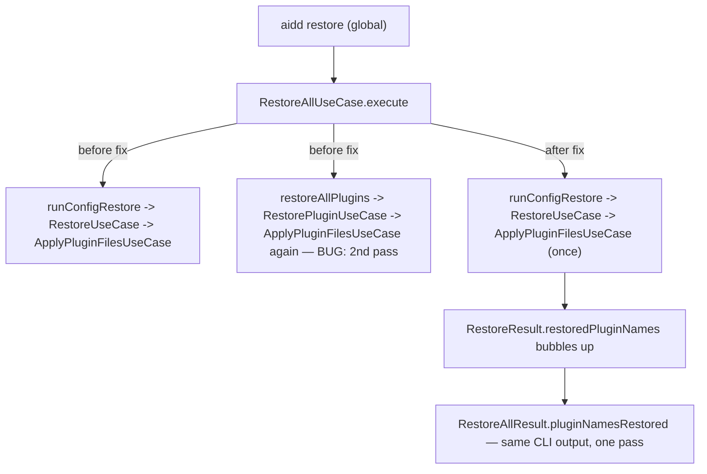

# Instruction: Collapse the double plugin-restore pass (A3)

## Architecture projection

> Tree of the final files. ✅ create · ✏️ modify · ❌ delete

```txt
.
└── cli/
    ├── src/application/use-cases/restore/
    │   ├── restore-all-plugins-use-case.ts                  ✏️ modify (return {totalFiles, pluginNames})
    │   ├── restore-use-case.ts                                ✏️ modify (bubble pluginNames via RestoreResult)
    │   └── restore-plugin-use-case.ts                          ❌ delete (unreferenced after this phase)
    ├── src/application/use-cases/global/
    │   └── restore-all-use-case.ts                            ✏️ modify (single pass, delete 2nd pass)
    └── tests/application/use-cases/
        ├── restore-plugin.unit.test.ts                        ❌ delete (tests the deleted class)
        ├── restore-use-case.unit.test.ts                      ✏️ modify (assert restoredPluginNames)
        └── restore-all-use-case.unit.test.ts                  ✅ create (no prior coverage existed)
```

## User Journey



## Tasks to do

### `1)` `RestoreAllPluginsUseCase` reports which plugins it actually restored

> Give the caller enough information to reconstruct the `pluginNamesRestored` UX without a second pass.

1. In `restore-all-plugins-use-case.ts`, add `export interface RestoreAllPluginsResult { totalFiles: number; pluginNames: string[] }` and change `execute()`'s return type from `Promise<number>` to `Promise<RestoreAllPluginsResult>`.
2. In `restoreToolPlugins`, track a `Set<string>` of plugin names: for each plugin in `targets`, add its name to the set only when `ApplyPluginFilesUseCase.execute(...)` returns `> 0` for that call. Return `{ total, names }` (or thread a shared accumulator) instead of a bare number.
3. In `execute()`, accumulate across tools into one `Set<string>` (dedup — a plugin shared by two tools should appear once), sum `totalFiles`, and return `{ totalFiles, pluginNames: [...set] }`.

### `2)` Bubble restored plugin names through `RestoreUseCase`

> `RestoreUseCase` is the sole caller of `RestoreAllPluginsUseCase` and needs to pass the names further up to `RestoreAllUseCase`.

1. In `restore-use-case.ts`, add `restoredPluginNames: string[]` to the `RestoreResult` interface.
2. Update `runPluginRestore` to return the full `RestoreAllPluginsResult` (or destructure it) instead of a bare number; update `executeRestore`/`saveIfChanged`/`buildTotals` to carry both `totalPluginFilesRestored` (existing field, unchanged meaning) and the new `restoredPluginNames` through to the final `RestoreResult`.
3. `ai.ts`/`ide.ts` command handlers are unaffected — they don't read `totalPluginFilesRestored` or plugin names off `RestoreResult` today (verified: neither file references either field); no command-layer change needed for this task.

### `3)` Collapse `RestoreAllUseCase` to a single pass

> Remove the redundant second materialization entirely.

1. In `global/restore-all-use-case.ts`, delete the `restoreAllPlugins` and `collectAllPluginNames` private methods, and the `RestorePluginUseCase` import.
2. Change `runConfigRestore`'s return type to include `restoredPluginNames: string[]` (from the single `RestoreUseCase.execute()` result), alongside the existing `totalRestored`/`totalKept`.
3. In `execute()`, remove the `const pluginNames = await this.restoreAllPlugins(...)` call; build `RestoreAllResult.pluginNamesRestored` directly from `restoreResult.restoredPluginNames` (the single pass's own result) instead.

### `4)` Delete the now-unreferenced `RestorePluginUseCase`

> Confirmed via grep: `restoreAllPlugins()` (deleted in task 3) was its only caller anywhere in `src/`.

1. Delete `src/application/use-cases/restore/restore-plugin-use-case.ts`.
2. Delete `tests/application/use-cases/restore-plugin.unit.test.ts` (tests the deleted class directly; see plan.md's Decisions for why the "throws PluginNotFoundError" scenario isn't ported elsewhere).

### `5)` Regression coverage for the single-pass invariant

> Prove the materialization happens exactly once, and that the CLI-visible output (`restore.ts`'s "Restored plugins: x, y") is unchanged — this class had zero prior test coverage.

1. Create `tests/application/use-cases/restore-all-use-case.unit.test.ts` (pattern after `restore-plugin.unit.test.ts`'s now-deleted setup: `buildUnitDeps`, `initAndInstall`, `PluginAddUseCase` + `seedFromDirectory` from `tests/fixtures/plugins/claude-format/sample-plugin`).
2. Test: install a translate-mode tool (claude) with a plugin, corrupt one of the plugin's files, run `RestoreAllUseCase.execute()`, assert the file is restored to original content AND assert the fetch/materialization happened exactly once (wrap `deps.pluginFetcher.fetch` or `deps.pluginDistributionReader.read` in a counting spy — same style as `EnsureBuiltMarketplaceUseCase`'s `builds` counter in the BUG-E2-01 test).
3. Test: same as task 2 but for a built-tree tool (cursor or opencode, whichever fixture already supports plugin install) — this is the tool family where the spike found a genuine unconditional double *disk write* (no hash guard), so it's the case that actually proves the collapse, not just the hash-guarded translate path.
4. Test: `result.pluginNamesRestored` contains the restored plugin's name exactly once.
5. Test: a plugin with nothing to restore (already up to date) does not appear in `pluginNamesRestored` and does not produce a `plugin:<name>` entry in `result.errors`, and a second `execute()` run right after leaves the plugin's persisted manifest entry (file hashes) unchanged — confirms skipping `manifestRepo.save()` on a 0-restore pass loses nothing (see plan.md Decisions).
6. Test: interactive global `aidd restore` where the user selects a non-plugin file (or omits the plugin's file) leaves an unselected, drifted plugin file NOT restored, for a translate-mode tool — proves `fileFilter` now actually reaches plugin files (it didn't before, see plan.md Decisions). Use the existing `promptForFiles`/`checkbox` prompter fake pattern already used by `restore-use-case.unit.test.ts`'s interactive tests.
7. Test: unscoped `aidd restore` (global) with two AI tools installed, each with a plugin, still restores both — no regression on the "restore everything" path.

## Test acceptance criteria

| Task | Acceptance criteria |
| ---- | ------------------------------------------------------------------------------------------------------------------------- |
| 1-3  | Corrupting one plugin file and running `aidd restore` fixes it with exactly one fetch/materialization call, not two — for both a translate-mode and a built-tree tool. |
| 1-3  | `aidd restore`'s "Restored plugins: ..." output lists the same plugin names as before this change, for the same scenarios. |
| 4    | `RestorePluginUseCase` has zero references anywhere in `src/` or `tests/` after this phase (verified by grep, not just by the deleted files compiling away). |
| 5    | A 0-restore pass changes nothing observable in the persisted manifest — proves skipping the save is safe, not assumed. |
| 6    | Deselecting a plugin's drifted file in interactive global restore leaves it un-restored — proves the filter fix, not just the dedup. |
| 7    | `tsc --noEmit` clean, and the existing `restore-use-case.unit.test.ts` suite (regular + merge file restore) still passes unmodified in behavior. |
