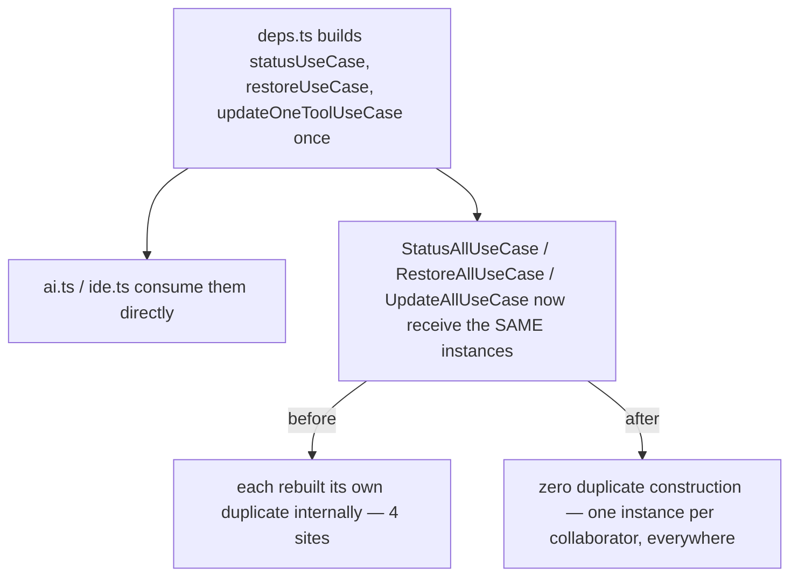

# Instruction: Inject shared instances into the 3 global "All" use-cases

## Architecture projection

> Tree of the final files. ✅ create · ✏️ modify · ❌ delete

```txt
.
└── cli/
    ├── src/
    │   ├── infrastructure/deps.ts                                                ✏️ modify
    │   └── application/use-cases/global/
    │       ├── status-all-use-case.ts                                            ✏️ modify
    │       ├── restore-all-use-case.ts                                           ✏️ modify
    │       └── update-all-use-case.ts                                            ✏️ modify
    └── tests/application/use-cases/
        └── restore-all-use-case.unit.test.ts                                     ✏️ modify (constructor signature)
```

## User Journey



## Tasks to do

### `1)` `StatusAllUseCase` receives `StatusUseCase` by injection

> Simplest of the 3 — every current constructor param becomes dead once injected.

1. In `status-all-use-case.ts`, change the constructor to `constructor(private readonly statusUseCase: StatusUseCase) {}`, dropping `fs`, `manifestRepo`, `hasher` (verified: used nowhere else in the class).
2. In `execute()`/`collectCategoryReports()`, replace the local `const useCase = new StatusUseCase(...)` with `this.statusUseCase`.

### `2)` `RestoreAllUseCase` receives `StatusUseCase` and `RestoreUseCase` by injection

> Two duplicate sites in this one file (`promptForFiles`, `runConfigRestore`).

1. In `restore-all-use-case.ts`, change the constructor to `(manifestRepo, prompter, statusUseCase, restoreUseCase)`, dropping `fs`, `hasher`, `logger`, `platform`, `pluginFetcher`, `pluginDistributionReader`, `assetProvider`, `builtDeps` (verified: each was used only to build the two now-injected instances; `manifestRepo` and `prompter` are still used directly elsewhere in the class and stay).
2. In `promptForFiles()`, replace `new StatusUseCase(this.fs, this.manifestRepo, this.hasher)` with `this.statusUseCase`.
3. In `runConfigRestore()`, replace the local `new RestoreUseCase(...)` (10 args) with `this.restoreUseCase`.

### `3)` `UpdateAllUseCase` receives `UpdateOneToolUseCase` by injection

> The duplicate here is built once in the constructor (not per-call), but it's still a second instance of the same collaborator `updateAiToolsUseCase`/`updateIdeToolsUseCase` already share.

1. In `update-all-use-case.ts`, change the constructor to `(manifestRepo, versionReader, pluginUpdateUseCase, marketplaceRefreshUseCase, updateOneToolUseCase)`, dropping `installRuntimeConfigUseCase`, `installIdeConfigUseCase`, `conflictResolver`, `decisionUseCase`, `fs` (verified: each was an unstored constructor-body-only param, used solely to build the now-injected `updateOneToolUseCase`).
2. Remove the constructor-body `this.updateOneToolUseCase = new UpdateOneToolUseCase(...)`; store the injected instance directly as `private readonly updateOneToolUseCase: UpdateOneToolUseCase`.

### `4)` Rewire `deps.ts`

1. Change `statusAllUseCase = new StatusAllUseCase(statusUseCase)`.
2. Change `restoreAllUseCase = new RestoreAllUseCase(manifestRepo, prompter, statusUseCase, restoreUseCase)`.
3. Change `updateAllUseCase = new UpdateAllUseCase(manifestRepo, currentVersionProvider, pluginUpdateUseCase, marketplaceRefreshUseCase, updateOneToolUseCase)`.
4. No reordering needed — `statusUseCase`/`restoreUseCase`/`updateOneToolUseCase` are already constructed earlier in the file than their respective "All" consumer.

### `5)` Update the one test that constructs `RestoreAllUseCase` directly

1. In `tests/application/use-cases/restore-all-use-case.unit.test.ts`, update `makeRestoreAllUseCase` to build a `StatusUseCase`/`RestoreUseCase` first and pass them per the new constructor signature, instead of the old 10-arg list.

## Test acceptance criteria

| Task | Acceptance criteria |
| ---- | -------------------------------------------------------------------------------------------------------------------------- |
| 1-4  | `aidd status`, `aidd restore`, `aidd update` produce output identical to before this change (verified by the existing test suite, unmodified assertions, plus the updated `restore-all-use-case.unit.test.ts`). |
| 1-4  | `grep -rn "new StatusUseCase\|new RestoreUseCase\|new UpdateOneToolUseCase" src/` finds only the 3 original construction sites in `deps.ts`, none inside `status-all-use-case.ts`, `restore-all-use-case.ts`, or `update-all-use-case.ts`. |
| 5    | `tsc --noEmit` clean; full existing test suite (2045+ tests) passes unmodified. |
