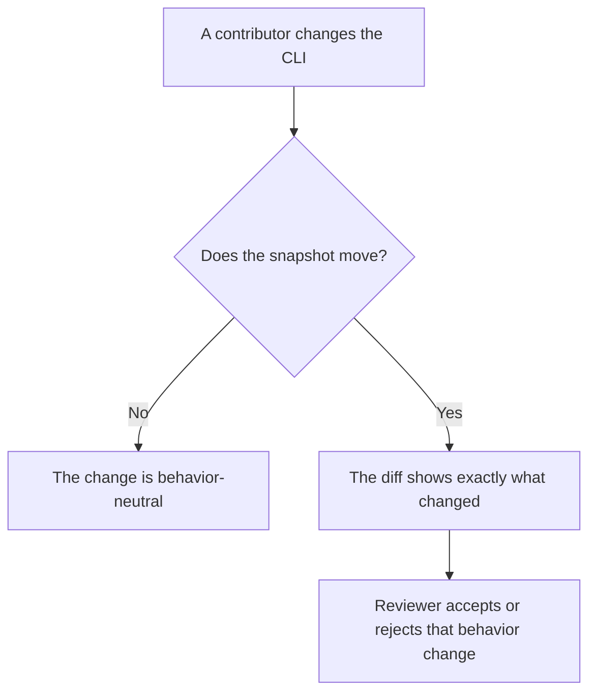
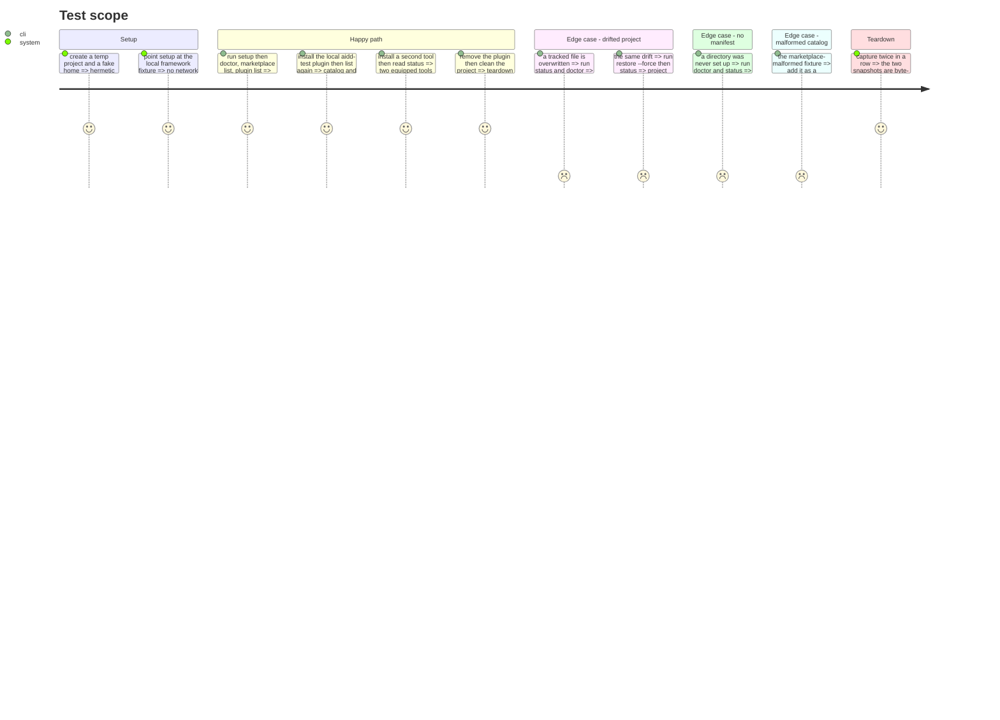

# Instruction: Extend the golden net

The sixteen phases that follow are only verifiable if a behavior snapshot covers the surface they
touch. Today `snapshots/phase0/snapshot.json` holds **five invocations** — `setup`, `status`,
`restore --force`, `clean --force`, `status` — while the test's own docstring claims "each public
CLI command". Nothing else in this plan is safe until that gap closes.

`captureMatrix` runs commands **sequentially in one project directory**. It is a scenario, not a
list of independent invocations: state accumulates and `clean --force` is terminal. Extending it is
a scenario design.

Already normalized: absolute paths, the built-cache directory, version strings, CRLF, and manifest
file hashes recomputed over normalized content. Already covered elsewhere: `framework build`, whose
own golden spans the nine target/mode cells.

## Architecture projection

> Tree of the final files. ✅ create · ✏️ modify · ❌ delete

```txt
.
└── cli/tests/golden/
    ├── golden-baseline.e2e.test.ts   ✏️ modify (honest docstring, extended scenario, error scenario)
    ├── help-surface.e2e.test.ts      ✅ create (--help for every command and subcommand)
    └── snapshots/
        ├── phase0/snapshot.json      ✏️ modify (recaptured with UPDATE_GOLDEN=1)
        └── help/surface.json         ✅ create (the user-visible surface, frozen)
```

## User Journey



## Test Scope



## Tasks to do

### `1)` Make the docstring honest

> The file must not promise more than it holds.

1. Replace "Each public CLI command is exercised" with what it does: one scenario over a hermetic
   fixture project, plus an error scenario.
2. Name what it deliberately leaves out — see task 6.

### `2)` Extend the main scenario

> Keep the existing order; insert around it.

1. After `setup`, capture `doctor`, `marketplace list` and `plugin list` on the fresh project.
2. Capture `plugin install aidd-test`, then `plugin list` again. The fixture serves it from
   `./plugins/aidd-test`, a local source, so this stays offline.
3. Capture a second tool install, then `status` with two tools equipped.
4. Capture `plugin remove aidd-test` before the existing `restore --force`.
5. Leave `clean --force` and the post-clean `status` last: `clean` ends the scenario.

### `3)` Capture drift

> The mechanism `status` and `doctor` share is the one never captured.

1. Between two captures, overwrite one tracked file with fixed content. It is not a command, so it
   produces no entry; its effect shows in the next one.
2. Capture `status` and `doctor` on the drifted project.
3. Capture `restore --force`, then `status` again.

### `4)` Add an error scenario in a second directory

> `clean --force` is terminal, so error paths need their own project.

1. Capture `doctor` and `status` on a directory with no manifest.
2. Capture a plugin install with no marketplace registered.
3. Capture a marketplace add pointing at `tests/fixtures/framework/marketplace-malformed`.
4. Capture an unknown tool id and an unknown command.
5. Prefix each entry's `command` with its scenario so both live in one snapshot file.

### `5)` Freeze the user-visible surface

> The eleven relocation phases have no other net for "nothing the user sees moved".

1. Add `help-surface.e2e.test.ts`: walk the command tree from the root, capture `--help` for every
   command and every subcommand, and store it as one snapshot.
2. It needs no fixture project and no network, so it is fast and runs everywhere.
3. From then on, a move that changes a description, a flag, an argument or an order fails
   immediately, with the diff naming the command.

### `6)` Prove the capture is deterministic

> Reproducible at capture time is not the same as stable.

1. Capture twice in a row and compare byte for byte.
2. Inspect the new entries for values `normalize()` does not handle. Timestamps are the likely leak,
   since marketplace entries carry `addedAt` and `lastFetched`. Extend `normalize()` rather than
   dropping the field.
3. Run the suite twice without `UPDATE_GOLDEN`.

### `7)` Record what stays out of reach

> An honest net names its holes.

1. In the docstring, one line each: anything hitting the network, anything interactive, and
   `framework build`, covered by its own golden.

## Test acceptance criteria

| Task | Acceptance criteria |
| ---- | ------------------- |
| 1, 7 | The docstring describes what the file covers and names what it does not; no claim exceeds the content |
| 2    | The snapshot holds an entry for `doctor`, `marketplace list`, `plugin list`, `plugin install`, `plugin remove` and a second tool install, on top of the existing five |
| 3    | The snapshot holds a `status` and a `doctor` taken on a drifted project, and a `status` after `restore --force` showing it back in sync |
| 4    | The snapshot holds at least four entries with a non-zero exit code, captured in a directory the main scenario never touched |
| 5    | The help snapshot holds an entry per command and per subcommand; changing one description fails the test, verified by changing one |
| 6    | Two consecutive captures are byte-identical, two consecutive verification runs pass, and no absolute path, version string or timestamp survives in the snapshot |
| all  | The snapshot diff of this phase is pure addition, **or** an entry changed for a reviewed reason recorded here. A change with no such reason means the capture is not deterministic |

## What this phase found

Extending the net immediately produced two results the plan did not anticipate.

**`aidd restore --force` was inert.** The command folded the flag into
`interactive = !force && isTTY`, and `RestoreAllUseCase` only took `interactive`, so a non-TTY run
always decided with `force: false`. A modified tracked file raised `InputRequiredError`, swallowed
into a warning telling the user to pass `--force` — which they had — while the command reported
"all files are unmodified" and `status` reported the same file modified. Fixed in its own commit;
that is why one existing snapshot entry changed, and its diff is the review.

**Two invocations this phase wrote were wrong, and the capture said so.**
`plugin remove --yes` recorded `error: unknown option`, not a removal. Worth noting while fixing it:
`plugin install` accepts `--yes` silently and `plugin remove` rejects it, though neither declares it
and it is not a global option.

**Every tracked file in this scenario is co-owned.** With claude and cursor installed, the manifest
tracks exactly one file per tool — their `settings.json`. `plugin install` writes no tracked file at
all: for both tools AIDD registers a locally built marketplace rather than copying. So this scenario
cannot exercise the CLI-owned regeneration regime; a flat-mode tool would be needed for that.
