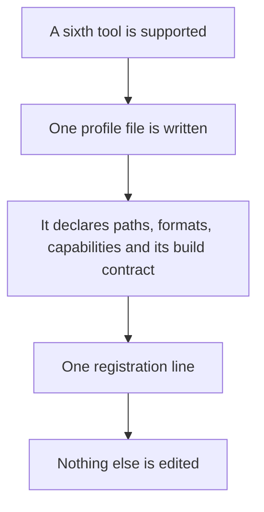
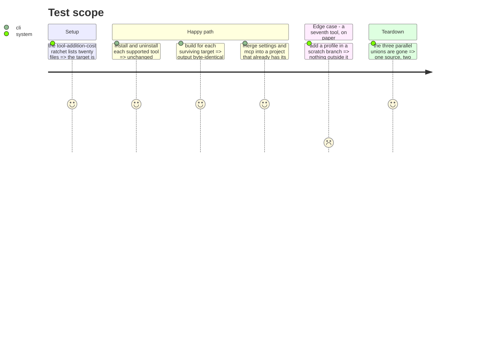

# Instruction: Extract the tools context

What the project targets, and how each target is configured. This is the phase that settles the
plan's acceptance test: adding a sixth tool must touch one file.

Today it touches eight, and three of them are parallel unions of the same five values. Measured:
`AiToolId`, `PluginFormat` and `FrameworkBuildTarget` have exactly the same members, in different
order, with nothing checking that they agree.

## Architecture projection

> Tree of the final files. ✅ create · ✏️ modify · ❌ delete

```txt
.
└── cli/src/contexts/tools/          ✅ create
    ├── domain/
    │   ├── profiles/                ✅ create (claude, cursor, copilot, codex, opencode, vscode)
    │   ├── registry.ts              ✏️ modify (from domain/tools/)
    │   ├── contracts.ts             ✏️ modify (from domain/tools/)
    │   ├── settings-capability.ts   ✏️ modify (co-owned files)
    │   ├── mcp-capability.ts        ✏️ modify (co-owned files)
    │   ├── mcp-exclusion.ts         ✏️ modify (from domain/models/)
    │   └── ports/                   ✅ create (native-plugin-activator, file-merger)
    ├── application/                 ✏️ modify (install-tool, uninstall-tool, the three config installs)
    └── infrastructure/              ✏️ modify (native-plugin-cli, codex-cli, copilot-cli)

cli/src/application/use-cases/framework/strategies/tool-contracts.ts  ❌ delete (820 l., split across profiles)
cli/src/domain/models/plugin-format.ts        ✏️ modify (becomes derived)
cli/src/domain/models/framework-build.ts      ✏️ modify (keeps only the mode type)
```

> **Frontière sans baril (tranché en phase 7).** Ce contexte n'a pas d'`index.ts`. La valeur de
> l'invariant est « rien n'importe l'intérieur d'un contexte », et un fichier de ré-exports n'est
> qu'un mécanisme — celui-là contredit `noBarrelFile` et le cliquet `no-re-export` à base vide. La
> frontière est tenue par un cliquet d'architecture qui liste les modules publics du contexte : une
> importation venue d'un autre contexte ne vise que cette liste. Voir `arborescence.md`, invariant 4.

## User Journey



## Test Scope



## Tasks to do

### `1)` Give each profile its build contract

1. `tool-contracts.ts` holds nine `build*Contract()` functions for five tools. A tool's build
   contract is a property of that tool: move each into its profile.
2. The 820-line file disappears.

### `2)` Derive the unions

1. `PluginFormat` and `FrameworkBuildTarget` have the same members as `AiToolId`. Make them aliases
   or explicit subsets so the values are written once.
2. `FRAMEWORK_BUILD_TARGET_MODES` becomes derived: each profile declares its mode, since phase 5
   made the mode a property of the tool.

### `3)` Move the co-owned configuration

1. `settings-capability`, `mcp-capability` and `mcp-exclusion` describe files the user also owns.
   They belong here, with the merge strategies that keep the user's entries.

### `4)` Close the context

1. Declare the context's public modules in the boundary ratchet, and add the biome `override` refusing imports into the interior.
2. Shrink the `tool-addition-cost` baseline to empty, or record what is left and why.

## Test acceptance criteria

| Task | Acceptance criteria |
| ---- | ------------------- |
| 1    | Building for each surviving target produces the same tree; no file outside the profiles names a tool |
| 2    | Changing the tool list in one place is enough; the derived types follow without a second edit |
| 3    | Installing into a project that already has its own `settings.json` and `.mcp.json` preserves the user's entries |
| 4    | An import into `contexts/tools/` interior fails the lint; the `tool-addition-cost` baseline is empty or justified line by line |
| all  | Golden, build golden and e2e pass **unmodified** |

## Livrée (2026-09-02)

Les tâches 1, 3 et 4 étaient faites depuis `c67bcd6a` : les neuf contrats de build sont dans un
`build.ts` par outil, `tool-contracts.ts` a disparu, `settings`, `mcp` et `mcp-exclusion` sont dans
`tools`, et la frontière du contexte est déclarée et prouvée par injection.

La tâche 2, elle, ne l'était pas. Les trois unions parallèles existaient toujours, écrites à la
main, avec un test de conformité qui vérifiait qu'elles s'accordaient — un détecteur, pas une
dérivation : ajouter un sixième outil demandait encore quatre éditions.

Ce qui a changé :

- `FrameworkBuildTarget` et `PluginFormat` sont des alias de `AiToolId`. Une cible de build est un
  outil, un format est la mise en page qu'un outil donne à un plugin ; les réécrire créait une
  deuxième liste à tenir.
- `FRAMEWORK_BUILD_TARGET_MODES` devient `frameworkBuildTargetModes()`, lue sur les profils : un
  outil supporte un mode quand son profil déclare un contrat de build pour ce mode. Une fonction et
  pas une constante, parce que le registre se remplit au câblage — une constante évaluée à l'import
  aurait capturé un registre vide. Le câblage de `runtime` itère la même liste, donc les deux ne
  peuvent plus diverger.
- Les emplacements de manifeste et de catalogue sont déclarés par chaque profil
  (`distributionProbes`) et collectés par `translate`.

L'ordre des sondes est un comportement, pas une présentation : le lecteur prend la première qui
résout, et copilot accepte un `plugin.json` nu à la racine, que n'importe quel répertoire peut
porter. Les sondes sont donc triées du chemin le plus profond au moins profond — la raison pour
laquelle l'ordre écrit à la main fonctionnait, dite explicitement. Un répertoire codex portant un
`plugin.json` racine était le cas discriminant : sans le tri il se lit `copilot`, et le test
d'intégration échoue exactement là.

Deux tests changeaient de nature en devenant tautologiques. « chaque cible est un outil enregistré »
et « chaque format de sonde est un outil enregistré » ne peuvent plus être faux : ils sont remplacés
par une éprouvette de chaque dérivation sur des profils synthétiques, dont le cas qu'un registre
réel ne présentera jamais — un outil enregistré qui ne déclare aucun contrat de build.

## Ce qui reste dans le socle, et pourquoi

Sept fichiers nommaient un outil hors de son profil, il en reste trois, chacun pour une raison
différente et une seule est une dette :

| Fichier | Pourquoi il reste |
| ------- | ----------------- |
| `tool-recommendations.ts` | Recommande des outils à un utilisateur par leur nom. Il n'y a pas de profil où lire « quel outil convient à quelle stack » : ce n'est la propriété d'aucun outil. |
| `config-refs.ts` | `CONFIG_OPENCODE = "opencode"` nomme un artefact de configuration, pas un outil. Il s'écrit comme un outil parce que l'artefact est son fichier de config ; c'est le profil d'opencode qui déclare le consommer. |
| `plugins-capability.ts` | `NativeActivation.binary` liste les trois CLI que ce dépôt a mesurées et pour lesquelles il a écrit un activateur. C'est une liste blanche assumée : un quatrième outil pilotant sa CLI devra de toute façon enregistrer un activateur pour ce binaire. |

## Vérifié

- 1987 tests, 982 suites, 0 échec — suites comptées, pas seulement les tests
- smoke : 98 pass, 0 fail, 22 / 22 commandes feuilles
- `aidd translate --to nope` répond `claude, cursor, copilot, opencode, codex`, dérivé des profils
- tsc 0, biome 0, build ok
