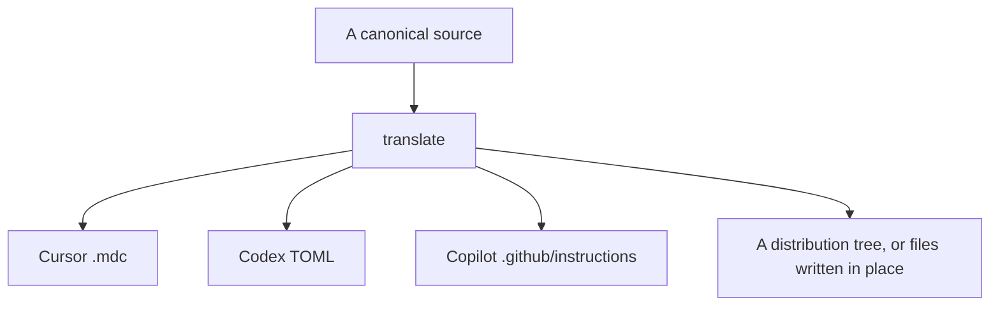
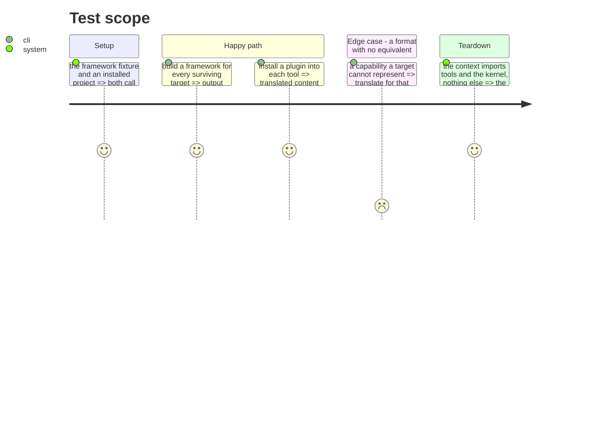

# Instruction: Extract the translate context

The core. Converting one canonical source into what each tool expects, at every level: plugin
content into a tool's format, a framework source into a target-native distribution, paths, merges
and rewrites.

It is the only thing the CLI does that a user cannot do without it, which is why it is a context and
not a service.

## Architecture projection

> Tree of the final files. ✅ create · ✏️ modify · ❌ delete

```txt
.
└── cli/src/contexts/translate/      ✅ create
    ├── domain/
    │   ├── capabilities/            ✏️ modify (agents, skills, commands, rules, hooks)
    │   ├── formats/                 ✏️ modify (markdown, command, placeholders, toml, paths, merges, rewrites)
    │   ├── content-translator.ts    ✏️ modify (from domain/models/plugin-content-translator.ts)
    │   ├── canon.ts                 ✏️ modify (from domain/models/framework.ts)
    │   └── build-target.ts          ✏️ modify (what remains of framework-build.ts)
    ├── application/
    │   └── translate-source.ts      ✏️ modify (from use-cases/framework/, in place or to a distribution tree)
    └── infrastructure/schema-validator.ts  ✏️ modify
```

> **`jsonc` reste dans le noyau (phase 9).** La projection le listait ici. Il n'y va pas :
> `kernel/merge.ts` appelle `stripJsonComments`, donc le laisser dans un contexte rendrait
> insatisfiable la règle « le noyau n'importe aucun contexte », et le dupliquer serait pire que de
> le déplacer. Trente lignes pures, sans import.

> **Frontière sans baril (tranché en phase 7).** Ce contexte n'a pas d'`index.ts`. La valeur de
> l'invariant est « rien n'importe l'intérieur d'un contexte », et un fichier de ré-exports n'est
> qu'un mécanisme — celui-là contredit `noBarrelFile` et le cliquet `no-re-export` à base vide. La
> frontière est tenue par un cliquet d'architecture qui liste les modules publics du contexte : une
> importation venue d'un autre contexte ne vise que cette liste. Voir `arborescence.md`, invariant 4.

## User Journey



## Test Scope



## Tasks to do

### `1)` Les capacités de contenu vont dans `tools`, pas ici — et voici pourquoi

> La projection les envoyait dans `translate`. Mesuré, c'est ce qui créait l'inversion que la
> tâche 4 interdit.

Une capacité de contenu chevauche la couture entre les deux contextes : `buildOutputPath` dit **où**
un outil range ses agents, savoir d'outil ; `convertFrontmatter` dit **comment** le contenu change de
forme, savoir de traduction. La mettre dans `translate` force `tools/domain/contracts.ts`, qui la
compose, à importer `translate`. La mettre dans `tools` semblait la forcer à importer `formats/`,
donc `translate`. Les deux placements paraissaient produire la même arête interdite.

Le blocage n'était pas réel. Ce que ces capacités tirent de `formats/`, mesuré symbole par symbole :

| capacité | ce qu'elle importe de `formats/` |
|---|---|
| agents | `parseFrontmatter`, `serializeFrontmatter` |
| skills, commands, rules | `serializeFrontmatter` |
| hooks | rien |

Deux transformations pures sur du frontmatter, sans connaissance d'outil ni de cible. Et
`formats/markdown.ts` fait 139 lignes **sans un seul import**. C'est du vocabulaire partagé, pas de
la traduction — exactement l'argument qui a mis `jsonc.ts` dans le noyau en phase 9, et le précédent
vient de ce dépôt.

1. `markdown.ts` va dans le noyau. Ses consommateurs sont déjà des deux côtés de la future frontière.
2. `agents`, `skills`, `commands`, `rules` et `hooks` rejoignent `settings` et `mcp` dans `tools` :
   un outil déclare ce qu'il accepte et où il le range. `translate` lit ces déclarations.
3. La chaîne `translate → tools → kernel` tient alors sans découper `AiTool` ni rouvrir la phase 10.

### `2)` Move the formats and the translator

1. Everything under `domain/formats/` that survived phase 3, plus `plugin-content-translator.ts`.
2. `framework.ts` becomes `canon.ts`: it describes the canonical source shape, not a product.

### `3)` Move the build, renamed for what it does

1. `use-cases/framework/` becomes `translate-source`: one source, N targets, written in place or to
   a distribution tree. The command keeps its current name until phase 18.

### `4)` Close the context

1. Declare the context's public modules in the boundary ratchet, and add the biome `override`.
   Verify it depends on `tools` and the kernel and on nothing else.
2. Ajouter aussi l'override inverse : `src/contexts/tools/**` ne peut pas importer
   `src/contexts/translate/**`. C'est l'arête que la phase 10 a laissée debout en promettant qu'elle
   se résoudrait ici ; une promesse que rien ne vérifie n'est pas une garantie. L'éprouver par
   injection, comme celui du noyau.

## Test acceptance criteria

| Task | Acceptance criteria |
| ---- | ------------------- |
| 1    | Installing a plugin produces the same files for every tool |
| 2    | Every format transform behaves as before; the build golden is unchanged |
| 3    | `framework build` still works, unchanged, under its current name |
| 4    | The context imports only `tools` and the kernel; an import into its interior fails the lint |
| all  | Golden, build golden and e2e pass **unmodified** |

## Livrée (2026-09-02)

Les trois premières tâches étaient faites depuis le commit `77a8c6bf` : `markdown.ts` est dans le
noyau, les formats et le traducteur sont dans `translate`, `framework.ts` s'appelle `canon.ts`, et
`translate` n'importe que le noyau et `tools` (vérifié : toutes ses importations relatives pointent
vers `kernel/`, `tools/domain/` ou son propre domaine).

La tâche 4 demandait d'éprouver les deux règles par injection plutôt que de les lire. C'est ce qui a
trouvé le défaut. L'override `tools` ne peut pas importer `translate` mordait bien. Celui de
`translate` ne mordait pas du tout : sa liste nommait `**/domain/models/**`,
`**/application/use-cases/**`, `**/infrastructure/adapters/**` et trois autres chemins que le
refactor avait déjà supprimés. La règle se lisait comme une frontière, ne correspondait à rien, et
laissait `translate` importer `framework`, `distribution`, `presentation` ou `runtime` sans un mot.

Elle nomme désormais les quatre destinations interdites qui existent. Les six overrides sont
prouvés un par un, en écrivant l'import interdit et en regardant biome refuser :

| Depuis | Import injecté | Message |
| ------ | -------------- | ------- |
| `translate/domain` | `../../framework/domain/manifest.js` | translate may import only the kernel and contexts/tools |
| `translate/domain` | `../../../runtime/wiring/translate.js` | idem |
| `tools/domain` | `../../translate/domain/plugin-format.js` | tools may not import translate |
| `distribution/domain` | `../../tools/domain/registry.js` | distribution knows no tool… |
| `kernel` | `../contexts/tools/domain/registry.js` | kernel must not import any context |
| `framework/domain` | `../application/restore/restore-use-case.js` | domain must not import application… |

Et `tests/architecture/import-rules-bite.arch.test.ts` empêche la panne de revenir : chaque motif de
chaque override doit encore désigner un chemin présent sous `src/`. Le bug d'origine réinjecté le
fait échouer en nommant la ligne fautive.
