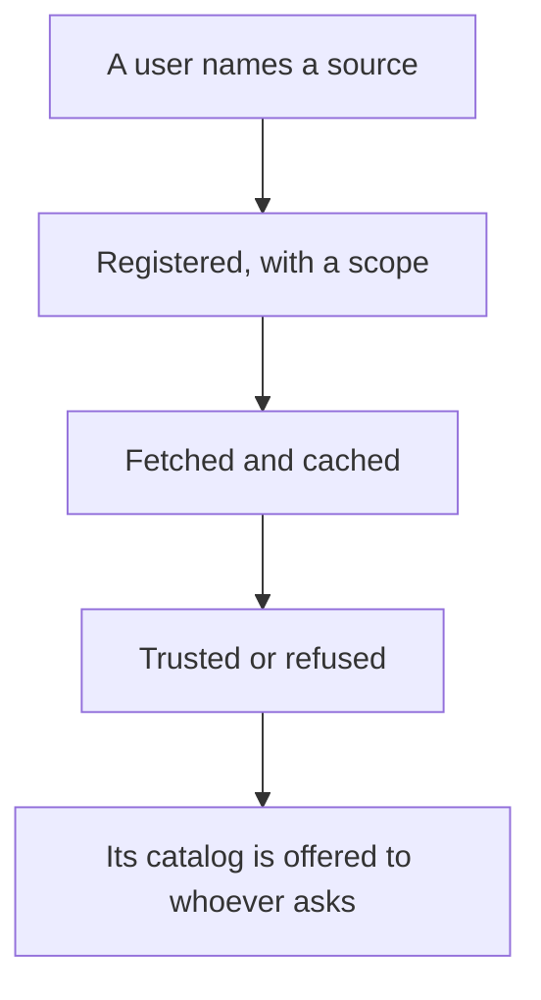
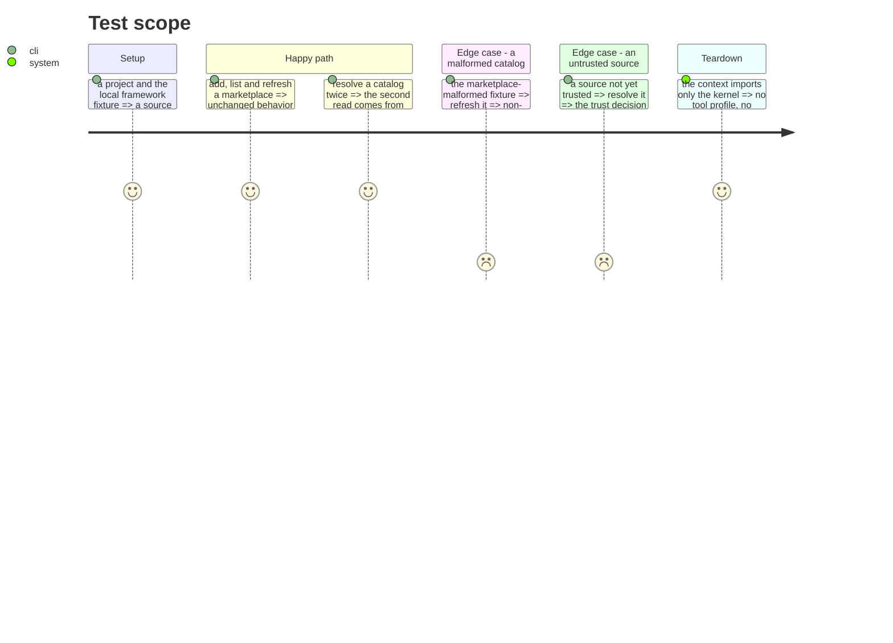

# Instruction: Extract the distribution context

Where content comes from: registered marketplaces, their catalogs, their caches, and whether they
are trusted. After phase 8 moved the three cross-area flows out, it knows nothing about tools and
nothing about what is installed — it is a leaf, and this phase proves it.

Its state left the manifest a while ago: `manifest.ts:142` records that the registry lives in
`.aidd/marketplaces.json`.

## Architecture projection

> Tree of the final files. ✅ create · ✏️ modify · ❌ delete

```txt
.
└── cli/src/contexts/distribution/   ✅ create
    ├── domain/
    │   ├── marketplace.ts           ✏️ modify (entry, scope, staleness)
    │   ├── cache-entry.ts           ✏️ modify
    │   ├── source-mode.ts           ✏️ modify
    │   ├── catalog.ts               ✏️ modify (from domain/models/plugin-catalog.ts)
    │   ├── catalog-parsers/         ✅ create (the Copilot-native reader from phase 8)
    │   └── ports/                   ✅ create (registry, cache, trust-store, catalog-repository, fetcher, raw-fetcher)
    ├── application/                 ✏️ modify (add, list, refresh, register-framework, resolve, fetch-source)
    └── infrastructure/              ✏️ modify (registry, catalog-repository, fetcher, cache, trust, raw-fetcher)
```

> **Frontière sans baril (tranché en phase 7).** Ce contexte n'a pas d'`index.ts`. La valeur de
> l'invariant est « rien n'importe l'intérieur d'un contexte », et un fichier de ré-exports n'est
> qu'un mécanisme — celui-là contredit `noBarrelFile` et le cliquet `no-re-export` à base vide. La
> frontière est tenue par un cliquet d'architecture qui liste les modules publics du contexte : une
> importation venue d'un autre contexte ne vise que cette liste. Voir `arborescence.md`, invariant 4.

## User Journey



## Test Scope



## Tasks to do

### `1)` Move the sourcing domain and its ports

1. The marketplace models, the catalog model and the Copilot-native parser.
2. The six ports it owns: `marketplace-registry`, `marketplace-cache`, `marketplace-trust-store`,
   `plugin-catalog-repository`, `plugin-fetcher`, `raw-catalog-fetcher`.

### `2)` Move the six use cases that stayed

1. `add`, `list`, `refresh`, `register-framework`, `resolve`, `fetch-source`. The three that crossed
   into the installation record left at phase 8.

### `3)` Close the context and prove the leaf

1. Declare the context's public modules in the boundary ratchet, and add the biome `override`.
2. Verify by import graph, not by reading: nothing under the context imports a tool profile or
   `Manifest`.

## Test acceptance criteria

| Task | Acceptance criteria |
| ---- | ------------------- |
| 1    | Adding, listing, refreshing and removing a marketplace behave as before, including the trust prompt |
| 2    | A malformed catalog still fails with a message naming the file, and one bad catalog does not abort a multi-marketplace report |
| 3    | The context imports only the kernel; an import into its interior fails the lint |
| all  | Golden and e2e pass **unmodified** |
