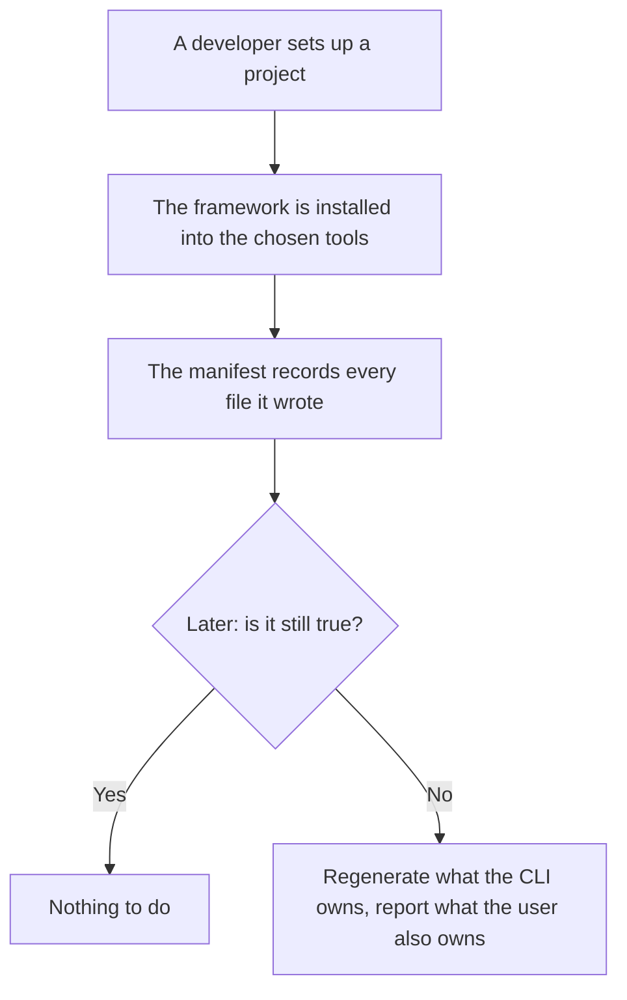
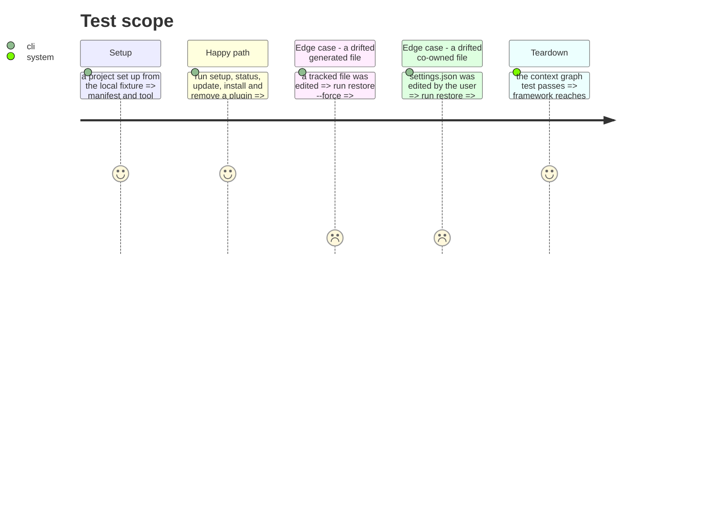

# Instruction: Extract the framework context

What is installed here, at which version, and whether it is still true. It is the only context
allowed to call another, and it owns `manifest.json` and the tool files.

This phase **moves only**. The aggregate keeps the shape it has today, defects included: 529 lines,
28 public methods, six responsibilities. Splitting it is phase 14, on its own, because a move and a
domain redesign in the same pass cannot both be reviewed.

## Architecture projection

> Tree of the final files. ✅ create · ✏️ modify · ❌ delete

```txt
.
└── cli/src/contexts/framework/      ✅ create
    ├── domain/
    │   ├── manifest.ts              ✏️ modify (moved as-is, not yet split)
    │   ├── plugin.ts                ✏️ modify (moved as-is, renamed in phase 14)
    │   ├── doctor.ts                ✏️ modify
    │   ├── install-scope.ts         ✏️ modify
    │   ├── setup-flow.ts            ✏️ modify
    │   ├── project-context.ts       ✏️ modify
    │   ├── semver.ts                ✏️ modify
    │   └── ports/                   ✅ create (manifest-repository, plugin-distribution-reader)
    ├── application/
    │   ├── flows/                   ✏️ modify (setup, sync, update, and the three from phase 8)
    │   └── cases/                   ✏️ modify (install, uninstall, plugin *, materialize, status, doctor, clean, init)
    └── infrastructure/              ✏️ modify (manifest-repository, plugin-distribution-reader, native plugin CLIs)
```

> **Frontière sans baril (tranché en phase 7).** Ce contexte n'a pas d'`index.ts`. La valeur de
> l'invariant est « rien n'importe l'intérieur d'un contexte », et un fichier de ré-exports n'est
> qu'un mécanisme — celui-là contredit `noBarrelFile` et le cliquet `no-re-export` à base vide. La
> frontière est tenue par un cliquet d'architecture qui liste les modules publics du contexte : une
> importation venue d'un autre contexte ne vise que cette liste. Voir `arborescence.md`, invariant 4.

## User Journey



## Test Scope



## Tasks to do

### `1)` Move what is left

> After four contexts leave, this context is what remains.

1. The installation domain, its two ports, the flows and the cases.
2. Change no signature and no method. Anything tempting to fix here belongs to phase 14.

### `2)` Close the context

1. Declare the context's public modules in the boundary ratchet. This context is the only one
   allowed to import another context's public modules.
2. Add the biome `override` refusing imports into the interior.

### `3)` Turn the chain into a test

> The invariant that carries the whole plan deserves more than a lint pattern.

1. Add `tests/architecture/context-graph.arch.test.ts`: build the import graph, map each file to its
   context, and assert the only edges are those `arborescence.md` invariant 2 allows —
   `framework → translate`, `translate → tools`, `framework → distribution`, and every context to
   the kernel.

   > Une première rédaction de cette tâche omettait `translate → tools`, l'arête que la phase 11
   > établit précisément. Un test écrit sur cette liste-là aurait refusé la structure voulue.

2. Il remplace les `override` biome par une seule liste lisible d'arêtes autorisées. Les deux ne
   doivent pas coexister en disant des choses différentes : soit le test devient la source unique et
   les overlays partent, soit ils restent et le test se contente de ce qu'ils ne savent pas exprimer.
   Trancher ici, et l'écrire.

## Test acceptance criteria

| Task | Acceptance criteria |
| ---- | ------------------- |
| 1    | Every command touching the installation record behaves as before; no public method changed |
| 2    | An import into `contexts/framework/` interior fails the lint |
| 3    | The context graph test lists the allowed edges and fails when a new one appears, verified by adding one |
| all  | Golden, help snapshot and e2e pass **unmodified** |
