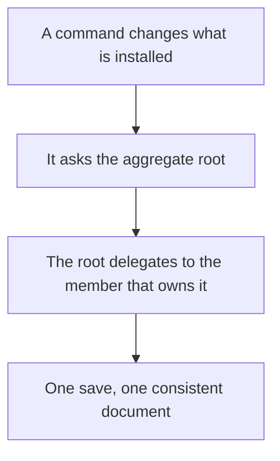
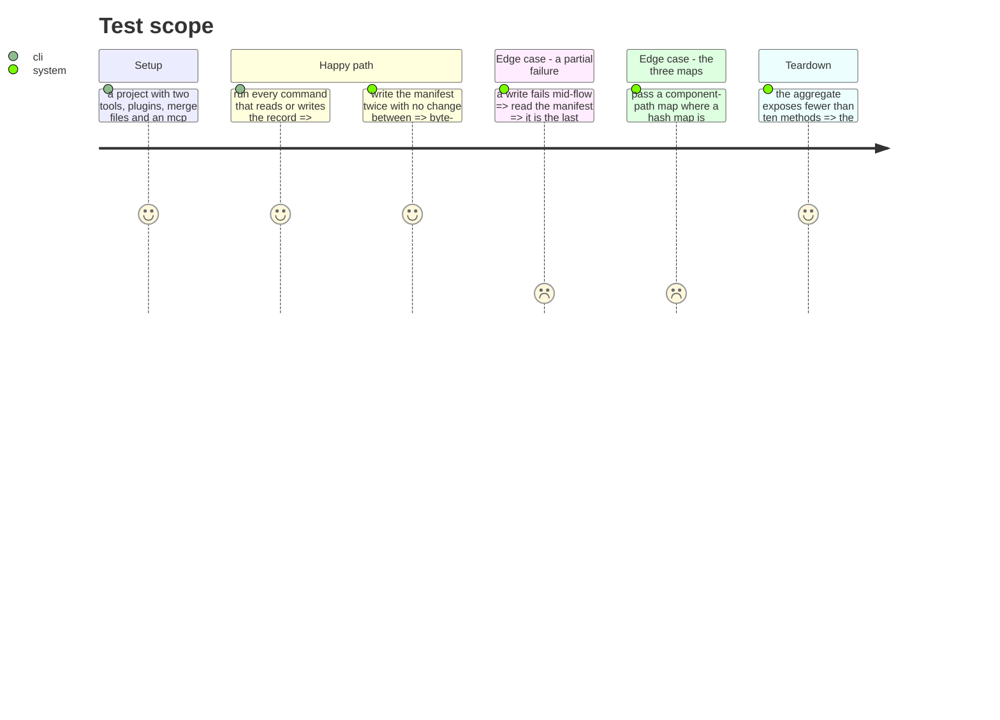

# Instruction: Split the Manifest aggregate

`Manifest` is 529 lines and 28 public methods covering six responsibilities: tools, tracked files,
merge files, mcp exclusions, plugins, serialization. None can change without reopening the same
file. It is a facade over a JSON document, not an aggregate.

This phase changes the domain and moves nothing. It is separate from phase 13 so its diff is
readable: one shows files arriving, the other shows a model changing shape.

Two smaller defects go with it. `FileHash` exists as a proper value object with `equals()`, and yet
the installed record carries three `ReadonlyMap<string, string>` of different meanings, told apart
only by a comment — the compiler sees the same type in all three. And `Plugin` alone does not say
which of the five plugins it is.

## Architecture projection

> Tree of the final files. ✅ create · ✏️ modify · ❌ delete

```txt
.
└── cli/src/contexts/framework/domain/
    ├── manifest.ts                  ✏️ modify (aggregate root: identity and consistency only)
    ├── tool-entry.ts                ✅ create (one tool's slice of the record)
    ├── tracked-files.ts             ✅ create (paths and hashes)
    ├── merge-files.ts               ✅ create (co-owned file entries)
    ├── mcp-exclusions.ts            ✅ create (from the manifest's four methods)
    ├── installed-plugin.ts          ✏️ modify (from plugin.ts, renamed and typed)
    └── manifest-serialization.ts    ✅ create (toJSON / fromJSON, out of the entity)
```

## User Journey



## Test Scope



## Tasks to do

### `0)` Mesurer avant de toucher

> `stryker.conf.json` mute exactement un fichier, `src/domain/models/manifest.ts`, avec un seuil de
> rupture à 50. C'est la meilleure preuve disponible que les tests de cet agrégat attrapent un
> changement — ce dont cette phase a besoin avant de le redécouper.

1. La réparation de Stryker appartient à la phase 9, avec le reste du harnais : une mesure prise
   après le redécoupage ne prouverait rien sur le redécoupage. Ici on l'utilise.
2. Enregistrer le score **avant** le découpage, puis après. L'écart entre les deux est la revue.
3. Si la phase 9 a conclu que la réparation est impossible, elle l'a écrit et a nommé ce qui la
   remplace. Le test d'aller-retour de la tâche 4 est ce remplacement, et il est plus faible : il
   prouve que la sortie est stable, pas que les tests remarqueraient un changement de comportement.

### `1)` Separate the members

> One save, one invariant, one file per responsibility.

1. `Manifest` keeps identity, consistency and the entry point to its members.
2. `ToolEntry` carries tracked files, merge files, mcp exclusions and installed plugins.
3. Serialization leaves the entity: `toJSON` and `fromJSON` become their own module.

### `2)` Type the three maps

1. Path to hash, installed path to component path, mcp server name to digest. Three distinct types,
   so one can no longer be passed where another is expected. `FileHash` already shows the shape.

### `3)` Rename by intention

1. `Plugin` becomes `InstalledPlugin`. The catalog entry and the fetched payload keep their own
   names, so each context speaks of its own plugin without ambiguity.

### `4)` Prove the round-trip did not move

> The strongest available net for a model change: the document on disk must be identical.

1. Add a test that loads every manifest fixture, writes it back, and asserts the bytes are unchanged.
2. Run it before and after the split. This is what makes the phase reviewable.

## Test acceptance criteria

| Task | Acceptance criteria |
| ---- | ------------------- |
| 0    | Either a mutation score for `manifest.ts` is recorded before the split, or the phase records why it cannot be and what stands in its place |
| 1    | Every command touching the record behaves as before; one save still writes one consistent document |
| 2    | Passing one of the three maps where another is expected fails to compile, verified by trying |
| 3    | No type named `Plugin` alone remains |
| 4    | Loading and rewriting every manifest fixture produces byte-identical output, before and after |
| all  | Golden, help snapshot and e2e pass **unmodified** |
