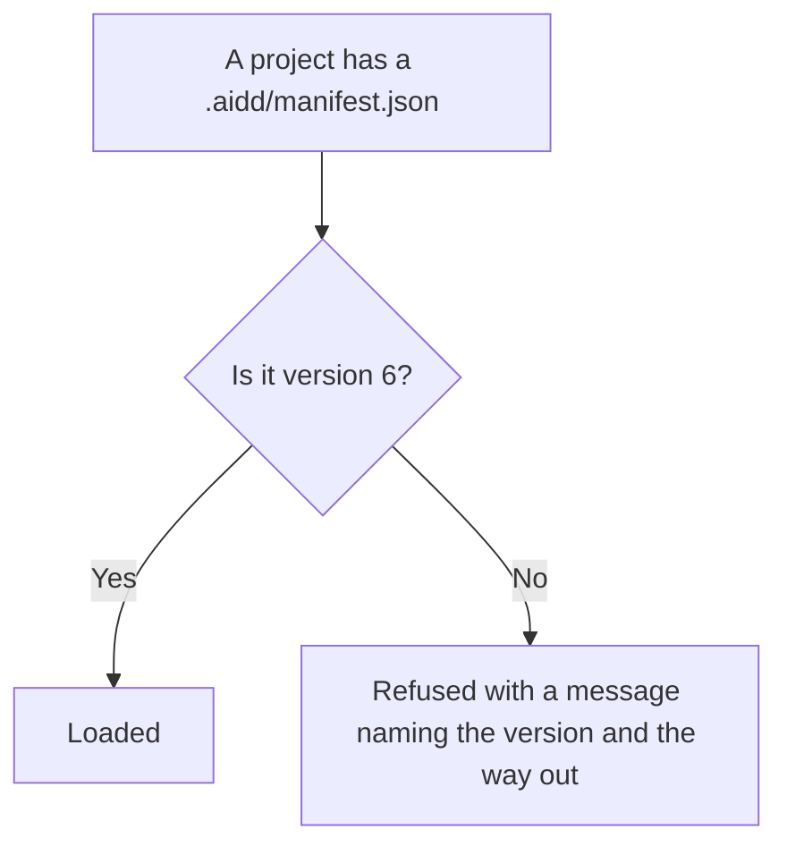
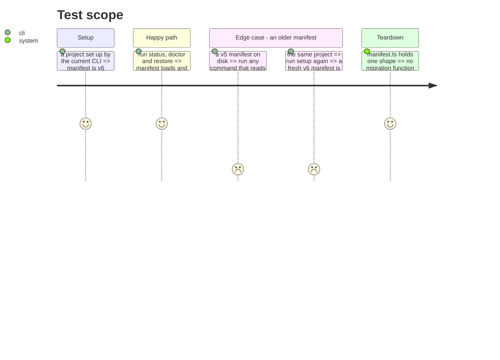

# Instruction: Drop the manifest version migrations

`manifest.ts` carries five migration functions, `migrateV1toV2` through `migrateV5toV6`, plus fields
kept only so a legacy manifest round-trips. A comment at line 89 says the block must stay "until all
users have upgraded past v1".

A domain entity that knows every past shape of its own JSON is carrying a persistence concern. The
decision is to remove them, not relocate them: the reachable versions are behind us.

This is the one deletion that changes what the CLI **accepts**, not just what it contains. It is
therefore placed late and deliberately: nothing in this plan depends on it, so it can be postponed
by its own opening check without holding anything back.

It also comes after phase 14, so the migrations are removed from an aggregate that has already been
split — a smaller file, a smaller diff, and the round-trip test written in phase 14 is available to
prove the removal changed no output for a supported manifest.

## Architecture projection

> Tree of the final files. ✅ create · ✏️ modify · ❌ delete

```txt
.
└── cli/
    ├── src/domain/models/manifest.ts   ✏️ modify (drop 5 migrations, legacy fields, VSCODE_MIGRATION_PATHS)
    ├── tests/domain/models/manifest.unit.test.ts  ✏️ modify (drop the legacy round-trip cases)
    └── README.md                        ✏️ modify (state the minimum manifest version accepted)
```

## User Journey



## Test Scope



## Tasks to do

### `0)` Check before removing

> The only task in this plan that can lose user data if skipped.

1. **Répondu le 2026-09-02.** La version 6 est arrivée le **2026-05-09**, commit `273573fc`
   « drop dead marketplaces aggregate (v5→v6 migration) », embarquée dans **4.1.0-beta.25**. La
   version publiée aujourd'hui est **5.2.1** : bientôt quatre mois et une version majeure entière.

   Un manifest antérieur appartient donc à un projet qui n'a pas vu AIDD depuis quatre mois.

2. **Mais l'ancienneté n'est pas la question, et le risque n'est pas où la tâche le cherchait.**
   Le porteur d'un vieux manifest a aussi un vieux CLI, qui sait encore migrer. Le danger apparaît
   quand il met le CLI à jour **d'abord** : `self-update` l'amène en 5.x, il ouvre son projet, et le
   CLI qui vient d'arriver ne sait plus lire ce qu'il aurait su lire une minute plus tôt.

   La garde de version qu'il faut conserver ne doit donc pas seulement refuser : elle doit nommer
   **la dernière version capable de migrer**, pour que l'utilisateur redescende, migre, puis remonte.
   Un message qui dit « version non supportée » sans dire par quoi la supporter transforme un
   problème réversible en impasse.

3. Si ce message ne peut pas être écrit avec certitude, ne pas supprimer les migrations.
2. If any doubt remains, stop and report. Postponing costs nothing: this phase is the only one no
   other phase waits for, which is why it sits here.

### `1)` Remove the migrations

1. Delete `migrateV1toV2` through `migrateV5toV6`, `VSCODE_MIGRATION_PATHS`, and the fields retained
   only for legacy round-trip.
2. Keep the version guard, et son message nomme la dernière version qui savait migrer — voir la
   tâche 0. Refuser sans dire par quoi remplacer le refus est une impasse, pas un garde-fou.
3. Drop the legacy round-trip cases from the manifest unit test, keep the version-guard ones.

### `2)` Say it in the README

1. One line: the minimum manifest version the CLI reads, and what to run when an older one is found.

## Test acceptance criteria

| Task | Acceptance criteria |
| ---- | ------------------- |
| 0    | The check is recorded in the phase or the phase is postponed with a reason |
| 1    | A v6 manifest loads and every command behaves as before; a v5 manifest is refused with a message naming the version |
| 1    | `manifest.ts` contains no function whose name starts with `migrate` |
| 2    | The README states the minimum version and the way out |
| all  | Golden and e2e pass unmodified: no fixture carries a manifest below v6 |

## Ce que la mutation dit de ce code (2026-09-02)

Mesuré après le découpage de la phase 14 : sur 109 mutants survivants, **82 sont dans
`manifest.ts`**, et leurs plus gros amas sont exactement les fonctions que cette phase supprime —
`migrateV3toV4` (10), `migrateV4toV5` (5), `migrateV2toV3` (4), plus les gardes qui les entourent.

Deux conséquences. D'abord, ce n'est pas une dette à rembourser avant de supprimer : écrire des tests
pour du code qui part serait du travail perdu. Ensuite, le score de mutation devrait monter
nettement après cette phase **sans qu'un seul test soit écrit** — et si ce n'est pas le cas, c'est
que la suppression a emporté autre chose que les migrations. C'est le contrôle le moins cher de
cette phase.
