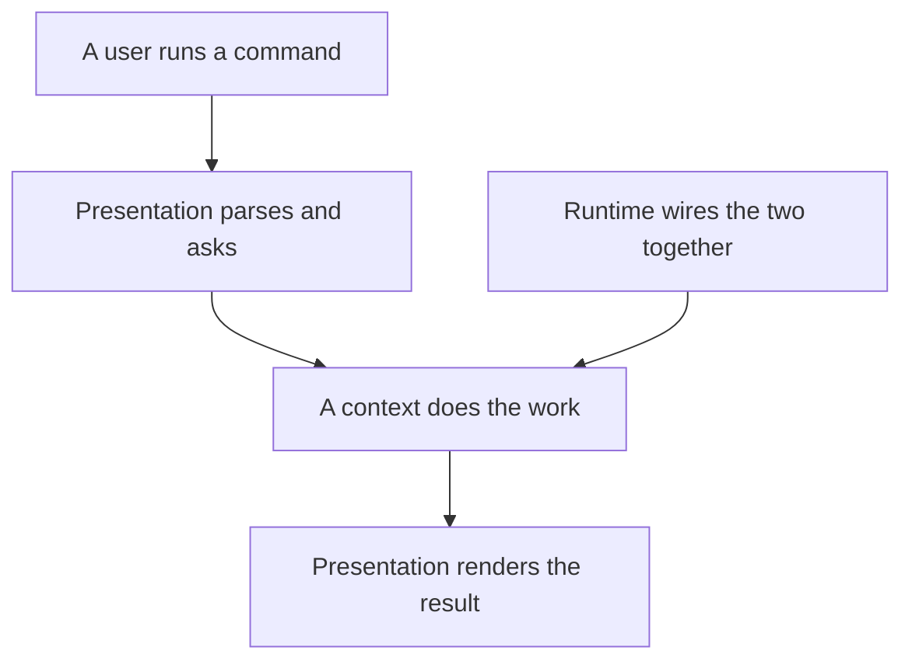
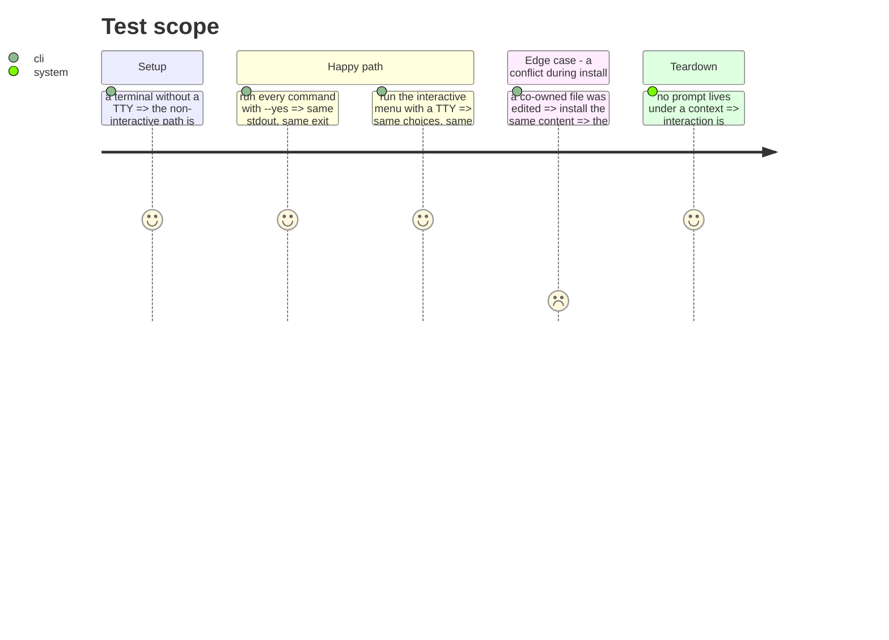

# Instruction: Separate presentation from runtime

What was called the shell mixed two layers. Presentation is not a technical leftover: commands
(1746 l.), display (139 l.), the interactive menu (366 l.) and the prompts add up to roughly 2 600
lines — and part of it currently sits under `use-cases/`, where a prompt was called a use case.

Runtime is the other half: wiring, http, git, platform, auth, self-update. `deps.ts` alone is 733
lines and becomes one wiring module per context.

## Architecture projection

> Tree of the final files. ✅ create · ✏️ modify · ❌ delete

```txt
.
└── cli/src/
    ├── presentation/                ✅ create
    │   ├── commands/                ✏️ modify (from application/commands/)
    │   ├── display/                 ✏️ modify (from application/display/)
    │   ├── prompts/                 ✅ create (setup-tools, setup-plugins, plugin-pick, conflict, menu)
    │   ├── output.ts                ✏️ modify
    │   └── error-handler.ts         ✏️ modify
    └── runtime/                     ✅ create
        ├── wiring/                  ✅ create (one module per context)
        ├── auth/                     ✏️ modify (credential-store, oauth-provider, token-provider)
        ├── prompter/                 ✏️ modify (the prompter port and its adapter)
        ├── http/  git/  platform/  project-root/  self-update/   ✏️ modify
        └── deps.ts                  ❌ delete (733 l., split across wiring/)
```

## User Journey



## Test Scope



## Tasks to do

### `1)` Move the interaction out of the contexts

1. `setup-tools-prompt`, `setup-plugins-prompt`, `plugin-pick`, `sync-conflict-resolver` and
   `menu-use-case` ask the user. They are presentation, not use cases.
2. What remains in a context is the decision the answer feeds.

### `2)` Split the wiring

1. `deps.ts` becomes one wiring module per context, each assembling only what its context needs.
2. `createMenuDeps` keeps its role: the pre-parse subset, which the current rule already describes.

### `3)` Gather the runtime

1. auth, http, git, platform, project-root and self-update are technical services, not a context.

## Test acceptance criteria

| Task | Acceptance criteria |
| ---- | ------------------- |
| 1    | Every interactive flow behaves as before, with and without a TTY; no context contains a prompt |
| 2    | Each context can be wired without pulling another's adapters; the pre-parse path still does no extra I/O |
| 3    | `presentation` and `runtime` import contexts; no context imports either |
| all  | Golden and e2e pass **unmodified**, including the TTY persona test |
