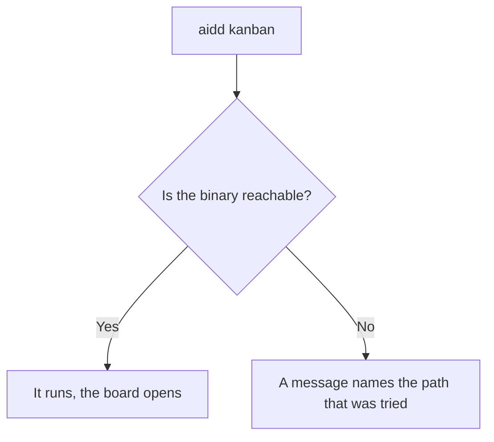
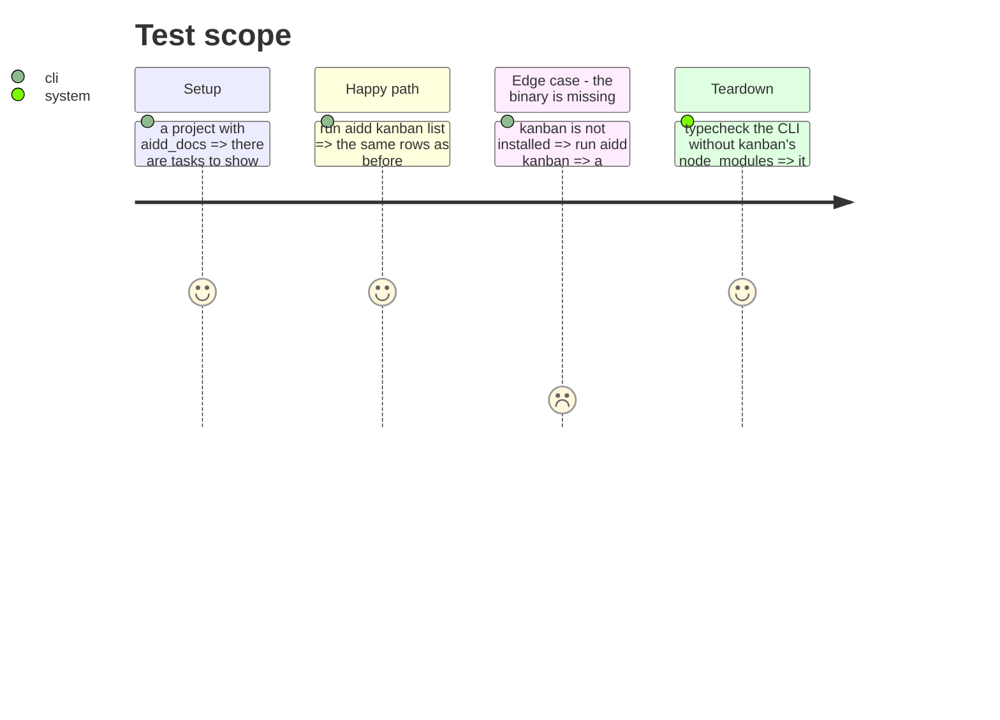

# Instruction: Turn kanban into a launcher

`commands/kanban.ts` imports `../../../../kanban/src/presentation/…`, a deep path into another
package. The consequences are measured: `cli/package.json` declares `ink`, `react`, `cli-table3` and
`gray-matter`, none of which `cli/src` imports — they are listed in `knip.json` as ignored
dependencies for exactly that reason. And `pnpm typecheck` fails on `../kanban/src/**` unless
kanban's own dependencies are installed, which `lefthook.yml` already documents as a workaround.

kanban only ever needed `DOCS_DIR`. The CLI should locate and run it, not contain it.

## Architecture projection

> Tree of the final files. ✅ create · ✏️ modify · ❌ delete

```txt
.
└── cli/
    ├── src/launchers/kanban.ts      ✅ create (locate the binary, execute it)
    ├── src/presentation/commands/kanban.ts  ✏️ modify (no deep import)
    ├── package.json                 ✏️ modify (drop ink, react, cli-table3, gray-matter)
    ├── knip.json                    ✏️ modify (drop the four ignored dependencies)
    └── ../lefthook.yml              ✏️ modify (cli-typecheck no longer needs kanban's node_modules)
```

## User Journey



## Test Scope



## Livrée autrement que prévu (2026-09-02)

La tâche 1 disait « remplacer l'import profond par un lanceur qui trouve le binaire et l'exécute ».
Il n'y a pas de binaire : `@ai-driven-dev/kanban-source` est `private`, sans version, sans `main`,
sans `exports`, sans `bin`, sans build, et `kanban/src/` ne contient aucun fichier d'entrée —
seulement des fonctions qui enregistrent des commandes dans un programme hôte. Kanban est une
bibliothèque, pas un programme.

### Ce que la phase voulait vraiment

Que le CLI cesse de porter les dépendances d'une interface texte. `tsup` déclare
`skipNodeModulesBundle: true`, donc elles ne sont pas empaquetées : elles étaient chargées à chaque
invocation d'`aidd`, pour une commande `hidden`.

| dépendance | poids direct |
|---|---|
| `ink` | 1,1 Mo |
| `react` | 252 Ko |
| `gray-matter` | 80 Ko |
| `cli-table3` | 68 Ko |

### Ce qui a été fait, et pourquoi pas ailleurs

Différer **dans kanban**, pas dans le CLI. Ses deux fichiers de commandes et son dépôt de documents
chargent maintenant `ink`, `react`, `cli-table3` et `gray-matter` dans le corps de leurs actions.
Les fonctions d'enregistrement restent importables immédiatement, donc commander connaît ses
sous-commandes au parsing.

Deux tentatives ont échoué avant celle-là, et chacune apprend quelque chose :

1. **Différer côté CLI, par un hook `preSubcommand`.** Impossible : commander parse avant que le
   hook ne se déclenche, et `aidd kanban list` répond `too many arguments for 'kanban'`.
2. **Différer sans activer le découpage.** Silencieusement inefficace : avec `splitting: false`,
   esbuild replie un `import()` en import statique. Le code semble paresseux et ne l'est pas.
   `splitting: true` est donc nécessaire, et son commentaire dans `tsup.config.ts` dit pourquoi.

### Vérifié par profil, pas par lecture

Un profil CPU d'`aidd --help` montre les quatre absentes du démarrage, là où `gray-matter` y était
encore après la première passe. Bundle principal de 402,9 à 389,8 Ko, `aidd --help` à 133 ms, et les
trois chemins de la commande répondent : `kanban --help` liste ses deux sous-commandes, `kanban list`
et `kanban list --json` fonctionnent. Kanban : 68 tests, 25 suites.

### Ce qui reste, et qui t'appartient

Les quatre restent **déclarées** dans `cli/package.json`, donc encore téléchargées à l'installation.
Les en sortir demande de décider ce qu'il advient d'`aidd kanban` chez quelqu'un qui ne les a pas —
message clair et commande indisponible, ou kanban publié à part avec son propre `bin`. Kanban
déclare déjà les quatre de son côté, donc la duplication est prête à disparaître le jour où la
question est tranchée.

Le coût de démarrage, lui, est payé une fois pour toutes.

## Tasks to do

### `1)` Locate and execute

1. Replace the deep import with a launcher that finds the binary and runs it.
2. On failure, name the path that was tried — a launcher that fails silently is worse than none.

### `2)` Drop the four dependencies

1. `ink`, `react`, `cli-table3` and `gray-matter` leave `cli/package.json`, and their entries leave
   `knip.json`.

   > Knip signale déjà `@types/react` et `ink-testing-library` comme inutilisées : cette tâche est
   > ce qui les fait disparaître. Il signale aussi `@commitlint/cli`, et c'est un **faux positif** —
   > `lefthook.yml` l'appelle, fichier que knip ne lit pas. Ne pas la supprimer : lui apprendre où
   > regarder. La CI masque les trois aujourd'hui derrière `--exclude exports,types`, ce qui rend
   > l'outil aveugle à ce qu'il devrait garder ; retirer l'exclusion une fois les vraies mortes
   > parties.
2. Note the drop in the bundle budget: it is a verifiable gain, not a claim.

### `3)` Simplify the hook

1. `cli-typecheck` no longer needs to install kanban's dependencies. Remove the workaround and its
   comment.

## Test acceptance criteria

| Task | Acceptance criteria |
| ---- | ------------------- |
| 1    | `aidd kanban` and `aidd kanban list` behave as before; a missing binary gives a message naming the path |
| 2    | `cli/src` imports none of the four packages, and `knip.json` ignores no dependency |
| 3    | `pnpm typecheck` passes with `kanban/node_modules` absent |
| all  | The bundle is smaller than before, measured by `check-bundle-size.mjs` |
