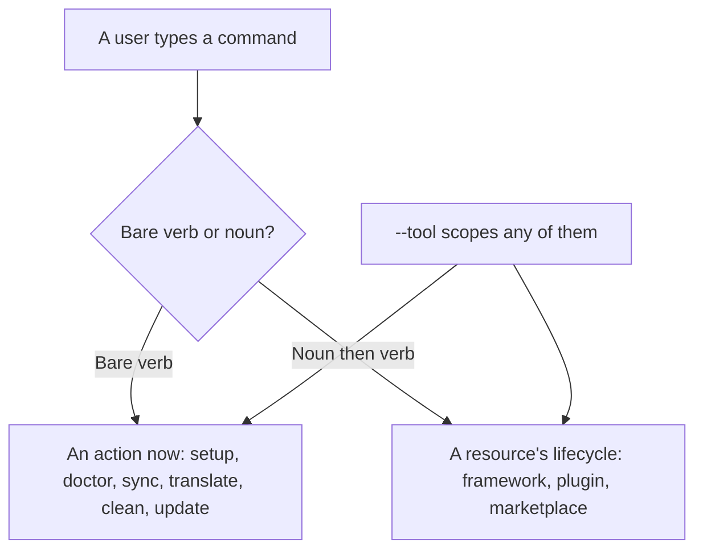
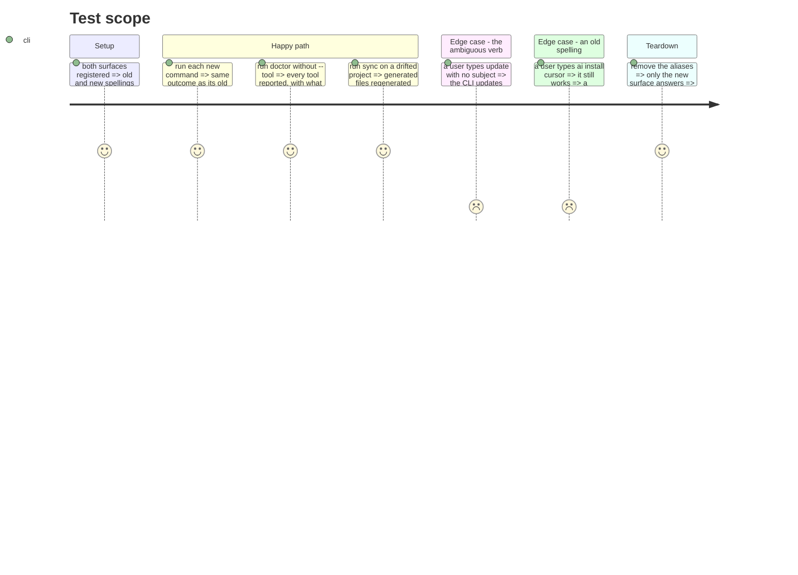

# Instruction: Move the command surface, by alias

Last, and by alias, for one reason: the e2e net invokes the CLI. Renaming breaks it at the moment it
is most needed. The new surface arrives beside the old, the tests move, the snapshot is recaptured,
then the old spelling goes.

The grammar is not invented: it is what Claude Code and Codex both follow without exception. A bare
verb performs an action; a noun then a verb manages a resource. `claude doctor` and `codex update`
act on the CLI; `claude plugin install` and `codex plugin add` manage a resource.

Today the same verb is declared four times — `update`, `status`, `list`, `doctor` — because the
grouping is by object. And `ai` and `ide` expose the same seven verbs for what is one subject.

## Architecture projection

> Tree of the final files. ✅ create · ✏️ modify · ❌ delete

```txt
.
└── cli/
    ├── src/presentation/commands/
    │   ├── ai.ts  ide.ts            ❌ delete (become the --tool flag)
    │   ├── status.ts  restore.ts  self-update.ts  ❌ delete (folded into doctor, sync, update)
    │   ├── framework.ts             ✏️ modify (install/update/remove; build becomes translate)
    │   ├── translate.ts             ✅ create (the core, visible in --help at last)
    │   ├── sync.ts                  ✅ create (the command ARCHITECTURE.md announced and never had)
    │   ├── doctor.ts                ✏️ modify (absorbs status, gains the tool inventory)
    │   ├── plugin.ts  marketplace.ts  ✏️ modify (aliases, no create)
    │   └── kanban.ts  telemetry.ts  ✏️ modify (open; enable/disable)
    └── tests/golden/
        ├── surface-equivalence.e2e.test.ts  ✅ create (old spelling and new produce the same outcome)
        ├── snapshots/phase0/snapshot.json   ✏️ modify (recaptured on the new surface)
        └── snapshots/help/surface.json      ✏️ modify (recaptured: this phase is the surface change)
```

## User Journey



## Test Scope



## Tasks to do

### `1)` Add the new surface beside the old

1. `sync` first: it never existed, so nothing is replaced. Then `doctor` enriched with the tool
   inventory. Then `translate`, before `framework build` is retired.
2. Every old spelling keeps working and prints one line naming its replacement.

### `2)` Prove the two surfaces are equivalent

> This is the one phase that changes the net and the subject at once. Recapturing the golden cannot
> tell a successful rename from a behavior change, because the command string moved too. So the net
> for this phase is not the snapshot — it is equivalence, and it only exists while both spellings do.

1. Add `surface-equivalence.e2e.test.ts`: for each pair, run the old spelling and the new one on two
   freshly created identical projects, and assert the same exit code, the same files written and the
   same manifest.

   > **Deux sortes de paires, deux exigences.** Une rédaction antérieure demandait aussi la même
   > sortie standard pour toutes. Impossible : la tâche 1 enrichit `doctor` de l'inventaire des
   > outils, donc sa sortie ne peut pas égaler celle de `status`, et six commandes repliées en une
   > ne peuvent pas toutes imprimer la même chose.
   >
   > - **Renommage pur** (`restore` → `sync`, `self-update` → `update`, `framework build` →
   >   `translate`) : mêmes effets **et** même sortie, l'écho de la commande retiré. Une sortie qui
   >   bouge ici est une régression.
   > - **Repli** (`status`, `ai status`, `ide status`, `ai doctor`, `ide doctor`, `plugin doctor` →
   >   `doctor`) : mêmes **effets** seulement. La sortie change par construction, et exiger qu'elle
   >   ne change pas reviendrait à interdire l'enrichissement que la tâche 1 demande.
   >
   > Dire lequel des deux régimes s'applique à chaque paire, dans le test. Une paire sans régime
   > déclaré est une paire que personne n'a examinée.
2. Cover every pair the phase introduces, including the ones that fold several commands into one:
   `status` and `ai status` against `doctor`, `restore` against `sync`, `ai install <tool>` against
   `framework install --tool <tool>`, `self-update` against `update`, `framework build` against
   `translate`.
3. The test lives only as long as the aliases. It is deleted with them in task 4, and its passing
   run is what licenses the deletion.

### `3)` Move the tests

1. e2e and golden invoke the new spellings. Recapture once, and review the diff as the behavior
   change it is.

### `4)` Retire the old surface

1. Remove `ai`, `ide`, `status`, `restore`, `self-update` and the aliases.
2. `--tool` is the single scope flag everywhere.

### `5)` Say what each adjacent command does

> Six pairs are close enough to be confused. One line each, in `--help`.

1. `marketplace refresh` re-fetches catalogs; `framework update` moves to a new version; `sync`
   rewrites owned files from what is already there.
2. `translate` converts an arbitrary source and records nothing; `sync` does the same conversion,
   driven by the manifest.
3. `setup` bootstraps the whole project; `framework install` acts on the framework alone.
4. `clean` removes AIDD from the project; `framework remove` removes the framework.

## Test acceptance criteria

| Task | Acceptance criteria |
| ---- | ------------------- |
| 1    | Every new command produces the same outcome as the old spelling it replaces; every old spelling still works and names its replacement |
| 2    | For every pair, the old and the new spelling produce the same exit code, files, manifest and output on identical projects |
| 3    | The golden diff shows the invocation strings changing and nothing else |
| 4    | No verb is declared twice for the same subject; `--tool` scopes every command that accepts a scope. The equivalence test is deleted with the aliases, after a passing run |
| 5    | `--help` distinguishes the six adjacent commands in one line each |
| all  | A user coming from Claude Code or Codex finds `update`, `doctor` and the noun groups where those CLIs put them |
