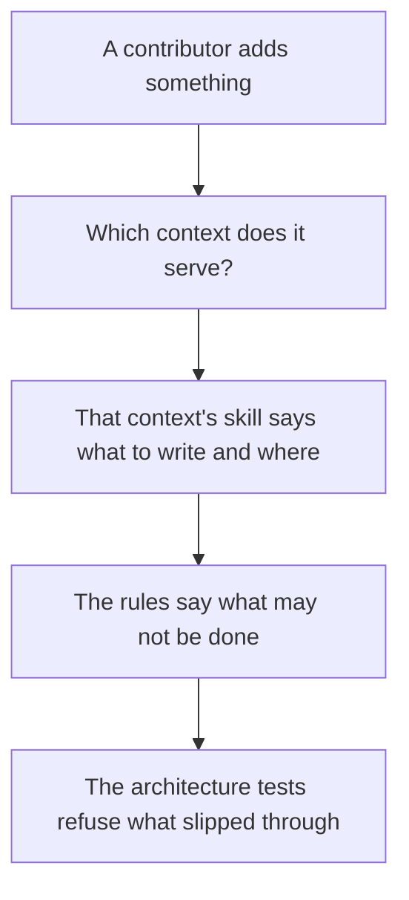
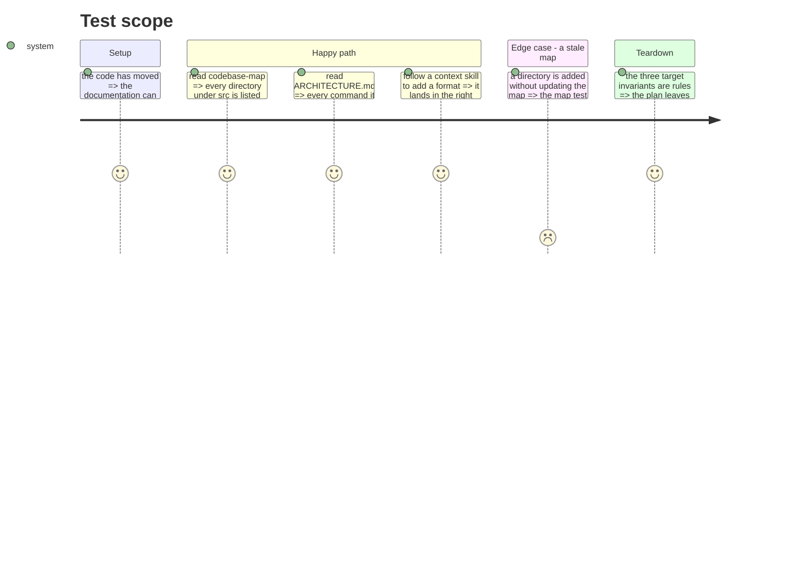

# Instruction: Rewrite the documentation and the skills

The last phase, because until now the documentation described a tree that had not moved.

Two files are rewritten rather than corrected: `codebase-map.md` (32 structural references) and
`memory/architecture.md` (16). The ten skills are replaced rather than updated: they encode the
layer taxonomy, answering "how do I create an adapter" when the first question becomes "which
context does this belong to".

Three target invariants also become rules here, now that they are true.

## Architecture projection

> Tree of the final files. ✅ create · ✏️ modify · ❌ delete

```txt
.
└── cli/
    ├── ARCHITECTURE.md              ✏️ modify (four contexts, the chain, the two ownership regimes)
    ├── aidd_docs/memory/
    │   ├── codebase-map.md          ✏️ modify (rewritten; the map test keeps it honest)
    │   └── architecture.md          ✏️ modify (rewritten)
    ├── .claude/skills/
    │   ├── {adapter,capability,command,domain-model,feature,format,tool,use-case}/  ❌ delete
    │   ├── {translate,tools,distribution,framework}/  ✅ create (one per context)
    │   └── {test,audit-remediate}/   ✏️ modify (cross-cutting, kept)
    └── .claude/rules/
        ├── 00-architecture/0-contexts.md  ✅ create (the chain, the kernel, one public entry)
        └── 01-standards/1-exports.md      ✏️ modify (barrels forbidden, context entry allowed)
```

## User Journey



## Test Scope



## Tasks to do

### `1)` Rewrite the two memory files

1. `codebase-map.md` describes the four contexts, the kernel, presentation and runtime. The
   `codebase-map` architecture test keeps it honest from then on.
2. `architecture.md` keeps its File Ownership section and drops what described the layer tree.

### `2)` Replace the skills

1. One per context: `translate`, `tools`, `distribution`, `framework`. Each answers what goes in,
   how, and how it is tested — relying on the invariants rather than repeating them.
2. Keep `test` and `audit-remediate`, which cut across.
3. The launcher subject — locate and execute, never embed — joins the skill of the context that
   carries kanban and telemetry.

### `3)` Promote the three target invariants

1. The chain `framework → translate → tools → kernel` plus `framework → distribution`.
2. The kernel imports no context and carries no business logic.
3. Rien n'importe l'intérieur d'un contexte : une importation venue d'ailleurs ne vise qu'un module
   que ce contexte déclare public.

### `4)` Rendre compte de la frontière, sans baril

> Le conflit que cette tâche devait trancher l'a été en phase 7, et dans l'autre sens que sa
> rédaction supposait : il n'y a pas d'`index.ts` de contexte. `1-exports.md` interdisait déjà tout
> baril, `noBarrelFile` est actif, et le cliquet `no-re-export` a une base vide éprouvée par
> injection — c'était l'arbre cible qui était l'intrus, pas la règle.

1. Écrire la frontière telle qu'elle est réellement tenue : un cliquet d'architecture liste les
   modules publics de chaque contexte, et rien ne ré-exporte quoi que ce soit. Vérifier au passage
   que la surface publique déclarée a bien rétréci à mesure que les consommateurs entraient dans
   leur contexte — 20 modules publics sur 48 fichiers pour `tools` à l'extraction, c'est un point de
   départ, pas une cible.

## Test acceptance criteria

| Task | Acceptance criteria |
| ---- | ------------------- |
| 1    | The `codebase-map` and `docs-do-not-lie` tests pass without a baseline |
| 2    | Ten skills become six; each context skill answers where a new artifact goes |
| 3    | The three invariants are rules, and each has a test or a lint rule behind it |
| 4    | A context entry is allowed, a convenience barrel is refused, and the rule says which is which |
| all  | Nothing in this plan remains described only in a task folder |
