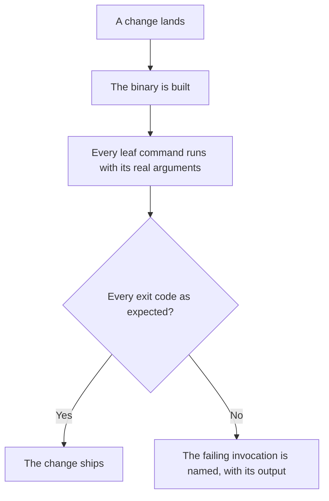
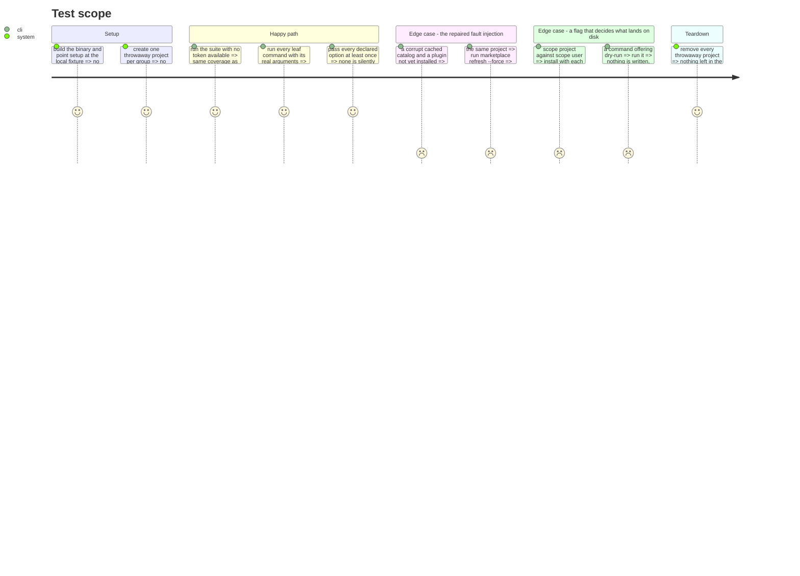

# Instruction: Make the smoke suite run, hermetically

`scripts/smoke-tools.sh` drives the built binary with real arguments in throwaway projects and
injects faults. It is the only net that exercises the CLI the way a user does.

It runs nowhere: no CI job, no lefthook entry, last touched by the commit that moved the repository.

## What running it established

**It is red.** 73 pass, 4 fail, 7 min 11 s.

**Its coverage depends on ambient machine state.** Line 106 reads
`TOKEN="${AIDD_TOKEN:-$(gh auth token 2>/dev/null || true)}"`, and everything substantial sits
behind `if [[ -z "$TOKEN" ]]`. Counted statically:

| | invocations | sections |
|---|---|---|
| hermetic | 11 | help/version, framework build, plugin create, auth, self-update --check, local marketplace |
| behind the token | 30 | the setup matrix, global read-only commands, restore, per-tool AI and IDE commands, plugin commands, the update conflict guard, fault injection |

So on a machine where `gh` happens to be logged in, the suite covers 41 invocations and reports
100% leaf command coverage. Where it is not, it covers 11 and the coverage report collapses. Same
command, same repository, two different nets — which is why it cannot gate a build as it stands.

**The four failures are one scenario that stopped testing what it claims.**
`corrupt-cache fault injection` sets up with `--plugins recommended`, corrupts the cached catalog,
then expects `plugin install aidd-dev` to fail with a message naming `marketplace refresh --force`.
It gets `Error: Plugin 'aidd-dev' is already installed.` — `aidd-dev` is in the recommended set, so
setup installed it and the install refuses before ever reading the corrupt catalog. A test defect.

**And one command hangs.** In a second run, `plugin update (all)` exceeded the script's own 180 s
ceiling and was killed. Seen once, not yet diagnosed.

## Architecture projection

> Tree of the final files. ✅ create · ✏️ modify · ❌ delete

```txt
.
└── cli/
    ├── scripts/smoke-tools.sh       ✏️ modify (local fixture, repaired scenario, 11 missing options)
    ├── package.json                 ✏️ modify (smoke:fast and smoke:full)
    └── ../.github/workflows/cli-ci.yml  ✏️ modify (a blocking smoke job)
```

## User Journey



## Test Scope



## Tasks to do

### `0)` Reproduce the hang, then bound it

> A net that can hang is a net that gets bypassed.

1. Reproduce `plugin update` exceeding 180 s, with and without a token.
2. If it is a product defect, record it as its own issue and fix it outside this phase — a net
   phase does not change behavior.
3. Either way, keep a per-command ceiling so one hang cannot stall the run, and make a timeout
   report which invocation stalled.

### `1)` Repair the broken scenario

> It must fail for the reason it claims, or it guards nothing.

1. Set up with `--plugins none`, or target a plugin the recommended set does not contain, so the
   install genuinely reaches the corrupt catalog.
2. Verify the repair the only way that counts: the assertion passes for the right reason, and still
   fails when the actionable message is removed from the product.

### `2)` Move the 30 gated invocations onto the local fixture

> This is the phase's real work, and what makes the suite a gate.

1. Replace `setup --source remote` with `--source local --path "$FRAMEWORK_FIXTURE"` in the seven
   places that use it.
2. The per-tool and plugin sections install `aidd-dev`, a really published plugin. The fixture
   serves `aidd-test` from a local path — swap the name, and check every assertion that depends on
   the plugin's content.
3. Keep a genuinely remote subset for what only remote fetching can prove, still gated, and name it
   as such. `smoke:fast` is hermetic and blocking; `smoke:full` adds the remote subset.
4. Record the measured wall-clock of each in the header. The full run is 7 min 11 s today.

### `3)` Pass the eleven options that never ran

> 11 of 24 declared options have never been passed once.

1. `--flat` on every target that accepts it. It is a documented build mode producing a different
   tree from marketplace mode, and nothing exercised it before.
2. `--scope project` against `--scope user`: assert the two land in different places.
3. `--dry-run`: assert the exit code **and** that nothing was written.
4. `--from`, `--marketplace`, `--plugin`, `--recommended`, `--no-plugins`, `--overwrite`,
   `--release`.
5. `--gh` needs credentials: assert the refusal path and say so in a comment.

### `4)` Make it run

1. Add a blocking `cli / Smoke` job running `smoke:fast` after the build job.
2. Keep the summary that already names every failing check — it is what made the four visible.

## What executing this phase established

**The hang was not a hang.** `plugin update` exceeding 180 s was the remote path doing real work:
updating recommended plugins across five tools against the published framework. On the local
fixture the same command takes 0.24 s. Task 2 removed it; no product defect.

**A third token dependency, unnoticed until now.** Beyond gating the sections, the coverage
threshold itself read `if [[ -n "$TOKEN" && "$pct" -lt 95 ]]` — the gate that enforces coverage only
fired when a token happened to be present. It is unconditional now.

**The corrupt-catalog scenario cannot be made hermetic.** It corrupts the *fetched* catalog cache
(`.aidd/cache/marketplaces`), which only a remote source populates: a local source is read directly,
and its built cache is regenerated rather than trusted — verified by corrupting it and watching the
install succeed anyway. So the scenario moved into the opt-in remote section, where it belongs.

**And once it finally reached its own code path, its expectation turned out to be obsolete.** With
the fetched catalog corrupted, `plugin install` now **succeeds** instead of failing with a message
naming `marketplace refresh --force`. That is the better behavior: a fetched catalog is a cache, and
the rule for CLI-owned files is to regenerate rather than error.

The check now pins the recovery instead of demanding the error. Pinning it took two attempts, and
the first one is worth keeping in mind: asserting the cache file was rewritten failed on one shape
of four. Three shapes make the CLI re-fetch, `{ truncated` does not — an internal difference with no
user-visible consequence. The assertion moved to what a user actually sees: the install succeeds and
the CLI keeps working with the corrupt catalog still on disk. All four shapes pass, and the suite
runs with no skipped check in either mode.

**Two of this phase's own edits were wrong, and the suite said so.** A blanket `aidd-dev` →
`aidd-test` rename reached the remote block too, where the really published marketplace does not
serve the fixture plugin. And a correction to a claim made in phase 1: `plugin install` does
declare `--yes`; only `plugin remove` does not.

## Measurements

| | before | after |
|---|---|---|
| hermetic invocations | 11 | all of them |
| gated behind an ambient token | 30 | 0 (one opt-in remote section) |
| checks | 73 pass / 4 fail | 99 pass / 0 fail |
| leaf command coverage without a token | collapsed | 37/37, same as with one |
| declared options never passed | 11 of 24 | 0 |
| wall clock | 7 min 11 s | 92 s |

## Test acceptance criteria

| Task | Acceptance criteria |
| ---- | ------------------- |
| 0    | No invocation can stall the run; a timeout names the invocation that stalled |
| 1    | The corrupt-catalog scenario reaches the code path it claims. It no longer asserts an outcome: see below |
| 2    | With no token available, the suite reports the same leaf command coverage as with one, and completes without reaching the network except in the named remote subset |
| 3    | Every declared option is passed at least once; `--dry-run` writes nothing and the two scopes write to different places |
| 4    | A red smoke run fails the build, and one run names every failing invocation with its output |
| all  | The suite is green before any later phase moves a file |
