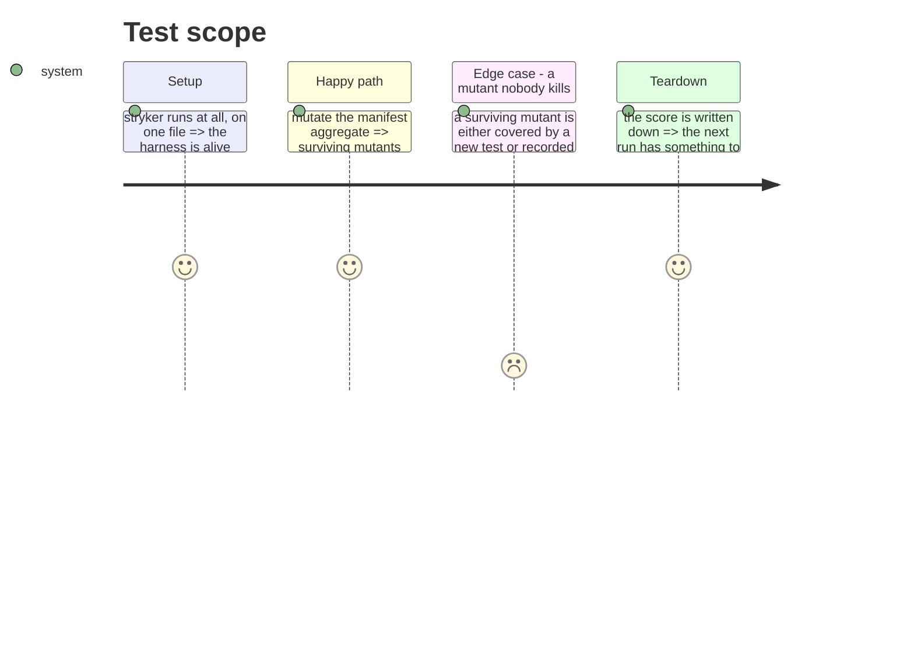

# Instruction: Make the tests prove they test something

Every net in this refactor answers "did the behaviour change?". None answers "would the tests notice
if it did?". Mutation testing is that second question, and it is the only one that measures a test
suite rather than the code.

It is placed last on purpose: it is worth running against the structure the refactor produces, not
against the one it replaces.

## Ce que cette phase n'est pas

La réparation de Stryker appartient à la phase 9, et son premier usage à la phase 14, qui a besoin
d'une mesure avant et après le découpage du Manifest. Ici, la campagne est large : elle mesure la
suite entière contre la structure que le refactor a produite.

## What is in the way

Stryker is installed and broken. It was already broken before this refactor, silently, which is part
of how the drift went unnoticed. Two failures were met, in order:

1. `ts.parseConfigFileTextToJson is not a function` — a TypeScript upgrade broke Stryker's config
   reader. Fixed with `tsconfigFile: ""`.
2. Its runner picks up `vitest.workspace.ts`, so it runs the e2e project, and the build golden fails
   inside Stryker's sandbox. `vitest.dir`, `vitest.related` and a dedicated config were each tried;
   none narrowed the initial run.

The second may have changed since: the e2e helper now strips drivable tool binaries from `PATH` and
reaches node through `process.execPath`, so the golden no longer depends on what the machine has
installed — which was part of why it could not survive a sandbox. Re-measure before re-diagnosing.

## Architecture projection

> Tree of the final files. ✅ create · ✏️ modify · ❌ delete

```txt
.
└── cli/
    ├── stryker.config.json          ✏️ modify (a runner that sees unit tests only)
    └── .github/workflows/           ✏️ modify (a scored run, not a gate that blocks a merge)
```

## Test Scope



## Ce que « large » doit vouloir dire, chiffré (2026-09-02)

Muter tout le code n'a pas de sens : un adaptateur et un câblage ne portent pas de règles, et un
mutant qui y survit ne dit rien sur la conception. Ce qui mérite d'être muté, c'est le domaine de
chaque contexte plus le noyau.

| cible | fichiers | lignes |
|---|---|---|
| `contexts/tools/domain` | 45 | 4431 |
| `contexts/framework/domain` | 19 | 1100 |
| `contexts/translate/domain` | 9 | 653 |
| `contexts/distribution/domain` | 11 | 423 |
| `kernel` | 17 | 1449 |

Environ 8000 lignes. À l'échelle du run du manifest — 660 lignes, 386 mutants, trois minutes — cela
donne un ordre de grandeur de plusieurs milliers de mutants et quelques dizaines de minutes,
`ignoreStatic` activé pour écarter les quatre mutants statiques qui consommaient 90 % du temps.

### La conséquence sur la tâche 3

« Chaque mutant survivant est tué ou accepté par écrit » tient pour 109 survivants. Pour plusieurs
centaines, c'est une promesse qu'on ne tiendra pas, et une promesse non tenue est pire qu'une
absence de promesse. La forme honnête :

1. Un run par contexte, nommé, pour qu'un chiffre désigne un responsable plutôt qu'une moyenne.
2. Le contexte au plus mauvais score est le seul dont les survivants sont traités un par un.
3. Le reste devient une base : un score par contexte, écrit, qui ne peut que monter.

Un score global unique serait le plus facile à produire et le moins actionnable.

## Tasks to do

### `1)` Bring the runner back to life

1. Point Stryker at the unit project only. The e2e and golden suites spawn a built binary and are
   worthless as mutation oracles anyway: they would be slow, and a surviving mutant there would say
   nothing about a unit's design.

### `2)` Mutate what carries the rules

1. Start with the manifest aggregate and the tool profiles: they hold the invariants everything else
   assumes, and they are pure, so a mutant that survives there is a real gap and not a wiring
   artefact.

### `3)` Turn the survivors into a decision

1. Each surviving mutant is either killed by a test that was missing, or written down as accepted
   with the reason. No silent list.
2. Record the score so the next run compares rather than restarts.

## Les scores, par contexte (2026-09-02)

Seuil de rupture 50 dans tous les cas.

| cible | fichiers | score |
|---|---|---|
| `contexts/translate/domain` | 9 | 78,63 % |
| `contexts/framework/domain` | 19 | 77,97 % |
| `contexts/distribution/domain` | 11 | 74,07 % |
| `kernel` | 17 | **61,60 %** |
| `contexts/tools/domain` | 45 | **61,64 %** |

> **Périmètre, et correction (2026-09-03).** Quatre de ces cibles ne mutaient que la couche
> `domain/` de leur contexte. Aucune commande gardée ne les reproduisait, et lues sans leur
> colonne « cible » elles se laissaient prendre pour le score du contexte entier. Les scopes
> déclarés dans `mutation-scopes.json` couvrent désormais chaque contexte en entier, ce que
> `application/` et `infrastructure/` font au chiffre compris — voir
> `aidd_docs/tasks/2026_09/2026_09_03_mutation-scopes/`.

Le noyau et `tools` sont à égalité au plus bas. Le noyau est le pire des deux endroits où l'être :
c'est le vocabulaire que les quatre contextes parlent, donc un changement de comportement qui y
passe inaperçu passe inaperçu partout. C'est lui dont les survivants ont été examinés.

### Ce que 255 survivants du noyau disent réellement

| fichier | survivants / mutants |
|---|---|
| `errors.ts` | 101 / 247 |
| `markdown.ts` | 60 / 236 |
| `source.ts` | 43 / 266 |
| `jsonc.ts` | 25 / 116 |
| `file.ts` | 14 / 42 |
| `merge.ts` | 10 / 75 |
| `paths.ts` | 2 / 11 |

**Cent des cent un survivants d'`errors.ts` sont un message remplacé par une chaîne vide.** Aucun
test ne fige la prose d'une erreur, et l'exiger produirait des tests qui cassent au premier
reformulage sans rien protéger. C'est une catégorie **acceptée**, écrite ici pour qu'on cesse de la
recompter comme une dette. L'exception qui confirme la règle vit ailleurs : le message de la garde
de version du manifest **est** un contrat, et un test épingle son invocation littérale — parce que
celui-là dit à l'utilisateur quoi taper.

La tentation inverse a été écartée aussi : retirer ce mutateur de la configuration aurait fait
monter le chiffre sans rien améliorer. Le score reste ce qu'il est ; c'est sa lecture qui était
fausse.

**Le manque réel est `markdown.ts`**, où chaque profil d'outil rencontre le contenu qu'il réécrit :
un changement y est un changement partout. Onze tests y ont été ajoutés, écrits sur les branches que
la mutation désignait — le guillemetage des globs, l'apostrophe doublée, le booléen écrit nu, la
chaîne JSON laissée brute, le délimiteur avec espaces en fin de ligne, le bloc non refermé traité
comme du corps, le seul saut de ligne retiré quand il n'y a pas de frontmatter.

`source.ts` et `jsonc.ts` restent la prochaine cible évidente, dans cet ordre.

## Ce que la campagne a coûté avant de mesurer quoi que ce soit

Deux obstacles, tous deux instructifs.

**Les tests d'architecture ne peuvent pas participer.** Ils lisent l'arbre des fichiers comme du
texte — tailles de dossiers, chemins cités, graphe d'imports. Stryker travaille sur une copie de cet
arbre avec un mutant injecté : ces tests répondent alors à une question sur le bac à sable, pas sur
le code, et ils font échouer le run initial avant le premier mutant. Ils mesurent la structure, et
la mutation ne mesure pas la structure. D'où `vitest.mutation.config.ts`, qui ne garde que les deux
projets qui mesurent du comportement. L'e2e en est exclu pour la raison inverse : il lance le
binaire construit, qu'aucun mutant n'atteint, donc tous survivraient et dilueraient le score.

À noter pour qui y reviendra : un simple `test.exclude` ne suffit pas. Le fichier de workspace
définit les projets et l'emporte sur une config passée par `--config` ; seule une autre déclaration
de projets le remplace.

**Deux tests unitaires lisaient la machine du développeur.** `MarketplaceListUseCase` attendait un
marketplace et en voyait trois ; `MarketplaceRegistryAdapter` en attendait zéro et en voyait deux.
Tous deux truquaient `HOME` — mais le CLI ne retombe sur `homedir()` que si
`AIDD_USER_CONFIG_DIR` n'est pas défini, et il suffit qu'une valeur traîne pour que le test aille
lire un vrai registre utilisateur. Ils passaient par chance, et Stryker les a mis à nu en changeant
le répertoire de travail. Corrigés en épinglant le répertoire de configuration, et vérifiés sous un
environnement délibérément empoisonné.

C'est le premier bénéfice de cette phase, et il est arrivé avant le premier chiffre : la mutation a
trouvé du non-déterminisme que 1969 tests verts ne montraient pas.

## Test acceptance criteria

| Task | Acceptance criteria |
| ---- | ------------------- |
| 1    | `stryker run` completes on the unit project without touching the golden or e2e suites |
| 2    | The manifest aggregate and the tool profiles are mutated, with a score recorded |
| 3    | Every surviving mutant is killed or accepted in writing; the score is committed so the next run has a baseline |
| all  | Mutation is scored, never a gate: it reports on the suite, it does not block a merge |

## Un piège d'outillage, pour qui relancera la campagne

Stryker ne nettoie pas `.stryker-tmp/` quand un run est interrompu ou échoue — c'est écrit dans son
journal : « Not removing the temp dir because an error occurred ». Le répertoire monte vite à une
centaine de mégaoctets, et il contient une copie complète du dépôt, `aidd_docs/` inclus.

Il est bien dans le `.gitignore`, ce qui ne suffit pas : le hook de pré-commit qui vérifie les liens
markdown lit le disque et non l'index, donc il scanne la copie et signale des liens morts pointant
vers des chemins d'il y a plusieurs phases. Un commit refusé pour des fichiers qui n'existent pas
vraiment.

`rm -rf .stryker-tmp` après un run interrompu, avant de committer.
