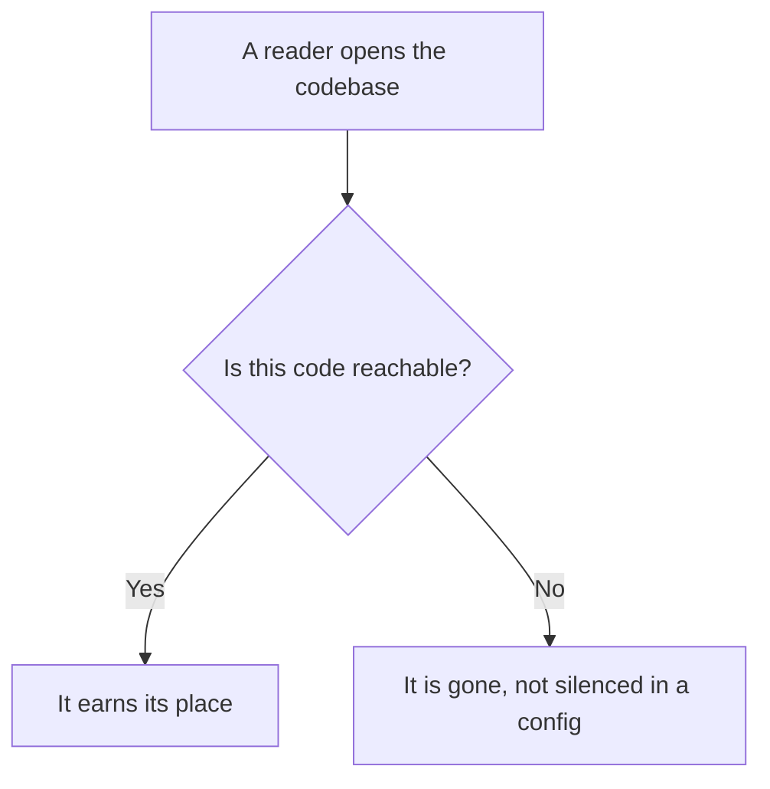
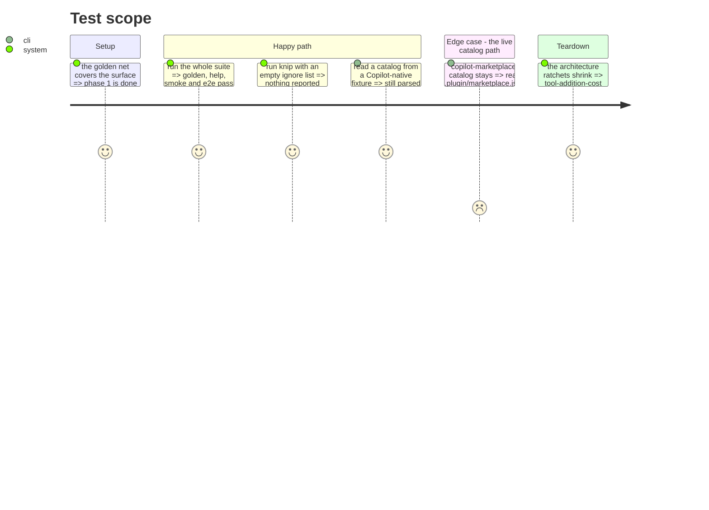

# Instruction: Delete dead code

Do not move what will be thrown away. Every target re-verified after phases 1 and 2 changed the
code around them.

| Target | Evidence | Size |
|---|---|---|
| the foreign-catalog branch | `loadForeign` has no production caller; `NormalizedPlugin` appears in 7 source files and 0 tests | 4 parsers (282 l.) + `normalized-plugin.ts` (27 l.) + a port method + 5 adapter methods of 123 |
| `domain/models/marketplace-entry.ts` | the only file unreachable from `src/cli.ts`, and `knip.json` names it to stay silent | 103 l. + its 157-line test |
| 4 exports of `mcp-exclusion.ts` | each appears once in `src` — its own definition — and once in tests | 134 of the file's 186 lines |
| `buildMergeFileEntries` | same shape: defined, tested, called by nothing | ~25 l. |
| `Update{Ai,Ide}Tools{Input,Result}` | once in `src`, zero in tests | 4 type declarations |

Roughly 700 lines, of which the telling part is the middle three rows: **live tests guarding dead
behavior**. They pass, they prove nothing, and they would have been carried through eleven
relocation phases.

## Architecture projection

> Tree of the final files. ✅ create · ✏️ modify · ❌ delete

```txt
.
└── cli/
    ├── src/domain/
    │   ├── models/
    │   │   ├── marketplace-entry.ts        ❌ delete (unreachable; knip.json silenced it)
    │   │   ├── normalized-plugin.ts        ❌ delete (only the dead foreign path used it)
    │   │   ├── mcp-exclusion.ts            ✏️ modify (drop 4 uncalled exports)
    │   │   └── merge.ts                    ✏️ modify (drop buildMergeFileEntries)
    │   ├── formats/{cursor,codex,copilot,opencode}-marketplace.ts  ❌ delete (foreign catalogs)
    │   └── ports/plugin-catalog-repository.ts  ✏️ modify (drop loadForeign)
    ├── src/infrastructure/adapters/
    │   └── plugin-catalog-repository-adapter.ts  ✏️ modify (drop loadForeign and its readers)
    ├── src/application/use-cases/global/
    │   ├── update-ai-tools-use-case.ts     ✏️ modify (drop unused Input/Result types)
    │   └── update-ide-tools-use-case.ts    ✏️ modify (idem)
    ├── tests/domain/models/marketplace-entry.unit.test.ts  ❌ delete (157 l., tests a deleted file)
    ├── tests/domain/models/mcp.unit.test.ts ✏️ modify (drop the 4 dead-export cases)
    ├── tests/domain/models/merge-entry.unit.test.ts  ✏️ modify (drop buildMergeFileEntries)
    ├── tests/application/use-cases/marketplace/marketplace-list-use-case.unit.test.ts  ✏️ modify (drop loadForeign stubs)
    ├── tests/infrastructure/adapters/plugin-catalog-repository-adapter.integration.test.ts  ✏️ modify (drop foreign reads)
    └── knip.json                            ✏️ modify (empty the ignore list)
```

## User Journey



## Test Scope



## Tasks to do

### `1)` Remove the foreign catalog branch

> Reachable but never invoked.

1. Delete `loadForeign()` from `PluginCatalogRepositoryAdapter` and from the port.
2. Delete `normalized-plugin.ts` and the four `{cursor,codex,copilot,opencode}-marketplace.ts`.
3. Drop the three `loadForeign` stubs in the marketplace-list unit test.
4. Keep `copilot-marketplace-catalog.ts`: it serves the live `load()` path, reading Copilot's own
   `.plugin/marketplace.json` into `PluginCatalog`.

### `2)` Remove the unreachable model

1. Delete `domain/models/marketplace-entry.ts` and its unit test.
2. Empty the `ignore` list in `knip.json`. The live namesake is
   `domain/capabilities/marketplace-entry.ts`, 25 lines, untouched.

### `3)` Remove the uncalled exports

1. From `mcp-exclusion.ts`, drop `extractMcpKeys`, `filterMcpExclusions`, `computeMcpExclusions`,
   `detectNewMcpEntries`. Keep `transformFor`, `McpExclusion`, `mcpExclusionEquals`.
2. Drop their cases from `tests/domain/models/mcp.unit.test.ts`.
3. Drop `buildMergeFileEntries` and the four `Update{Ai,Ide}Tools{Input,Result}` types.

### `4)` Shrink the ratchets

1. Remove the deleted files from the `tool-addition-cost` baseline.

## What executing this phase established

**1871 lines deleted across 23 files, one line inserted.** The nets were not touched: golden, help
surface, smoke and e2e all pass on files unchanged by this phase, which is what makes a deletion
batch reviewable.

**The compiler found what the plan had missed.** Four whole test files for the deleted parsers — 595
lines — were not in the projection, and neither was the 180-line `loadForeign` block inside the
catalog adapter's integration test. A projection written by reading is not a projection verified by
compiling.

**Deleting dead code revealed more dead code.** `ForeignSchemaValidationError` existed only to serve
the foreign-catalog path; once that path went, nothing referenced it. That is the argument for doing
this before the moves rather than after: each removal exposes the next.

**The ratchets did their job without being asked.** `tool-addition-cost` refused to stay silent on
six entries that had become obsolete, naming each one. Its baseline is now 14 instead of 20 — and
the difference is a measurement of what this phase removed, not a claim about it.

**Duplication fell with it**: 3.43% to 3.17%, 71 clones to 66. The jscpd threshold moved from 3.5 to
3.2 to match, since leaving it where it was would have allowed a third of a percent of new
duplication to pass unnoticed.

| | before | after |
|---|---|---|
| unit tests | 1522 | 1399 |
| integration tests | 510 | 482 |
| `knip.json` ignore entries | 1 | 0 |
| duplication | 3.43% | 3.17% |
| `tool-addition-cost` baseline | 20 | 14 |

## Test acceptance criteria

| Task | Acceptance criteria |
| ---- | ------------------- |
| 1    | Reading a Copilot-native marketplace still returns the same plugin list; no other behavior changes |
| 2    | `knip.json` carries no ignore entry for `src/`, and knip reports nothing |
| 3    | `mcp-exclusion.ts` exports three symbols, all called from production |
| 4    | The `tool-addition-cost` baseline shrank, and the test fails if an entry is removed from the list without the file being fixed |
| all  | The golden snapshot and every e2e file pass **unmodified**: this batch removes only code nothing reaches |
