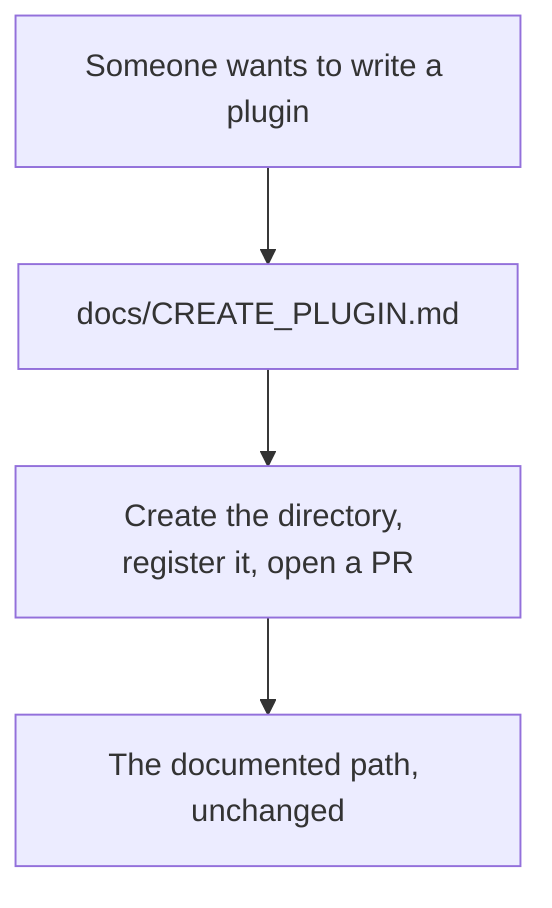
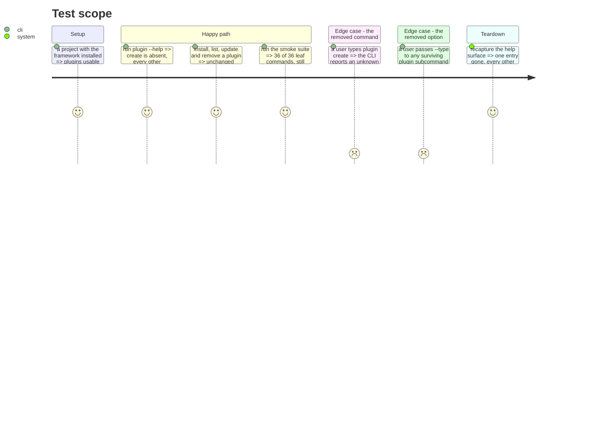

# Instruction: Drop plugin scaffolding

`aidd plugin create` is exposed in `--help` and documented nowhere: zero mentions across `docs/`,
`README.md` and `cli/README.md`. `docs/CREATE_PLUGIN.md`, the contribution guide, describes an
entirely manual flow — create the directory, register it in `marketplace.json`, test, open a PR.

Nobody writes third-party plugins today, and the command was never on a contributor's path.

## What this fiche got wrong before, and now does not

It was written before phases 1 and 2 built three nets, and its projection was read rather than
compiled.

- It claimed `snapshots/phase0` would lose a help line. It will not: that snapshot holds 22 command
  invocations and captures no help output at all.
- The snapshot that changes is the **help surface** golden, which loses its `aidd plugin create`
  entry — a net that did not exist when this was planned.
- It ignored the **smoke suite** entirely: a `plugin create (scaffold)` section, an entry in
  `ALL_COMMANDS`, and a coverage report that goes from 37 leaf commands to 36.
- It listed one test file. There are four, plus a fifth that falls with the cascade below.

## The cascade

`parsePluginComponentKind` has exactly one production caller: the `--type` option of the `create`
subcommand (`commands/plugin.ts:51`). Remove the command and `plugin-component-kind.ts` and
`InvalidPluginComponentKindError` become unreachable in turn — the same pattern phase 3 met with
`ForeignSchemaValidationError`, written down this time instead of discovered.

Checked and safe: `plugin-manifest-schema.integration.test.ts` is the only test of the scaffold
against the bundled schema, but the adapters it exercises — `AjvSchemaValidatorAdapter` and
`BundledAssetProviderAdapter` — are covered by eight other tests. Deleting it loses no coverage of
anything that survives.

## Architecture projection

> Tree of the final files. ✅ create · ✏️ modify · ❌ delete

```txt
.
└── cli/
    ├── src/
    │   ├── application/
    │   │   ├── commands/plugin.ts                          ✏️ modify (drop the create subcommand and its --type)
    │   │   └── use-cases/plugin/plugin-create-use-case.ts  ❌ delete (133 l.)
    │   ├── domain/models/
    │   │   ├── plugin-scaffold.ts                          ❌ delete (86 l.)
    │   │   └── plugin-component-kind.ts                    ❌ delete (12 l., cascade)
    │   ├── domain/errors.ts                                ✏️ modify (drop InvalidPluginComponentKindError)
    │   └── infrastructure/deps.ts                          ✏️ modify (drop the use-case wiring)
    ├── tests/
    │   ├── e2e/plugin-create.e2e.test.ts                   ❌ delete (92 l.)
    │   ├── application/use-cases/plugin/plugin-create-use-case.integration.test.ts  ❌ delete (293 l.)
    │   ├── domain/models/plugin-scaffold.unit.test.ts      ❌ delete (77 l.)
    │   ├── domain/models/plugin-component-kind.unit.test.ts ❌ delete (24 l., cascade)
    │   ├── infrastructure/adapters/plugin-manifest-schema.integration.test.ts  ❌ delete (34 l.)
    │   └── golden/snapshots/help/surface.json              ✏️ modify (loses `aidd plugin create`)
    └── scripts/smoke-tools.sh                              ✏️ modify (drop the section and the ALL_COMMANDS entry)
```

Roughly 750 lines, of which 520 are tests.

## User Journey



## Test Scope



## Tasks to do

### `1)` Remove the command, its use case and its wiring

1. Drop the `create` subcommand from `commands/plugin.ts`, including its `--type` option.
2. Delete `plugin-create-use-case.ts` and `plugin-scaffold.ts`, and their wiring in `deps.ts`.
3. Delete the five test files listed in the projection.

### `2)` Follow the cascade

> Do not leave behind what only the removed command reached.

1. `plugin-component-kind.ts` and `InvalidPluginComponentKindError` lose their last caller.
2. Confirm with the compiler, not by reading: `tsc --noEmit` must stay clean once they are gone, and
   `knip` must report nothing.

### `3)` Update the smoke suite

1. Drop the `plugin create (scaffold)` section and the `plugin create` entry from `ALL_COMMANDS`.
2. Coverage must still report 100%, on 36 leaf commands instead of 37.

### `4)` Recapture the help surface

1. `UPDATE_HELP_GOLDEN=1`, then read the diff: exactly one entry disappears and `aidd plugin`'s own
   help loses one line. Anything else means the removal reached further than intended.

## What executing this phase established

**921 lines deleted, 2 inserted, across 15 files.** Correcting the fiche first paid off: the four
mistakes it carried were fixed before they became surprises, and the cascade it predicted happened
exactly as written — `plugin-component-kind.ts` and `InvalidPluginComponentKindError` lost their last
caller with the `--type` option.

**But the cascade went one level deeper than predicted.** `knip` found
`domain/formats/marketplace-json.ts` unreachable: it was imported only by the deleted use case. Its
test went with it, 97 lines in all. This is the third phase in a row where deletion uncovered more
deletion, and the second where the tooling found what reading had not — which is why task 2 said to
confirm with the compiler rather than by rereading.

**A flaw in the duplication ratchet, found by this phase.** Phase 3 tightened `jscpd --threshold`
from 3.5 to 3.2 because duplication had fallen to 3.17%. Deleting 921 more lines of
**non-duplicated** code pushed the ratio back up to 3.22% — 66 clones and 694 duplicated lines,
unchanged in absolute terms, over a smaller codebase. **A percentage ratchet punishes deletion.**
The threshold moved to 3.3, and phase 5 (the last deletion phase) should expect the same effect.
Ratcheting the clone count rather than the ratio would be the real fix.

| | before | after |
|---|---|---|
| unit tests | 1399 | 1380 |
| integration tests | 482 | 465 |
| e2e files | 16 | 15 |
| smoke leaf commands | 37/37 | 36/36, still 100% |
| help-surface entries | 44 | 43 |

## Test acceptance criteria

| Task | Acceptance criteria |
| ---- | ------------------- |
| 1    | `plugin --help` no longer lists `create`; install, list, remove, update, search and doctor behave as before |
| 2    | `tsc --noEmit` is clean and `knip` reports nothing with no new ignore entry |
| 3    | The smoke suite is green at 36/36 leaf commands, 100% |
| 4    | The help-surface diff removes one entry and edits one line; no other entry changes |
| all  | `snapshots/phase0`, the e2e suite and the build golden pass **unmodified** — this removes a command, it changes nothing about the ones that stay |
| all  | `docs/CREATE_PLUGIN.md` needs no edit: it never mentioned the command |
