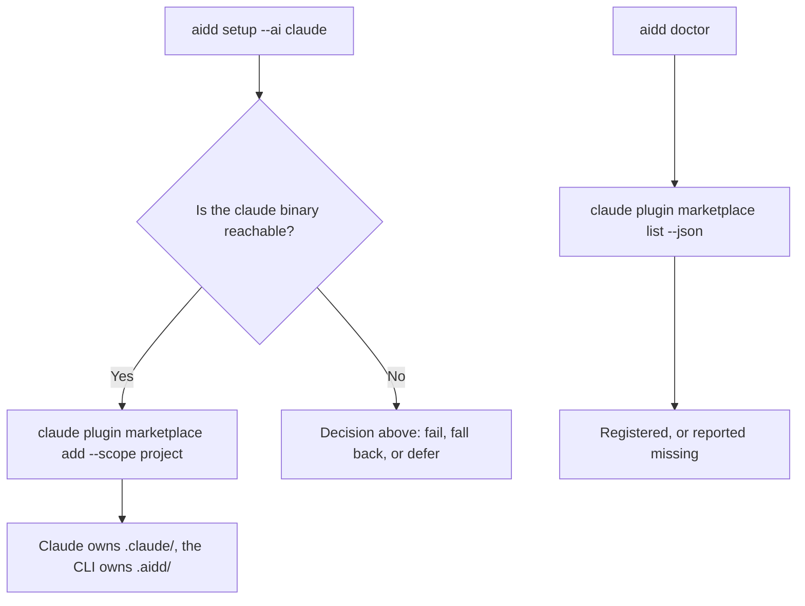
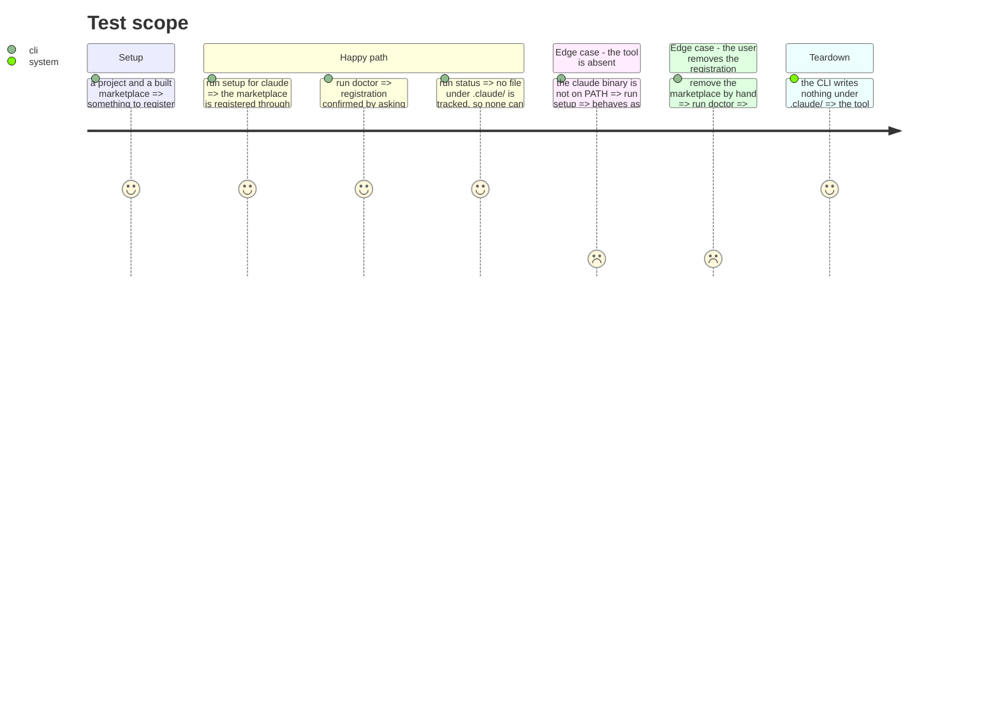

# Instruction: Let each tool own its own configuration

## What this slot first held, and why it was cancelled

It was going to remove flat build mode for the four native tools, believing their flat cells
duplicated their native mode. The premise was wrong: two axes were conflated. `PluginsCapability.mode`
describes how a *plugin* is installed into a tool; `FrameworkBuildMode` describes how the *framework*
is built for a target. The build golden settles it — for claude, marketplace mode produces 198 files
under `.claude-plugin/` and `plugins/`, flat mode 189 under `.claude/agents/`, `.claude/skills/` and
`.claude/hooks/`. Two deliverables, and `cli/README.md` documents the second. The nine build cells
stay.

## What replaces it

Today the CLI hand-writes `.claude/settings.json` — another tool's private configuration — and then
records that file's hash in its own manifest.

A first attempt drove `claude plugin marketplace add` **in addition** to writing the file. Measured:
two writers and one recorder, so `status` reports the file modified forever after. That attempt was
reverted. The fix is not to add a second writer, it is to stop being one.

So: **write through the tool's command, verify through the tool's command, track nothing the tool
owns.**

| | today | target |
|---|---|---|
| register | this CLI writes `extraKnownMarketplaces` into `.claude/settings.json` | `claude plugin marketplace add <built> --scope project` |
| verify | compare the file's hash to the manifest | `claude plugin marketplace list --json` |
| track | `.claude/settings.json`, the tool's only tracked file | nothing under `.claude/` |

`--scope project` is not optional: the command defaults to **user** scope and would otherwise
register the marketplace globally, for every project on the machine.

## Décision (2026-08-22)

Tranchée après mesure. La question posée — « que faire hors ligne ? » — n'était pas le vrai blocage,
et les trois issues qu'elle proposait reposaient sur deux faits faux.

### Ce que la mesure a corrigé

**Le précédent hors ligne existe déjà, et il ne coûte pas ce que la fiche croyait.** `aidd setup --ai
codex` pose exactement un fichier, `.codex/config.toml`, qui ne contient que `model` et
`approval_policy` : aucun enregistrement. Le marketplace de codex n'existe que par sa commande. Donc
codex sans son binaire, aujourd'hui, c'est déjà un setup qui réussit et n'enregistre rien. Claude
pose lui aussi exactement un fichier. Piloter la commande ne créerait pas un nouveau mode d'échec
silencieux : il est déjà en place pour un outil sur deux.

**Mais l'enregistrement d'AIDD ne peut pas être partagé, quelle que soit la source.** Mesuré dans les
deux modes :

| `--source` | ce qui atterrit dans `extraKnownMarketplaces` |
|---|---|
| `remote` (défaut) | `{source:"directory", path:"<abs>/.aidd/cache/built/aidd-framework/claude"}` |
| `local --path <repo>` | `{source:"directory", path:"<abs>/<repo>"}` |

Ce qu'AIDD enregistre n'est jamais le dépôt amont, c'est **l'arbre construit** — un chemin absolu, et
dans le cas par défaut un chemin vers le dossier que le `.gitignore` exclut. C'est mécanique : l'arbre
construit est la forme claude du marketplace, le dépôt amont est agnostique. Tant que ces arbres ne
sont pas hébergés, l'enregistrement est machine-local par construction.

**Toutes les entrées de marketplace sont machine-locales, sans exception.** Un marketplace tiers
github semblait produire `{source:"github", repo:"…"}`, partageable — mais c'était un artefact : sa
construction avait échoué. `mergeMarketplacesMap` lit `builtSources.get(name) ?? m.source`, et
`builtSourcesForTool` remplace chaque marketplace construit avec succès par `{kind:"local", path:
builtDir}`, que `resolveSourceForSettings` rend ensuite absolu. Quand la construction réussit — le cas
normal — la source déclarée n'est jamais utilisée.

Donc la clé `extraKnownMarketplaces` est machine-locale **en entier**, et il n'y a pas à distinguer
entrée par entrée.

**En revanche, la clé voisine ne l'est pas.** `enabledPlugins` s'écrit `{"plugin@marketplace": true}` :
des noms, aucun chemin. Elle se partage, et la committer est correct. Le fichier mélange donc deux
clés de natures opposées, ce qui est la coupe à faire.

### Ce qui est tranché

**La phase se scinde en deux, et une seule moitié est faisable maintenant.**

**5a — séparer les deux clés selon ce qu'elles peuvent porter. Faisable tout de suite, sans
hébergement, sans piloter aucune commande.** `extraKnownMarketplaces`, faite de chemins absolus, part
dans `.claude/settings.local.json` — un fichier que Claude lit déjà, qu'AIDD ajoute à son `.gitignore`
et dont il n'enregistre pas l'empreinte. `enabledPlugins`, faite de noms, reste dans
`.claude/settings.json` avec la configuration runtime, committée et suivie comme aujourd'hui.

La capability sait déjà exprimer cette coupe : `MarketplaceSettings` porte
`enabledPluginsSettingsPath` pour envoyer une clé ailleurs. 5a ajoute le miroir pour l'autre clé.
AIDD reste l'unique auteur des deux fichiers, donc aucune collision d'empreinte, et le hors ligne
continue de marcher.

Ça corrige un défaut réel et vérifié : aujourd'hui un collègue qui clone récupère un enregistrement
qui pointe vers un répertoire ne pouvant pas exister chez lui.

**5b — piloter la commande de l'outil. Reste bloqué, et pas pour la raison qu'indiquait la fiche.**
Le blocage n'est pas le hors ligne, c'est que piloter ne donne pas un résultat meilleur tant que les
marketplaces ne sont pas hébergés :

- au scope `project`, `claude plugin marketplace add` réécrit `.claude/settings.json`, le fichier
  qu'AIDD écrit et dont il enregistre l'empreinte — la collision qui avait fait échouer la première
  tentative revient telle quelle ;
- au scope `local`, il écrit `.claude/settings.local.json`, un fichier séparé donc sans collision
  (vérifié : « declared in local settings ») — mais c'est précisément ce que 5a obtient déjà en
  écrivant le fichier, sans exiger le binaire ;
- cursor ne peut pas être piloté du tout : sa commande prend une URL git, pas un chemin.

Piloter devient le bon geste quand `add` prend une URL pour les quatre outils, c'est-à-dire après la
décision d'hébergement. Voir `marketplaces-heberges.md`. 5b y est rattaché.

### Ce que la décision coûte

5a laisse AIDD auteur de la configuration d'un autre outil, ce qui est l'objectif affiché de la
phase. C'est assumé : l'objectif est en aval de l'hébergement, pas du hors ligne.

## The decision this phase needs

Setup currently works when Claude Code is **not installed**: writing the settings file leaves a
registration that takes effect when the tool arrives. Driving the CLI cannot do that.

Three ways out, and this phase should not start before one is chosen.

1. **Require the binary.** Registration fails with a clear message when `claude` is absent. Simplest,
   and it drops a case that may not matter.
2. **Write the file only as a fallback.** When the binary is absent, write `.claude/settings.json`
   and track it; when it is present, drive the command and track nothing. Preserves both, at the cost
   of two code paths and a manifest whose content depends on what was installed at setup time.
3. **Defer to the remote marketplace.** Once the per-tool built marketplaces are hosted rather than
   local, `add` takes a URL and there is nothing local to point at. See below.

## Why the remote direction changes this

The built marketplaces live in `.aidd/cache/built/<name>/<target>` — local paths. That is the only
reason Cursor cannot be driven at all: `cursor-agent plugin marketplace add` takes a **git URL** and
indexes per account, verified against the installed CLI.

Host the generated per-tool marketplaces and the same three commands work everywhere: claude, codex,
copilot and cursor all accept a URL. The plan's four tool profiles would then differ by paths and
formats only, not by how registration happens — which is the shape phase 10's acceptance test is
asking for.

That is a product direction, not a refactor step. This phase should be sized once it is settled.

## Les scopes, outil par outil

Vérifié contre les quatre CLI installées.

| outil | scopes exposés par sa propre commande | fichier écrit |
|---|---|---|
| claude | `user` (défaut), `project`, `local` | `~/.claude/`, `.claude/settings.json`, `.claude/settings.local.json` |
| codex | aucun — user-global par conception | `~/.codex/config.toml` |
| copilot | aucun — pas d'option `--scope` | `~/.copilot/` |
| cursor | aucun — niveau compte | indexé côté serveur |

Seul Claude a des scopes à offrir. Le modèle d'AIDD doit donc passer d'un scope **unique par outil**
(`installScope: "project" | "user"`, une valeur) à la **liste des scopes supportés** plus un défaut,
et n'exposer `--scope` que là où l'outil en accepte un.

## Ce que le .gitignore change au raisonnement

AIDD ajoute une seule ligne au `.gitignore` du projet : `.aidd/cache/`. Ce qui reste versionné :
`.aidd/manifest.json`, `.aidd/marketplaces.json` et `.claude/settings.json`.

Or `.claude/settings.json` est committé **et** contient le chemin du marketplace AIDD — un chemin
**absolu** vers `.aidd/cache/built/aidd-framework/claude`, c'est-à-dire vers le dossier ignoré.
Vérifié sur un projet neuf, dans les deux modes de `--source`.

Attention à ne pas généraliser : c'est vrai de l'enregistrement d'AIDD, pas de toutes les entrées.
Un marketplace tiers déclaré en github s'écrit `{source:"github", repo:"…"}` et se partage très bien.
C'est ce contraste, et non le chemin seul, qui fonde la décision plus bas.

Un collègue qui clone récupère donc un pointeur vers un répertoire qui n'existe pas chez lui et
n'existera qu'après son propre `setup`. C'est un défaut latent du modèle actuel, indépendant de tout
le reste, et il décide du scope par défaut :

| contenu | scope | fichier | pourquoi |
|---|---|---|---|
| config runtime d'AIDD (`respectGitignore`, `permissions`) | `project` | `.claude/settings.json` | réellement partageable, mérite d'être committé |
| enregistrement du marketplace | `local` | `.claude/settings.local.json` | chemin absolu vers un dossier ignoré : il ne peut être que machine-local |

Le défaut `local` n'est pas un compromis, c'est la seule valeur cohérente avec ce que
l'enregistrement contient. Et `--scope local` écrit un **fichier séparé**, vérifié — ce qui supprime
au passage la collision d'empreinte qui avait fait échouer la première tentative.

## Architecture projection

> Tree of the final files. ✅ create · ✏️ modify · ❌ delete

```txt
.
└── cli/src/
    ├── domain/tools/ai/claude.ts        ✏️ modify (nativeActivation, marketplaceSettings dropped)
    ├── domain/capabilities/plugins-capability.ts  ✏️ modify (claude joins the driven binaries)
    ├── domain/ports/native-plugin-activator.ts    ✏️ modify (a read: list registered marketplaces)
    ├── infrastructure/adapters/native-plugin-cli-adapter.ts  ✏️ modify (implement the read)
    └── application/use-cases/                     ✏️ modify (doctor asks the tool, not the file)
```

## User Journey



## Test Scope



## Tasks to do

### `0)` Settle the offline decision — fait, voir « Décision » plus haut

> Répondu le 2026-08-22 : la question ne bloquait pas ce qu'elle prétendait bloquer. Ce qui suit est
> la moitié 5a, réalisable sans hébergement. La moitié 5b est rattachée à `marketplaces-heberges.md`.

### `1)` Écrire chaque entrée dans le fichier que sa nature impose

1. `MarketplaceSettings` gagne `marketplacesSettingsPath`, miroir de `enabledPluginsSettingsPath`
   qui existe déjà. Le profil claude l'ajuste sur `.claude/settings.local.json`. Quand il est
   déclaré, la clé y est écrite et son empreinte n'est pas enregistrée.
2. La clé laissée dans le fichier suivi par une installation antérieure en est retirée, sinon un
   chemin absolu périmé reste committé.
3. AIDD ajoute le fichier à son `.gitignore` — Claude ne l'y met pas lui-même, vérifié. Le chemin
   est lu sur les profils installés, jamais écrit en dur.

### `2)` Vérifier sans suivre

> `claude plugin marketplace list` **n'a pas** d'option `--json` — vérifié contre la CLI installée.
> La fiche en supposait une. La distinction utile n'est pas lire par la commande plutôt que par le
> fichier, c'est **lire sans enregistrer d'empreinte** : lire pour confirmer ne crée pas de dérive,
> enregistrer un hachage en crée.

1. `doctor` confirme l'enregistrement en lisant le fichier machine-local, sans en suivre
   l'empreinte. Le fichier partagé n'a pas besoin de ce contrôle : son empreinte est déjà suivie,
   donc il signale ses propres dégâts.

### `3)` Ne suivre que ce qui se partage

> Le critère d'origine — « plus aucun fichier sous `.claude/` dans le manifest » — est faux et ne peut
> pas être atteint : `configOutputPaths: { "settings.json": ".claude/settings.json" }` fait qu'AIDD
> écrit légitimement ce fichier pour `respectGitignore` et `permissions`. Vérifié sur un projet neuf.
> Ce qui quitte le fichier suivi, c'est l'entrée machine-local, pas le fichier.

1. `.claude/settings.local.json` n'entre pas dans le manifest : AIDD l'écrit, ne le suit pas, et
   `status` ne peut donc pas rapporter de dérive dessus.

## La réponse, outil par outil

Chaque outil reçoit ce que son architecture permet, pas une règle uniforme. Ce qui décide, c'est où
l'outil accepte de lire une déclaration machine-locale.

| outil | ce que son architecture permet | ce qu'AIDD écrit |
|---|---|---|
| claude | `plugin marketplace add … --scope local` écrit `.claude/settings.local.json` ; `plugin install --scope project` écrit `enabledPlugins` | **la commande écrit l'enregistrement**, AIDD n'écrit rien ; la config runtime et `enabledPlugins` restent à AIDD |
| copilot | aucun jumeau machine-local. `.github/copilot/settings.json` est lu par VS Code et documenté comme la recommandation d'équipe ; `chat.plugins.marketplaces` a une portée application et VS Code la refuse en réglages d'espace de travail | `enabledPlugins` seulement. Aucun enregistrement : un chemin absolu ne peut pas être une recommandation d'équipe. Copilot apprend ses marketplaces par sa propre CLI |
| codex | pas de réglages de marketplace du tout, tout passe par sa CLI | rien |
| cursor | idem, et sa commande n'accepte qu'une URL git | rien |
| opencode | mode plat, pas de plugins natifs | rien |

La capability porte donc trois réponses possibles pour l'emplacement des enregistrements, et non deux :
dans le fichier partagé, dans un fichier machine-local, ou **nulle part**.

### La règle qui tranche : la commande de l'outil d'abord

Un outil qui propose une commande pour écrire sa configuration l'écrit mieux que nous — dans son
format, à son scope, et il continuera de le faire quand ce format changera. AIDD n'écrit donc que ce
qu'aucune commande ne couvre. La capability sépare les deux axes : `marketplaceSettings` dit **où**
le fichier se trouve, pour le `.gitignore` et pour `status` ; `nativeActivation` dit **qui** l'écrit.

Ce qui a résisté à la règle, mesuré plutôt que supposé : `claude plugin install --scope project`
écrit exactement `{"<plugin>@<marketplace>": true}` dans `.claude/settings.json`, caractère pour
caractère ce qu'AIDD y écrit déjà. Le piloter ne serait pas mieux, ce serait une seconde manière de
faire la même chose, et ça donnerait un second auteur à un fichier dont AIDD enregistre l'empreinte.
`enabledPlugins` reste donc écrit par AIDD.

**Hors ligne.** L'enregistrement étant piloté, un binaire absent veut dire aucun enregistrement —
comme codex et copilot aujourd'hui. Vérifié : `Warning: claude CLI not found on PATH — skipping
native plugin activation.`, et rien d'écrit. C'est la lecture littérale du principe : le fichier
quand l'outil n'offre **pas de commande**, pas quand le binaire manque.

### Deux régressions que le golden a attrapées, et une fragilité qu'il révélait

Piloter la commande rend la sortie observable dépendante de ce que la machine a d'installé. Le golden
est devenu vert ici et rouge sans le binaire — donc inutilisable comme garde-fou. Les runs bac à
sable filtrent maintenant du `PATH` tout répertoire contenant une CLI pilotable, et appellent node par
`process.execPath` : filtrer par répertoire est ce qui tient sur une machine où `node` et `copilot`
partagent `/opt/homebrew/bin`.

Sous ce filtre, le golden a montré deux vraies régressions :

- **L'arbre construit disparaissait.** La construction était un effet de bord de l'enregistrement,
  donc plus de binaire, plus d'arbre — alors que construire est le travail d'AIDD quel que soit
  l'écrivain, et que l'arbre est ce que tout enregistrement désigne. Construire vient maintenant
  avant de décider qui écrit.
- **`doctor` sortait en 1** en signalant qu'un outil non installé ne déclare pas son marketplace.
  Le contrôle ne se déclenche plus quand le binaire est hors de portée : signaler ça, c'est signaler
  qu'un logiciel absent est mal configuré.

### Ce qui a été écarté, et pourquoi

Un chemin **relatif** rendrait l'entrée identique sur toutes les machines et sur tous les OS, ce qui
supprimerait le problème à la racine. Deux sondes n'ont pas pu établir que Claude le résout :
`marketplace list` se contente de réafficher la déclaration, et `marketplace update` répond
« Successfully updated » sur un chemin cassé. Aucune ne discrimine, donc rien n'est bâti dessus.
Claude écrit lui-même un chemin absolu au scope local ; suivre sa convention est le choix défendable.

## Ce que la mise en œuvre a appris

**Le golden a attrapé une régression que la coupe introduisait.** Sortir la clé du fichier suivi
faisait apparaître `settings.local.json` comme fichier *ajouté* dans `status` : la fausse dérive
avait simplement changé de forme. `detectAddedFiles` excluait déjà les `.backup` pour cette raison
exacte, et les fichiers machine-locaux suivent le même précédent, lus sur le profil par
`machineLocalFilesOf`.

**Le contrôle de `doctor` n'était pas facultatif.** Un fichier suivi signale lui-même ses dégâts, son
empreinte cesse de correspondre. Un fichier délibérément non suivi ne signale rien : supprimé à la
main, `doctor` disait « installation saine ». `DoctorRegistrationUseCase` comble exactement cet angle
mort, et la commande qu'il propose répare vraiment — vérifié.

**L'exclusion dans `status` repose sur une égalité de chaînes, donc sur une convention tacite.**
`detectAddedFiles` compare le chemin déclaré par le profil à celui qu'il reconstruit depuis le
répertoire de l'outil : un profil déclarant `settings.local.json` au lieu de
`.claude/settings.local.json` cesserait silencieusement d'être exclu. Un test autour de `status` ne
l'attrape pas — le fichier tomberait hors du répertoire scanné, donc aucune dérive de toute façon,
et le test passerait pour la mauvaise raison. La convention est donc devenue un invariant vérifié
sur tous les profils dans `registry-conformance`, éprouvé par injection.

**`update` n'appelle pas la synchronisation des marketplaces.** Elle tourne sur `setup`, `install`,
`marketplace add/remove/refresh` et `plugin install`, pas sur `update`. Antérieur à cette phase, non
corrigé ici, consigné dans `findings.md`.

## Test acceptance criteria

| Task | Acceptance criteria |
| ---- | ------------------- |
| 0    | La décision est écrite ici avant tout changement de code — fait |
| 1    | Après setup, `.claude/settings.json` ne contient plus aucun chemin absolu, et l'enregistrement du framework se trouve dans `.claude/settings.local.json`, lui-même gitignoré |
| 2    | Retirer l'enregistrement à la main fait que `doctor` le signale, avec la commande qui répare |
| 3    | `settings.local.json` n'apparaît pas dans le manifest, et aucun `status` ne rapporte de dérive dessus |
| all  | Un projet cloné par un collègue n'hérite plus d'un chemin qui ne peut pas exister chez lui. Le diff golden montre la scission du fichier et rien d'autre |
