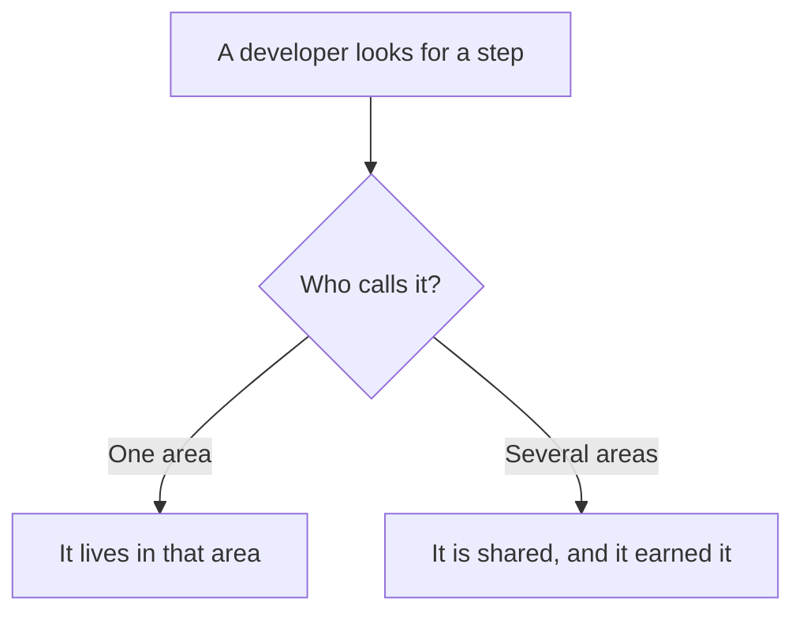
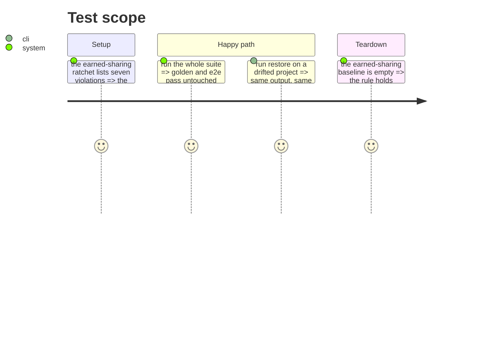

# Instruction: Dissolve the shared dumping ground

`use-cases/shared/` holds fourteen files. Measured against the rule this repo now carries — a module
is shared when it has callers in two areas — seven fail: five have one caller, two have none outside
`shared/` itself.

The directory is not the cause. `0-layer-responsibilities.md` used to say a use case may be promoted
as soon as another use case calls it; that rule is gone, and this phase clears what it produced.

Do this before any extraction: otherwise the dumping ground gets moved rather than emptied.

## Architecture projection

> Tree of the final files. ✅ create · ✏️ modify · ❌ delete

```txt
.
└── cli/src/application/
    ├── commands/shared/spawn-cli-command.ts   ✏️ modify (move next to its single caller)
    └── use-cases/shared/
        ├── resolve-marketplace-use-case.ts     ✏️ modify (stays: 9 callers, several areas)
        ├── ensure-built-marketplace-use-case.ts ✏️ modify (stays: 5 callers, several areas)
        ├── fetch-marketplace-source-use-case.ts ❌ delete (moves under its only caller)
        ├── generate-tool-distribution-use-case.ts ❌ delete (moves under restore)
        ├── resolve-restore-decision.ts          ❌ delete (moves under restore)
        ├── restore-drift-entries-use-case.ts    ❌ delete (moves under restore)
        ├── restore-merge-files-use-case.ts      ❌ delete (moves under restore)
        └── restore-regular-files-use-case.ts    ❌ delete (moves under restore)
```

## User Journey



## Test Scope



## Tasks to do

### `1)` Move the seven down

> Each goes under the area that calls it. Tests follow their subject.

1. `fetch-marketplace-source` has one caller, `resolve-marketplace`. It becomes its private step.
2. The four `restore-*` files and `resolve-restore-decision` move under `restore/`.
3. `generate-tool-distribution` moves under `restore/`, its only caller.
4. `commands/shared/spawn-cli-command.ts` moves next to its single caller.

### `2)` Keep the two that earned it

1. `resolve-marketplace` and `ensure-built-marketplace` stay. Record in one line each why: nine and
   five callers, spread across areas.

### `3)` Empty the ratchet

1. Remove the seven entries from the `earned-sharing` baseline. The list must be empty.

## Test acceptance criteria

| Task | Acceptance criteria |
| ---- | ------------------- |
| 1    | Every moved file sits under the area that calls it; no `shared/` directory holds a single-caller module |
| 2    | The two survivors still serve every caller they served before |
| 3    | The `earned-sharing` baseline is empty, and the test fails if a new single-caller shared module appears |
| all  | Golden and e2e pass **unmodified**: this batch moves files and changes no behavior |
