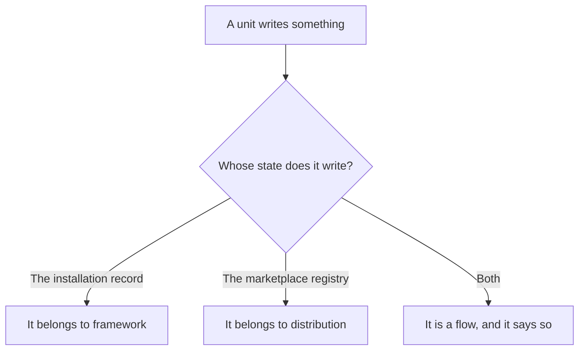
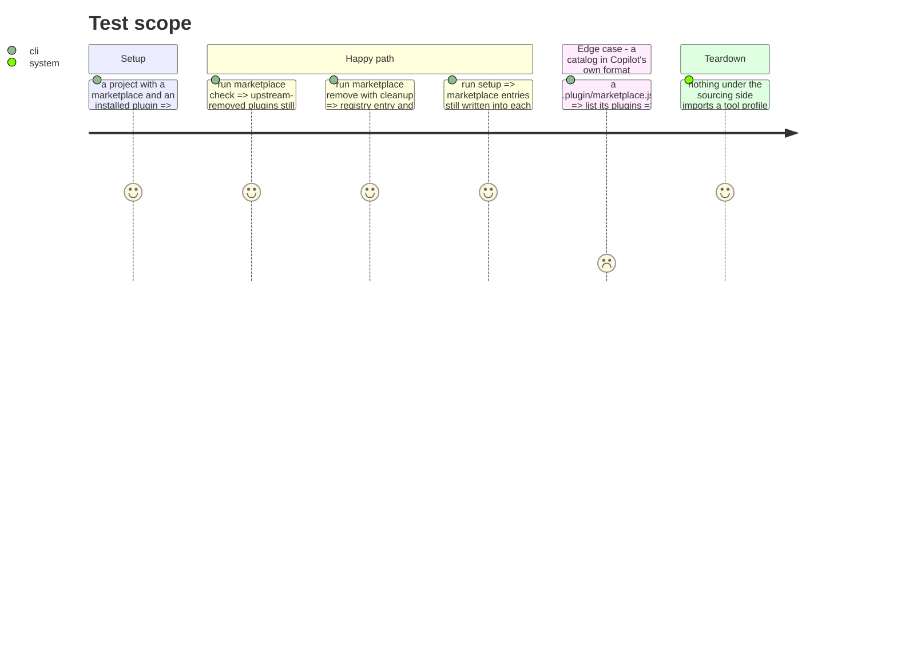

# Instruction: Put three misplaced units where they belong

Three units carry a name from one area and do the work of another. Each was found by following what
they write, not what they are called.

Moving them is what makes `distribution` a leaf: afterwards it knows nothing about tools or about
the installation record.

## Architecture projection

> Tree of the final files. ✅ create · ✏️ modify · ❌ delete

```txt
.
└── cli/src/
    ├── application/use-cases/
    │   ├── plugin/translator/          ✏️ modify (moves under the framework side)
    │   ├── marketplace/
    │   │   ├── marketplace-check-use-case.ts    ✏️ modify (becomes a cross-area flow)
    │   │   ├── marketplace-remove-use-case.ts   ✏️ modify (idem)
    │   │   └── marketplace-sync-settings-use-case.ts  ✏️ modify (idem)
    │   └── flows/                      ✅ create (holds the three, until phase 13 places them)
    └── domain/formats/copilot-marketplace-catalog.ts  ✏️ modify (moves to the sourcing side)
```

## User Journey



## Test Scope



## Tasks to do

### `1)` Move the translator to the framework side

> Four of its six files import `Manifest` and `Plugin`.

1. It is not translation, it is translation applied at install time and recorded. Move
   `use-cases/plugin/translator/` accordingly.

### `2)` Name the three flows

1. `marketplace-check` diffs catalogs against `manifest.getPlugins(toolId)`.
2. `marketplace-remove` deletes plugin files and calls `manifest.removePlugin` then `save`.
3. `marketplace-sync-settings` writes into each tool's settings file.
4. All three cross two areas. Move them out of `marketplace/` into a `flows/` directory.

### `3)` Move the catalog parser to the sourcing side

1. `copilot-marketplace-catalog.ts` parses a catalog into `PluginCatalog`. Reading a catalog is
   sourcing, not formatting.

## Test acceptance criteria

| Task | Acceptance criteria |
| ---- | ------------------- |
| 1    | Installing, updating and restoring a plugin behave as before for every tool |
| 2    | `marketplace check`, `marketplace remove --cleanup` and `setup` behave as before |
| 3    | A Copilot-native catalog is still read correctly |
| all  | Nothing left under `marketplace/` imports a tool profile or `Manifest`. Golden and e2e pass **unmodified** |
