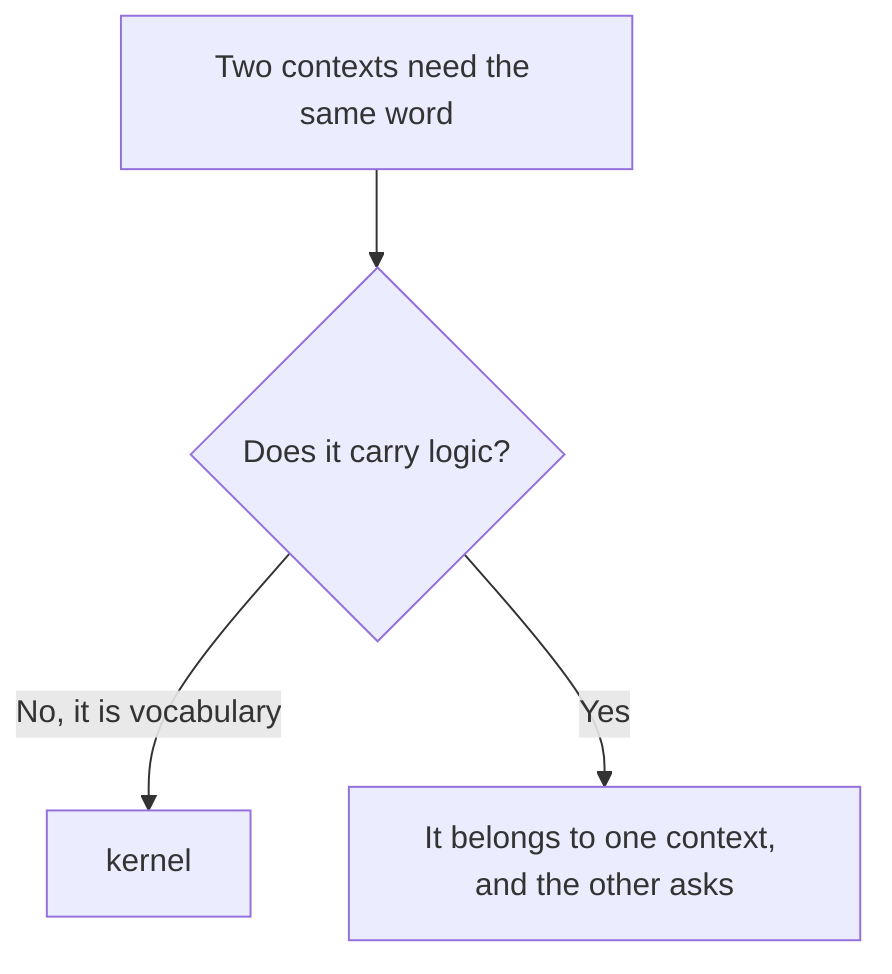
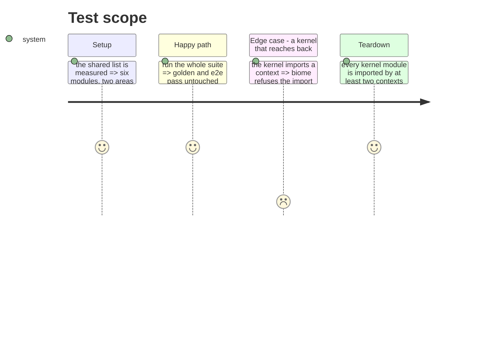

# Instruction: Extract the kernel

Six modules pass the two-area rule and are the shared vocabulary of every context: tool identity,
where content comes from, project paths, files and their hashes, merge strategies, and errors.

They get a home and a name, and their names move up from mechanism to concept — the project's own
naming rule.

## Architecture projection

> Tree of the final files. ✅ create · ✏️ modify · ❌ delete

```txt
.
└── cli/src/kernel/                  ✅ create
    ├── tool.ts                      ✏️ modify (from domain/models/tool-ids.ts)
    ├── source.ts                    ✏️ modify (from domain/models/plugin-source.ts)
    ├── paths.ts                     ✏️ modify (from domain/models/paths.ts)
    ├── file.ts                      ✏️ modify (from domain/models/file.ts)
    ├── merge.ts                     ✏️ modify (from domain/models/merge.ts)
    ├── errors.ts                    ✏️ modify (from domain/errors.ts)
    └── ports/                       ✅ create (file-reader, file-writer, hasher, logger, asset-provider)
```

## User Journey



## Test Scope



## Tasks to do

### `1)` Move the six, renamed to the concept

1. `tool-ids.ts` becomes `tool.ts`, `plugin-source.ts` becomes `source.ts`. The others keep their
   names, which already say the concept.
2. No directory per module: six files, six directories would be structure for its own sake.

### `2)` Move the shared ports

1. `file-reader`, `file-writer`, `hasher`, `logger` and `asset-provider` serve at least two
   contexts. The rest stay with the context that owns them.

### `3)` Forbid the reverse edge

1. Add a biome `override`: the kernel may not import from any context. Verify it refuses a
   deliberate violation.

### `4)` Poser les deux filets dont les extractions suivantes dépendent

> La phase 10 ne peut pas fermer un contexte sans une frontière à opposer, et aucune extraction ne
> peut se dire réussie sans une mesure du découpage. Les deux viennent ici, avant la première.

1. **Cliquet de frontière.** Une importation venue d'un autre contexte ne vise qu'un module que le
   contexte cible déclare public ; tout le reste est intérieur. La liste des modules publics est la
   donnée du test, elle ne peut que rétrécir. C'est ce qui remplace l'`index.ts` retiré de l'arbre
   cible — voir `arborescence.md`, invariant 4.
2. **Remettre Stryker en marche.** Il ne tourne pas depuis une montée de TypeScript, et aucun job ni
   hook ne l'appelle, ce qui est la raison pour laquelle personne ne l'a vu casser. La phase 14 a
   besoin d'une mesure **avant** de redécouper le Manifest, et une mesure prise après ne prouve rien
   sur le redécoupage : la réparation doit donc précéder, pas suivre. La campagne large reste la
   phase 20.

   Deux réglages, deux causes d'échec distinctes, les deux confirmés en les retirant un par un :

   - `disableTypeChecks: false` — c'est le correctif réel. Avec `tsconfigFile: ""` aucun checker de
     types ne tourne, donc l'injection par défaut de `// @ts-nocheck` en tête de chaque fichier
     copié ne protégeait rien. Or Stryker copie tout le projet dans son bac à sable, y compris
     `dist/` (ignoré par git mais pas par sa copie de fichiers) : l'injection y ajoutait 15 octets à
     `dist/cli.js`, et le golden `framework-build-golden.e2e.test.ts` — qui compare le binaire
     octet à octet — échouait avant même le premier mutant.
   - `vitest.configFile: "vitest.config.ts"` — indépendamment nécessaire, vérifié en le retirant :
     sans lui, le runner retombe sur `vitest.workspace.ts`, et le dry-run échoue par timeout
     (60000 ms) sur les tests golden plutôt que par diff de contenu. La piste d'origine ("le projet
     e2e du workspace fait échouer le golden") pointait donc la bonne case sans en avoir la bonne
     raison — le workspace ne fait pas échouer le golden par contenu, il le fait échouer par lenteur.

   Score de mutation mesuré sur `src/domain/models/manifest.ts`, seuil de rupture 50 % : **65.32 %
   à 73.87 %** sur quatre lancements consécutifs, sans changement de code entre eux. La borne basse
   vient d'un quatrième lancement de vérification indépendant, sous la borne annoncée par les trois
   premiers — ce qui confirme la variance plutôt que de la contredire.

   Le chiffre qui sert n'est pas le score mais le reste : **110 mutants survivants sur 421**. Un
   changement de comportement sur trois passerait inaperçu dans cet agrégat, et c'est précisément ce
   que la phase 14 doit savoir avant de le redécouper. L'écart vient de
   4 mutants statiques qui concentrent ~90 % du temps d'exécution ("static mutants" — voir
   l'avertissement de Stryker) : sur une machine partagée sous charge variable, certains expirent
   (`timed out`) plutôt que d'être tués ou de survivre proprement, et le compte de survivants en
   dépend. La borne basse reste largement au-dessus du seuil de rupture ; ce n'est pas un signal
   fiable de tendance run-à-run, seulement une preuve que Stryker tourne et mesure. `ignoreStatic`
   (suggéré par l'avertissement) réduirait cette variance si la phase 20 en a besoin.

   Avec `coverageAnalysis: "perTest"`, le runner vitest de Stryker active par défaut le mode `related`
   (`vitest.related`) : le dry-run n'exécute donc que les 536 tests dont l'import touche
   transitivement `manifest.ts`, pas les 2002 de la suite complète — un sous-ensemble déterministe
   (fonction du graphe d'imports du fichier muté, pas d'un tirage aléatoire), donc reproductible et
   comparable à la mesure que prendra la phase 14.
3. **Cliquet de taille de dossier.** Un dossier ne porte pas plus de dix fichiers source directs,
   règle reprise du harnais de `gouvernail`. Les six dossiers qui dépassaient avant la phase 7 —
   à remesurer au moment de poser le cliquet, la phase 7 ayant vidé `shared/` entre-temps :
   `domain/models` 29, `domain/ports` 25, `infrastructure/adapters` 23, `domain/formats` 21,
   `application/commands` 16, `use-cases/shared` 14. La base de départ est cette liste, et chaque
   extraction doit la faire rétrécir — c'est la mesure du découpage, pas une opinion sur lui.

## Test acceptance criteria

| Task | Acceptance criteria |
| ---- | ------------------- |
| 1    | Every consumer imports the kernel; no duplicate of a moved module remains |
| 2    | A port in the kernel is used by two contexts or more; a port used by one moved with it |
| 4    | Both ratchets fail on a deliberate violation, and their baselines shrink at every later extraction |
| 3    | An import from the kernel to a context fails the lint, verified by introducing one |
| all  | Golden and e2e pass **unmodified** |
