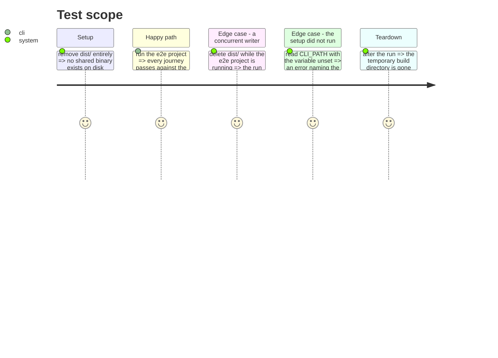

# Instruction: Build the e2e binary into a directory only that run knows

## Architecture projection

> Tree of the final files. ✅ create · ✏️ modify · ❌ delete

```txt
.
└── cli/
    ├── tsup.config.ts                              ✏️ modify (outDir from the environment, schemas follow it)
    ├── vitest.workspace.ts                         ✏️ modify (globalSetup on the e2e project)
    ├── package.json                                ✏️ modify (test/test:e2e stop building)
    ├── tests/
    │   ├── e2e/
    │   │   ├── global-setup.ts                     ✅ create
    │   │   ├── helpers.ts                          ✏️ modify (CLI_PATH from the run's own build)
    │   │   ├── persona.e2e.test.ts                 ✏️ modify (same)
    │   │   └── update-check.e2e.test.ts            ✏️ modify (same)
    │   └── architecture/
    │       └── no-shared-binary.arch.test.ts       ✅ create
    └── aidd_docs/memory/testing.md                 ✏️ modify (the rule becomes a mechanism)
```

## Test Scope



## Tasks to do

### `1)` Let the build write somewhere else

1. `tsup.config.ts`: `outDir` reads `process.env.AIDD_BUILD_OUT_DIR` and falls back to `dist`.
2. `onSuccess` copies the five schema files into that same directory. They are hardcoded to
   `dist/` today, so a build elsewhere would produce a binary whose schemas are missing.

### `2)` Give the e2e project its own build

1. `tests/e2e/global-setup.ts`: create a directory under the OS temp dir, run `tsup` into it
   with `AIDD_BUILD_OUT_DIR` set, publish the binary's path, and remove the directory on teardown.
2. Register it as `globalSetup` on the `e2e` project in `vitest.workspace.ts`.

### `3)` Point every reader at it

1. `helpers.ts`, `persona.e2e.test.ts` and `update-check.e2e.test.ts` read the published path.
2. No fallback: an absent value throws an error saying the e2e global setup did not run.

### `4)` Stop the second pair of writers

1. `test` and `test:e2e` drop `pnpm build`; nothing in a test run reads `dist/` any more.
2. `smoke` keeps it — `scripts/smoke-tools.sh` runs the published binary and is a separate command.

### `5)` Keep the path from coming back

1. `tests/architecture/no-shared-binary.arch.test.ts`: no file under `tests/` may resolve a path
   into `dist/`. Prove it by injecting the original line and watching it fail.
2. `aidd_docs/memory/testing.md`: replace "Run one vitest at a time" with what now makes it
   unnecessary. Leave the history — the failure was chased twice.

## Test acceptance criteria

| Task | Acceptance criteria |
| ---- | ------------------- |
| 1 | `AIDD_BUILD_OUT_DIR=/tmp/x pnpm exec tsup` produces a runnable `/tmp/x/cli.js` with its five schema files beside it |
| 2 | `rm -rf dist && pnpm exec vitest run --project e2e` passes; the temporary directory is gone afterwards |
| 3 | Reading `CLI_PATH` with the variable unset fails with an error naming the global setup, not with ENOENT on `dist/` |
| 4 | `pnpm test` no longer writes `dist/`; `pnpm smoke` still works |
| 5 | Re-injecting `resolve(process.cwd(), "dist/cli.js")` into a test file fails the new architecture test by name |
| all | Goldens unchanged, 1987 tests over 982 suites, tsc 0, biome 0 |

## Livrée (2026-09-02)

Deux choses que la fiche n'avait pas vues, trouvées à l'exécution.

**`skipNodeModulesBundle` rend le critère 1 infaisable tel qu'écrit.** Les dépendances restent des
imports externes que Node résout en remontant depuis le fichier construit. Un build dans le temp de
l'OS n'a aucun `node_modules` au-dessus de lui : le binaire meurt sur `commander` avant d'imprimer
un mot. Premier correctif tenté : un lien symbolique vers le vrai `node_modules` dans le répertoire
temporaire.

**Ce lien a révélé pire.** Le `clean: true` de tsup traverse une entrée de répertoire symbolique et
vide sa cible au lieu de délier le lien — prouvé avec une cible jetable dont le fichier témoin a
disparu. Un second build dans le même répertoire aurait vidé le `node_modules` réel du dépôt.

Le lien a donc été supprimé, pas défendu : le répertoire de build est maintenant sous `cli/`
(`.e2e-build/run-XXXX`, gitignoré). Node y trouve `cli/node_modules` en remontant, sans lien, donc
sans rien que `clean` puisse traverser. Vérifié avec un fichier témoin dans `node_modules` : intact
après un run e2e complet.

Défendre le danger aurait demandé un effet de bord au chargement du module de config, dont la
justesse dépendait de l'ordre interne de tsup. Supprimer sa cause n'en demande aucun.

## Vérifié

| Critère | Preuve |
| ------- | ------ |
| 2 | `rm -rf dist && vitest run --project e2e` => 14 fichiers / 104 tests verts, `dist/` toujours absent, `.e2e-build/` vide après |
| 3 | `globalSetup` retiré => `CLI_PATH is unset: tests/e2e/global-setup.ts did not run…`, pas un ENOENT sur `dist/` |
| 5 | ligne d'origine réinjectée dans `persona.e2e.test.ts` => échec nommant le fichier |
| — | **la course elle-même** : deux `vitest run --project e2e` simultanés, `dist/` absent => `A:0 B:0`, 14/14 et 104/104 des deux côtés |
| all | 1 990 tests / 986 suites, ratios égaux · tsc 0 · biome 487 fichiers 0 · goldens `git diff` vide |

## Revue (2026-09-02)

Trois défauts trouvés en relisant le candidat commité, deux causés par lui.

**`AIDD_BUILD_OUT_DIR` détruisait le répertoire qu'on lui donnait.** `clean: true` vide sa cible
avant de construire. Un répertoire témoin contenant `notes.txt` a disparu, sortie 0, sans un mot —
et le binaire produit là ne démarrait pas, faute de `node_modules` au-dessus de lui. La variable
n'accepte plus que `dist` ou un répertoire sous `.e2e-build/` ; tout le reste lève une erreur qui
dit pourquoi. Vérifié sur les deux pièges : un répertoire hors du paquet et `src`.

**knip signalait `tests/e2e/global-setup.ts` comme fichier mort.** vitest le charge depuis la
configuration, ce que knip ne suit pas. `cli-knip` est une étape de `pre-push` : la porte était
rouge. Déclaré comme point d'entrée, avec `vitest.mutation.config.ts` que Stryker charge de la même
façon et qui était rouge depuis la phase 20.

**`warnDeprecated` n'a jamais été câblé.** Ajouté à la phase 18, zéro référence dans `src` comme
dans `tests` — la phase avait conclu qu'un renommage pur garde une sortie identique et le
message n'a jamais servi. Supprimé plutôt qu'ignoré : knip avait raison.

La preuve de concurrence du premier passage montrait deux runs verts, ce qui n'exclut pas qu'ils se
soient sérialisés par hasard. Refaite en hostile : un processus crée `dist/cli.js`, le remplit
d'ordures et le supprime deux cents fois pendant que la suite e2e tourne. 104 / 104 verts. La
dépendance n'est pas devenue improbable, elle n'existe plus.
