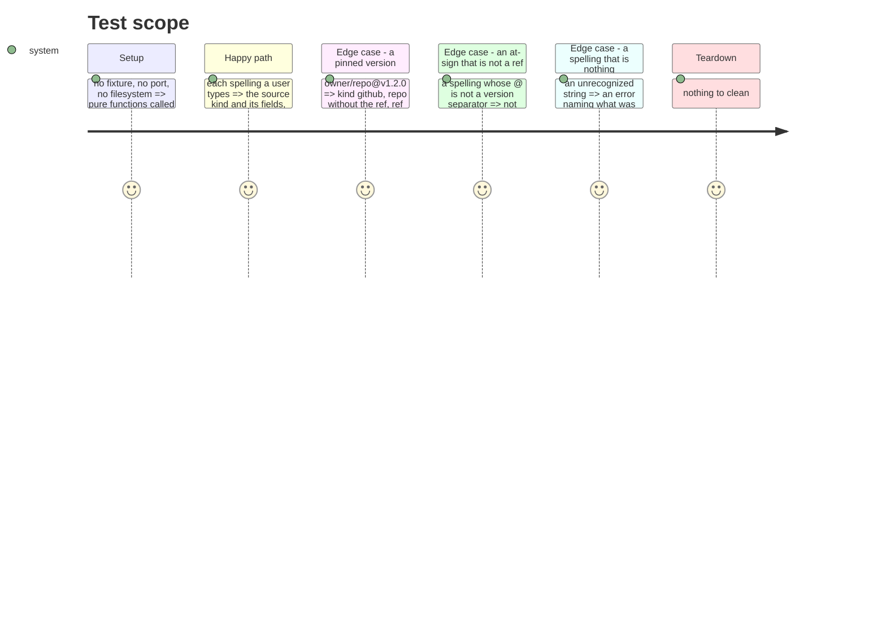

# Instruction: The source spellings a user types

`aidd plugin add` accepts a source in several spellings. Four of them are parsed by code no
test executes: 71 mutants in `src/kernel/source.ts`, 27 % of the file. The kernel is the
vocabulary all four contexts speak, so a behaviour change that passes unnoticed here passes
unnoticed everywhere.

## Architecture projection

> Tree of the final files. ✅ create · ✏️ modify · ❌ delete

```txt
.
└── cli/
    └── tests/kernel/
        └── source.unit.test.ts     ✏️ modify (extend; the nested shape already exists)
```

No production file changes. If a test cannot be made to pass without touching `src/`, that is
a bug found, and it gets its own commit before the test lands.

## What is untested, and what breaks for a user

| Function | Mutants | What a user types | What breaks if it regresses |
| -------- | ------: | ----------------- | --------------------------- |
| `parsePluginSourceShorthand` | 30 | `owner/repo`, `https://…`, `git@…`, `./local`, or raw JSON | The wrong source kind is chosen, so the plugin is fetched by the wrong adapter — or a valid spelling is rejected outright |
| `parseGitHubVersionedShorthand` | 18 | `owner/repo@v1.2.0` | The ref is dropped and the default branch is installed instead of the pinned version, silently |
| `parseGitLabShorthand` | 11 | `gitlab:owner/repo`, `gitlab:owner/repo@ref` | The built URL is wrong, so the clone fails — or worse, points somewhere else |
| `describePluginSource` | 6 | nothing; it is what `status` and `doctor` print back | The user is shown a source that is not the one recorded |
| `optionalString` / `optionalSha` | 4 | a manifest field of the wrong type | A malformed manifest is accepted instead of refused |
| `parseObjectPluginSource` | 2 | an unknown `kind` | The error does not say which kinds exist |

## Test Scope



## Tasks to do

### `1)` Name by intention, with the functional case inside

1. One `describe` per spelling the user types — `describe("gitlab: shorthand")`, not
   `describe("parseGitLabShorthand")`. The nested `it` states the outcome:
   `it("resolves gitlab:owner/repo to a gitlab.com git URL")`.
2. Never a method name in an `it`. The repo's `aidd-dev:test` skill, action
   `02-name-behaviorally`, is the authority; this phase only refuses to drift from it.

### `2)` Pin the spellings

1. `parsePluginSourceShorthand`: one case per branch — https, http, `git@`, `./`, `/`,
   `gitlab:`, bare `owner/repo`, versioned, raw JSON, and the unrecognized string.
2. Assert the whole returned object, not one field. A mutant that swaps `kind` or drops
   `ref` survives an assertion that only checks the URL.

### `3)` Pin the two that decide a version

1. `parseGitHubVersionedShorthand` through its caller: `owner/repo@ref` keeps the ref and
   strips it from the repo; `@` at index 0 is not a separator; a repo that fails the pattern
   falls through rather than returning a broken source.
2. `parseGitLabShorthand`: with and without a ref, and the malformed case that must throw.

### `4)` Pin what the user is shown

1. `describePluginSource` for all five kinds, including the `ref` and `version` suffixes —
   these are what `status` and `doctor` print, and a wrong one misleads silently.

### `5)` Measure, and say what moved

1. `pnpm test:mutation:kernel`, compare against 62,74 %, and record the delta to the point,
   not the hundredth — the scope's run-to-run noise is around 0,4.
2. Record the mutants that survive on purpose, with the reason, rather than adding a test
   that only kills them.

## Test acceptance criteria

| Task | Acceptance criteria |
| ---- | ------------------- |
| 1 | Every `it` reads as an outcome a user could observe; no `it` names a function |
| 2 | Each spelling has a case, and each asserts the complete parsed source |
| 3 | A ref survives the round trip; a lone `@` and a malformed gitlab spelling behave as stated |
| 4 | All five kinds print back what was recorded |
| 5 | The kernel scope is re-measured and the delta reported, with the surviving mutants explained |
| all | 1 995 tests still pass with the new ones added, suites ratio equal, tsc 0, biome 0 |

## Livrée (2026-09-03)

`src/kernel/source.ts` : 71 mutants sans couverture, il n'en reste aucun. Le scope `kernel`
passe de 62,74 % à **72,74 %**, soit dix points. Plus que les sept que le compte laissait
attendre, parce que couvrir les orthographes traverse aussi le reste du fichier : 639 mutants
tués avant, 740 après. Deux points de ces dix viennent de la revue, pas du premier jet.

31 tests ajoutés, 60 dans le fichier après avoir supprimé un bloc que les nouveaux couvraient mieux.

### Ce qu'une supposition a coûté, et ce qu'elle a appris

J'avais écrit que `owner/repo@release@2` gardait `release@2` comme ref, parce que la fonction
coupe sur le dernier `@`. Le test a échoué. La moitié dépôt devient `owner/repo@release`, qui
ne satisfait pas le motif `owner/repo`, donc l'orthographe entière est refusée. Le comportement
réel est le bon — mieux vaut refuser que d'installer un dépôt dont le nom porte un `@` en
silence — et il est maintenant épinglé. C'était une supposition écrite comme une observation.

### Deux trous trouvés en relisant le rapport, pas en lisant le code

`parsePluginSource("owner/repo")` et `parsePluginSource("./chemin")` : une source enregistrée
comme **chaîne** dans le manifeste plutôt que comme objet. Rien ne passait par là. C'est le
genre de branche qu'une lecture ne signale pas et qu'un mutant sans couverture désigne.

### Ce qui survit, et pourquoi ce n'est pas poursuivi

**Corrigé après revue.** La première version de cette section déclarait inoffensive une famille
qui contenait une vraie perte de donnée, silencieuse et sur le chemin principal. Elle affirmait
que les gardes `if (src.ref !== undefined)` de la sérialisation ne survivaient qu'à cause de
`toEqual`, qui ignore les clés valant `undefined`, et que `JSON.stringify` les supprimant, rien
d'observable ne différait. Faux sur les trois points, pour deux des douze mutants :

- `resolvePluginSourceFromMarketplace` construit une source `git-subdir` portant le `ref` de la
  marketplace, c'est-à-dire la version épinglée.
- `InstalledPlugin.create` et `fromDistribution` appellent `serializePluginSource` puis
  `fromJSON` → `parsePluginSource` **en mémoire**, sans jamais passer par `JSON.stringify`.
- Une garde cassée en `false` ne pose pas la clé du tout : ni `toEqual` ni `toStrictEqual` ne la
  rattrapent. Seul un aller-retour `git-subdir` **portant** un `ref` et un `sha` la tue.

Le `ref` disparaissait donc du plugin enregistré, et la branche par défaut s'installait là où une
version était demandée — mot pour mot le préjudice que le tableau d'ouverture de cette fiche
donne comme raison d'écrire la phase. Le test manquant existe maintenant, en `toStrictEqual`.

Ce qui reste hors de portée, et pourquoi — 25 survivants, comptés un par un :

| Famille | Nombre | Pourquoi ils restent |
| ------- | -----: | -------------------- |
| `StringLiteral` dans des messages d'erreur | 8 | Les tests affirment le fragment qui porte l'information — le nom du champ, la forme attendue. Figer la phrase entière rendrait chaque reformulation rouge sans qu'un utilisateur y gagne |
| Gardes `!== undefined` mutées en `true` | 7 | La clé est posée avec la valeur `undefined` ; `JSON.stringify` la supprime et l'aller-retour en mémoire la relit comme absente. Aucun manifeste écrit ni aucun plugin enregistré ne diffère. C'est la seule moitié de la famille dont l'argument d'origine tenait |
| Gardes de position `atIndex` | 4 | Deux formes du même test ; la valeur limite qui les distingue est déjà écartée par le motif du dépôt, testé juste à côté |
| `Regex` sur les motifs de dépôt et de paquet | 3 | Les cas limites qui les tuent sont des chaînes qu'aucun format n'autorise |
| Un `case` vidé qui retombe sur le suivant | 1 | `url` et `git-subdir` produisent la même sortie pour les champs communs ; la sortie observable est identique |
| Divers | 2 | Deux conditions dont les deux branches mènent au même résultat |

Les tuer monterait le chiffre sans protéger quoi que ce soit, ce que la règle du plan interdit.
La différence avec la version précédente de ce tableau est qu'il compte les survivants un par
un, au lieu d'en ranger 27 dans trois familles et de laisser les dix autres hors du récit. Trois
de ces dix étaient des trous d'une ligne, tous couverts depuis : un chemin absolu enregistré
comme chaîne, un champ présent mais vide, et une erreur dont seule la classe était affirmée
alors que les deux branches lèvent la même classe.

### Le noyau, ce qu'il en reste

46 mutants sans couverture ailleurs dans le scope : `errors.ts` 20, `merge.ts` 18, `file.ts` 5,
`markdown.ts` 3. À traiter avec la même règle, pas parce qu'ils sont là.
