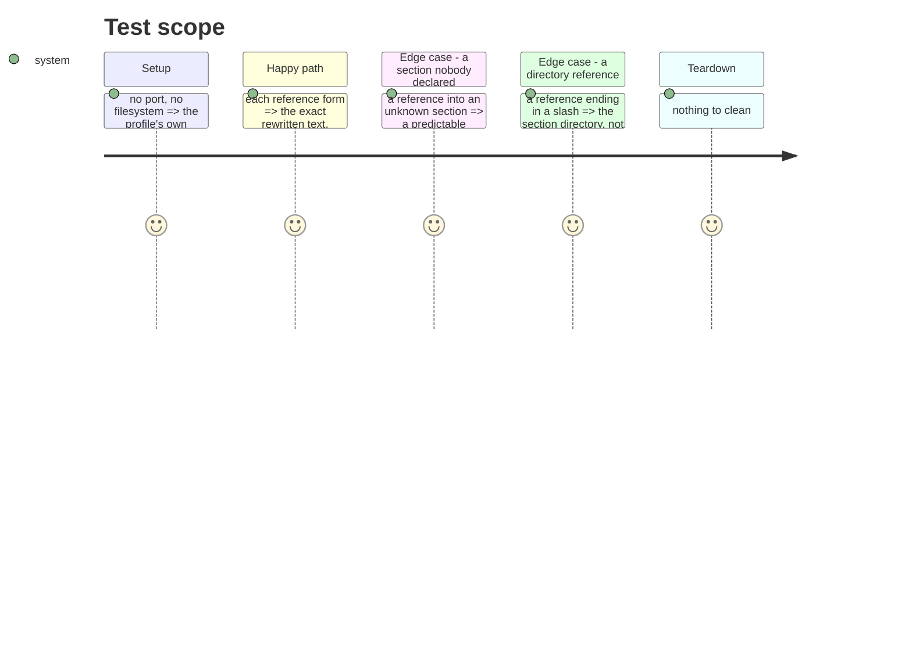

# Instruction: The references Copilot rewrites, in both directions

`src/contexts/tools/domain/profiles/copilot/profile.ts` carries 173 mutants no unit or
integration test executes — 46 % of the file, the largest single gap outside the command
wiring. Nearly all of it is one thing: the rewriting of framework references into Copilot's
own layout, and the reverse.

Copilot is the only tool that rewrites content between the canonical form and its workspace
paths. Every other profile passes content through. So this code has no sibling to compare
against, and a regression in it is a regression nobody else's tests would notice.

> **Found while measuring, before writing a line: 61 of those 173 mutants are in code nothing
> calls.** See "The reverse surface has no consumer" below. This phase covers the live 112 and
> writes no test for the dead 61, because a test there would freeze code that should probably
> be deleted and would make deleting it harder.

## Architecture projection

> Tree of the final files. ✅ create · ✏️ modify · ❌ delete

```txt
.
└── cli/
    └── tests/contexts/tools/domain/profiles/
        └── copilot.unit.test.ts     ✏️ modify (extend)
```

No production file changes. If a test cannot pass without touching `src/`, that is a bug
found, and it gets its own commit before the test lands.

## What is untested, and what breaks for a user

| Behaviour | What a user sees if it regresses |
| --------- | -------------------------------- |
| `@{{TOOLS}}/agents/x.md` becomes a markdown link to `.github/agents/x.agent.md` | An installed Copilot file points at a path that does not exist; the reference is dead in the editor |
| `@{{TOOLS}}/commands/…` resolves through the same flattening the install uses | The link points at the unflattened name, so it resolves nowhere |
| `@{{TOOLS}}/rules/…` and `…/skills/…` reach `instructions/` and `skills/` | Same, for two more sections |
| `@{{DOCS}}/…` becomes a link into the project's docs directory | Documentation references break for whoever configured a non-default docs dir |
| `{{TOOLS}}/…` without the `@` replaces the prefix and stays plain text | A frontmatter path turns into a markdown link, which frontmatter cannot hold |
| An unknown section falls back to a prefixed path | A new framework section silently drops its references instead of degrading predictably |
| ~~The reverse turns each installed form back into its placeholder~~ | ~~Nothing.~~ No caller — see below |
| ~~`detectUserFileSectionKey` maps an installed path back to its canonical key~~ | ~~Nothing.~~ No caller — see below |

## The reverse surface has no consumer

Four symbols are declared, implemented in every profile, and called from no production file:

| Symbol | Declared | Implemented | Production callers |
| ------ | -------- | ----------- | -----------------: |
| `AiTool.reverseRewriteContent` | `tools/domain/contracts.ts` | 5 profiles | **0** |
| `AiTool.detectUserFileSectionKey` | `tools/domain/contracts.ts` | 5 profiles | **0** |
| `<X>Capability.reverseConvertFrontmatter` | 4 capability classes | 5 profiles | **0** |
| `detectSectionKeyFromPrefixes` | `tools/domain/formats/command.ts` | — | **0** |

Established by searching `src/` for each name and excluding the declaration and implementation
sites; the remaining count is zero in all four cases. No dynamic dispatch reaches them either:
there is no bracket access on a tool or config object anywhere in `src/`. Git history shows no
caller has existed under `framework/` or `application/` since the CLI was migrated into this
repository — the symmetry was built, the consumer never was.

In copilot's profile that is 61 uncovered mutants: 38 in `reverseCopilotContent`, 23 in
`detectUserFileSectionKey`. Three other profiles carry unit tests for `detectUserFileSectionKey`
already, which is how dead code keeps looking alive.

The decision — delete the four, or wire them to the feature they were built for — is not this
phase's to take. What this phase refuses to do is write tests that make either choice harder.

## Test Scope



## Tasks to do

### `1)` Name by intention, with the functional case inside

1. `describe` names what the content does — `describe("a reference to another framework file")`,
   not `describe("rewriteCopilotContent()")`. The nested `it` names what the reader of the
   installed file gets.
2. The existing blocks in this file are named after methods. They are left as they are: this
   phase adds, it does not rename, and mixing the two changes in one commit hides both.

### `2)` Pin each reference form

1. One case per form: agents, commands, rules, skills, docs, the bare `{{TOOLS}}/` prefix,
   and the unknown section.
2. Assert the whole rewritten string, not that it contains a substring. A mutant that
   changes the link target while keeping the label survives a `toContain`.

### `3)` Leave the reverse alone, and say why

1. No test for `reverseRewriteContent` or `detectUserFileSectionKey`. Nothing calls them.
2. Record the finding with the search that establishes it, so the decision to delete or to
   wire them up is made on evidence rather than on the shape of the API.

### `5)` Measure, then account for every survivor

1. `pnpm test:mutation:tools`, compare against 61,04 %, report the delta in points.
2. For every surviving mutant, either cover it or state why it is harmless — and state it by
   naming the call chain that reaches the code, not by reasoning about what the code looks
   like. Phase 1 declared a family harmless on an argument about `JSON.stringify` that did not
   apply, and the family contained a silent loss of a pinned version. Every claim of harmless
   in this phase cites the caller it followed.

## Test acceptance criteria

| Task | Acceptance criteria |
| ---- | ------------------- |
| 1 | Every added `it` reads as an outcome someone reading an installed file could observe |
| 2 | Each reference form asserts the complete rewritten string |
| 3 | No test is added for the four dead symbols, and the finding is recorded with the search that establishes it |
| 5 | The `tools` scope is re-measured, and each survivor is covered or explained with its caller |
| all | The full suite passes with the new tests added, suites ratio equal, tsc 0, biome 0, knip 0 |
